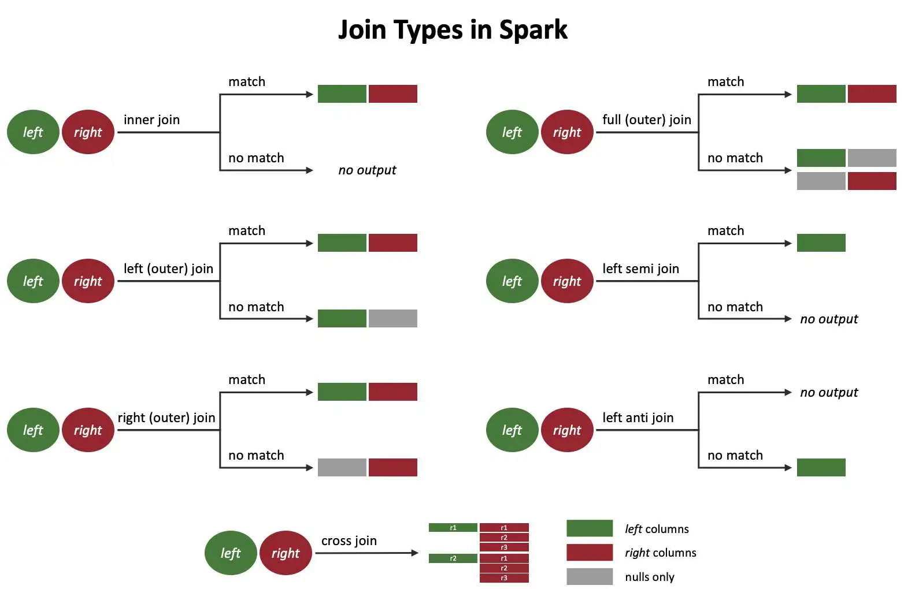
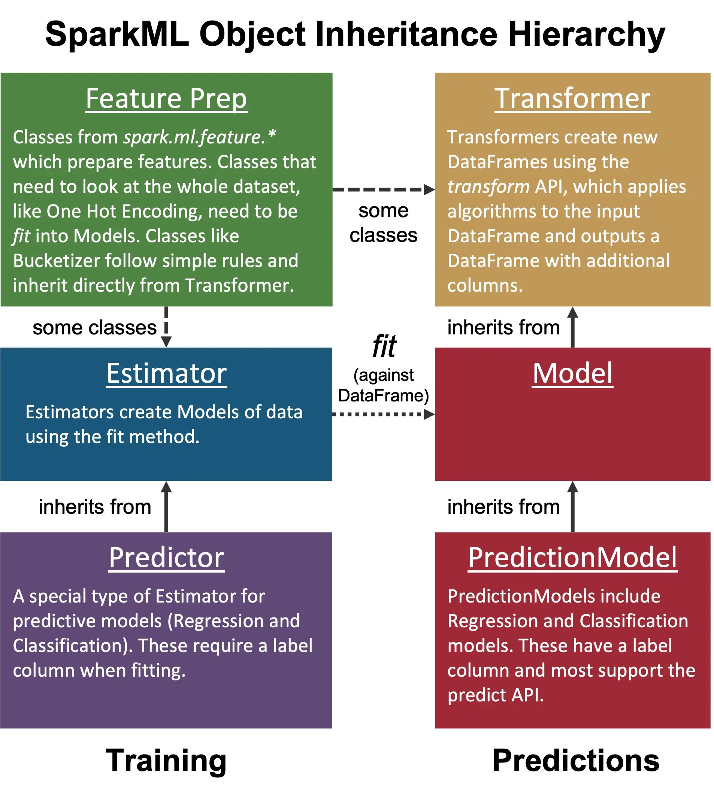
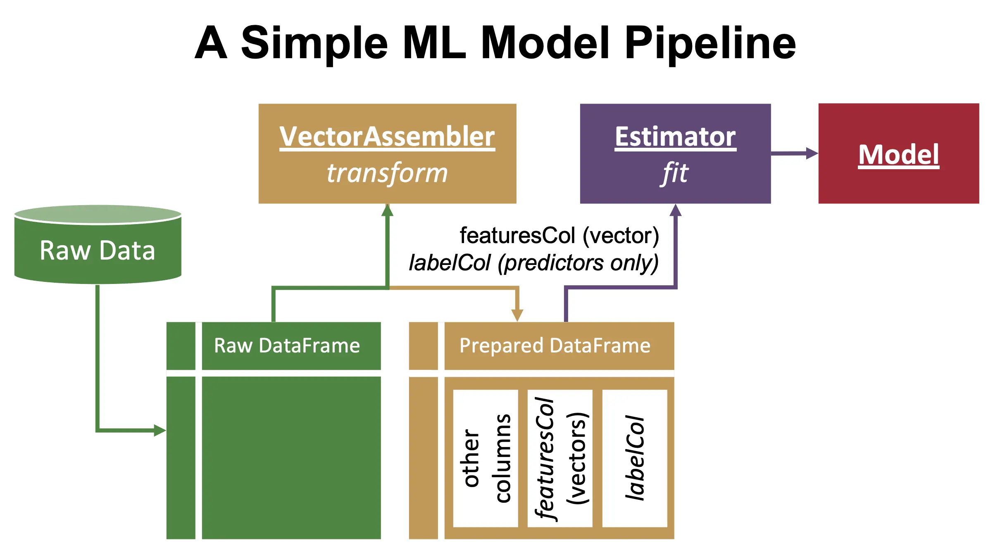
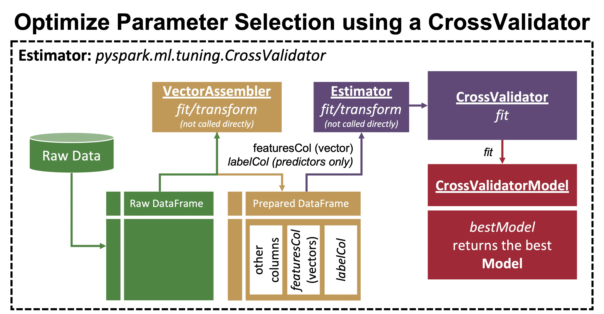
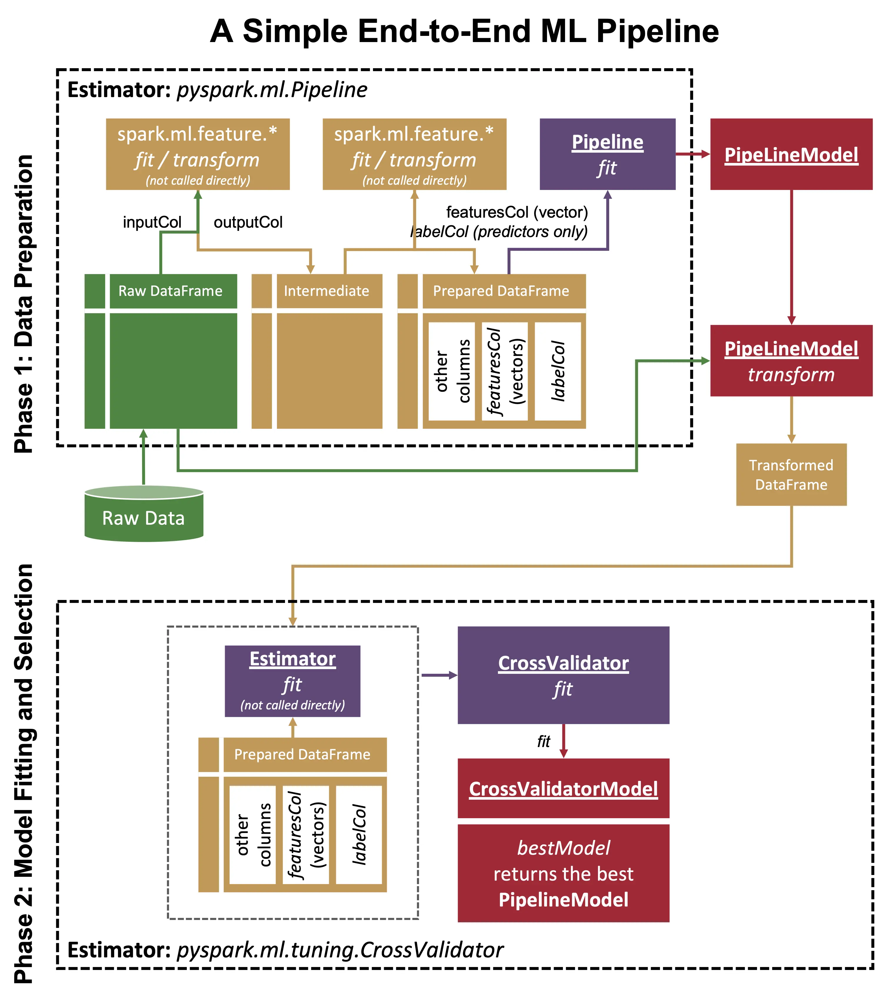
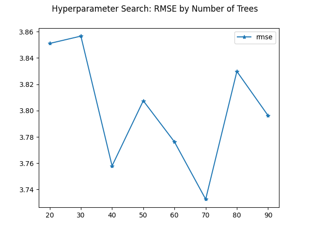

PySpark Cheat Sheet
===================
This cheat sheet will help you learn PySpark and write PySpark apps faster. Everything in here is fully functional PySpark code you can run or adapt to your programs.

These snippets are licensed under the CC0 1.0 Universal License. That means you can freely copy and adapt these code snippets and you don't need to give attribution or include any notices.

These snippets use DataFrames loaded from various data sources:
- "Auto MPG Data Set" available from the [UCI Machine Learning Repository](https://archive.ics.uci.edu/ml/datasets/auto+mpg).
- customer_spend.csv, a generated time series dataset.
- date_examples.csv, a generated dataset with various date and time formats.
- weblog.csv, a cleaned version of this [web log dataset](https://www.kaggle.com/datasets/shawon10/web-log-dataset).

These snippets were tested against the Spark 3.2.2 API. This page was last updated 2022-09-19 15:31:03.

Make note of these helpful links:
- [PySpark DataFrame Operations](https://spark.apache.org/docs/latest/api/python/reference/pyspark.sql/dataframe.html)
- [Built-in Spark SQL Functions](https://spark.apache.org/docs/latest/api/sql/index.html)
- [MLlib Main Guide](http://spark.apache.org/docs/latest/ml-guide.html)
- [Structured Streaming Guide](https://spark.apache.org/docs/latest/api/python/reference/pyspark.ss/index.html)
- [PySpark SQL Functions Source](https://spark.apache.org/docs/latest/api/python/_modules/pyspark/sql/functions.html)

Try in a Notebook
-----------------
See the [Notebook How-To](notebook.md) for instructions on running in a Jupyter notebook.

Generate the Cheatsheet
-----------------------
You can generate the cheatsheet by running `cheatsheet.py` in your PySpark environment as follows:
- Install dependencies: `pip3 install -r requirements.txt`
- Generate README.md: `python3 cheatsheet.py`
- Generate cheatsheet.ipynb: `python3 cheatsheet.py --notebook`


Table of contents
=================

<!--ts-->
   * [Accessing Data Sources](#accessing-data-sources)
      * [Load a DataFrame from CSV](#load-a-dataframe-from-csv)
      * [Load a DataFrame from a Tab Separated Value (TSV) file](#load-a-dataframe-from-a-tab-separated-value-tsv-file)
      * [Save a DataFrame in CSV format](#save-a-dataframe-in-csv-format)
      * [Load a DataFrame from Parquet](#load-a-dataframe-from-parquet)
      * [Save a DataFrame in Parquet format](#save-a-dataframe-in-parquet-format)
      * [Load a DataFrame from JSON Lines (jsonl) Formatted Data](#load-a-dataframe-from-json-lines-jsonl-formatted-data)
      * [Save a DataFrame into a Hive catalog table](#save-a-dataframe-into-a-hive-catalog-table)
      * [Load a Hive catalog table into a DataFrame](#load-a-hive-catalog-table-into-a-dataframe)
      * [Load a DataFrame from a SQL query](#load-a-dataframe-from-a-sql-query)
      * [Load a CSV file from Amazon S3](#load-a-csv-file-from-amazon-s3)
      * [Load a CSV file from Oracle Cloud Infrastructure (OCI) Object Storage](#load-a-csv-file-from-oracle-cloud-infrastructure-oci-object-storage)
      * [Read an Oracle DB table into a DataFrame using a Wallet](#read-an-oracle-db-table-into-a-dataframe-using-a-wallet)
      * [Write a DataFrame to an Oracle DB table using a Wallet](#write-a-dataframe-to-an-oracle-db-table-using-a-wallet)
      * [Write a DataFrame to a Postgres table](#write-a-dataframe-to-a-postgres-table)
      * [Read a Postgres table into a DataFrame](#read-a-postgres-table-into-a-dataframe)
   * [Data Handling Options](#data-handling-options)
      * [Provide the schema when loading a DataFrame from CSV](#provide-the-schema-when-loading-a-dataframe-from-csv)
      * [Save a DataFrame to CSV, overwriting existing data](#save-a-dataframe-to-csv-overwriting-existing-data)
      * [Save a DataFrame to CSV with a header](#save-a-dataframe-to-csv-with-a-header)
      * [Save a DataFrame in a single CSV file](#save-a-dataframe-in-a-single-csv-file)
      * [Save DataFrame as a dynamic partitioned table](#save-dataframe-as-a-dynamic-partitioned-table)
      * [Overwrite specific partitions](#overwrite-specific-partitions)
      * [Load a CSV file with a money column into a DataFrame](#load-a-csv-file-with-a-money-column-into-a-dataframe)
   * [DataFrame Operations](#dataframe-operations)
      * [Add a new column to a DataFrame](#add-a-new-column-to-a-dataframe)
      * [Modify a DataFrame column](#modify-a-dataframe-column)
      * [Add a column with multiple conditions](#add-a-column-with-multiple-conditions)
      * [Add a constant column](#add-a-constant-column)
      * [Concatenate columns](#concatenate-columns)
      * [Drop a column](#drop-a-column)
      * [Change a column name](#change-a-column-name)
      * [Change multiple column names](#change-multiple-column-names)
      * [Change all column names at once](#change-all-column-names-at-once)
      * [Convert a DataFrame column to a Python list](#convert-a-dataframe-column-to-a-python-list)
      * [Convert a scalar query to a Python value](#convert-a-scalar-query-to-a-python-value)
      * [Consume a DataFrame row-wise as Python dictionaries](#consume-a-dataframe-row-wise-as-python-dictionaries)
      * [Select particular columns from a DataFrame](#select-particular-columns-from-a-dataframe)
      * [Create an empty dataframe with a specified schema](#create-an-empty-dataframe-with-a-specified-schema)
      * [Create a constant dataframe](#create-a-constant-dataframe)
      * [Convert String to Double](#convert-string-to-double)
      * [Convert String to Integer](#convert-string-to-integer)
      * [Get the size of a DataFrame](#get-the-size-of-a-dataframe)
      * [Get a DataFrame's number of partitions](#get-a-dataframe-s-number-of-partitions)
      * [Get data types of a DataFrame's columns](#get-data-types-of-a-dataframe-s-columns)
      * [Convert an RDD to Data Frame](#convert-an-rdd-to-data-frame)
      * [Print the contents of an RDD](#print-the-contents-of-an-rdd)
      * [Print the contents of a DataFrame](#print-the-contents-of-a-dataframe)
      * [Process each row of a DataFrame](#process-each-row-of-a-dataframe)
      * [DataFrame Map example](#dataframe-map-example)
      * [DataFrame Flatmap example](#dataframe-flatmap-example)
      * [Create a custom UDF](#create-a-custom-udf)
   * [Transforming Data](#transforming-data)
      * [Run a SparkSQL Statement on a DataFrame](#run-a-sparksql-statement-on-a-dataframe)
      * [Extract data from a string using a regular expression](#extract-data-from-a-string-using-a-regular-expression)
      * [Fill NULL values in specific columns](#fill-null-values-in-specific-columns)
      * [Fill NULL values with column average](#fill-null-values-with-column-average)
      * [Fill NULL values with group average](#fill-null-values-with-group-average)
      * [Unpack a DataFrame's JSON column to a new DataFrame](#unpack-a-dataframe-s-json-column-to-a-new-dataframe)
      * [Query a JSON column](#query-a-json-column)
   * [Sorting and Searching](#sorting-and-searching)
      * [Filter a column using a condition](#filter-a-column-using-a-condition)
      * [Filter based on a specific column value](#filter-based-on-a-specific-column-value)
      * [Filter based on an IN list](#filter-based-on-an-in-list)
      * [Filter based on a NOT IN list](#filter-based-on-a-not-in-list)
      * [Filter values based on keys in another DataFrame](#filter-values-based-on-keys-in-another-dataframe)
      * [Get Dataframe rows that match a substring](#get-dataframe-rows-that-match-a-substring)
      * [Filter a Dataframe based on a custom substring search](#filter-a-dataframe-based-on-a-custom-substring-search)
      * [Filter based on a column's length](#filter-based-on-a-column-s-length)
      * [Multiple filter conditions](#multiple-filter-conditions)
      * [Sort DataFrame by a column](#sort-dataframe-by-a-column)
      * [Take the first N rows of a DataFrame](#take-the-first-n-rows-of-a-dataframe)
      * [Get distinct values of a column](#get-distinct-values-of-a-column)
      * [Remove duplicates](#remove-duplicates)
   * [Grouping](#grouping)
      * [count(*) on a particular column](#count-on-a-particular-column)
      * [Group and sort](#group-and-sort)
      * [Filter groups based on an aggregate value, equivalent to SQL HAVING clause](#filter-groups-based-on-an-aggregate-value-equivalent-to-sql-having-clause)
      * [Group by multiple columns](#group-by-multiple-columns)
      * [Aggregate multiple columns](#aggregate-multiple-columns)
      * [Aggregate multiple columns with custom orderings](#aggregate-multiple-columns-with-custom-orderings)
      * [Get the maximum of a column](#get-the-maximum-of-a-column)
      * [Sum a list of columns](#sum-a-list-of-columns)
      * [Sum a column](#sum-a-column)
      * [Aggregate all numeric columns](#aggregate-all-numeric-columns)
      * [Count unique after grouping](#count-unique-after-grouping)
      * [Count distinct values on all columns](#count-distinct-values-on-all-columns)
      * [Group by then filter on the count](#group-by-then-filter-on-the-count)
      * [Find the top N per row group (use N=1 for maximum)](#find-the-top-n-per-row-group-use-n-1-for-maximum)
      * [Group key/values into a list](#group-key-values-into-a-list)
      * [Compute a histogram](#compute-a-histogram)
      * [Compute global percentiles](#compute-global-percentiles)
      * [Compute percentiles within a partition](#compute-percentiles-within-a-partition)
      * [Compute percentiles after aggregating](#compute-percentiles-after-aggregating)
      * [Filter rows with values below a target percentile](#filter-rows-with-values-below-a-target-percentile)
      * [Aggregate and rollup](#aggregate-and-rollup)
      * [Aggregate and cube](#aggregate-and-cube)
   * [Joining DataFrames](#joining-dataframes)
      * [Join two DataFrames by column name](#join-two-dataframes-by-column-name)
      * [Join two DataFrames with an expression](#join-two-dataframes-with-an-expression)
      * [Multiple join conditions](#multiple-join-conditions)
      * [Various Spark join types](#various-spark-join-types)
      * [Concatenate two DataFrames](#concatenate-two-dataframes)
      * [Load multiple files into a single DataFrame](#load-multiple-files-into-a-single-dataframe)
      * [Subtract DataFrames](#subtract-dataframes)
   * [File Processing](#file-processing)
      * [Load Local File Details into a DataFrame](#load-local-file-details-into-a-dataframe)
      * [Load Files from Oracle Cloud Infrastructure into a DataFrame](#load-files-from-oracle-cloud-infrastructure-into-a-dataframe)
      * [Transform Many Images using Pillow](#transform-many-images-using-pillow)
   * [Handling Missing Data](#handling-missing-data)
      * [Filter rows with None or Null values](#filter-rows-with-none-or-null-values)
      * [Drop rows with Null values](#drop-rows-with-null-values)
      * [Count all Null or NaN values in a DataFrame](#count-all-null-or-nan-values-in-a-dataframe)
   * [Dealing with Dates](#dealing-with-dates)
      * [Convert an ISO 8601 formatted date string to date type](#convert-an-iso-8601-formatted-date-string-to-date-type)
      * [Convert a custom formatted date string to date type](#convert-a-custom-formatted-date-string-to-date-type)
      * [Get the last day of the current month](#get-the-last-day-of-the-current-month)
      * [Convert UNIX (seconds since epoch) timestamp to date](#convert-unix-seconds-since-epoch-timestamp-to-date)
      * [Load a CSV file with complex dates into a DataFrame](#load-a-csv-file-with-complex-dates-into-a-dataframe)
   * [Unstructured Analytics](#unstructured-analytics)
      * [Flatten top level text fields in a JSONl document](#flatten-top-level-text-fields-in-a-jsonl-document)
      * [Flatten top level text fields from a JSON column](#flatten-top-level-text-fields-from-a-json-column)
      * [Unnest an array of complex structures](#unnest-an-array-of-complex-structures)
   * [Pandas](#pandas)
      * [Convert Spark DataFrame to Pandas DataFrame](#convert-spark-dataframe-to-pandas-dataframe)
      * [Convert Pandas DataFrame to Spark DataFrame with Schema Detection](#convert-pandas-dataframe-to-spark-dataframe-with-schema-detection)
      * [Convert Pandas DataFrame to Spark DataFrame using a Custom Schema](#convert-pandas-dataframe-to-spark-dataframe-using-a-custom-schema)
      * [Convert N rows from a DataFrame to a Pandas DataFrame](#convert-n-rows-from-a-dataframe-to-a-pandas-dataframe)
      * [Grouped Aggregation with Pandas](#grouped-aggregation-with-pandas)
      * [Use a Pandas Grouped Map Function via applyInPandas](#use-a-pandas-grouped-map-function-via-applyinpandas)
   * [Data Profiling](#data-profiling)
      * [Compute the number of NULLs across all columns](#compute-the-number-of-nulls-across-all-columns)
      * [Compute average values of all numeric columns](#compute-average-values-of-all-numeric-columns)
      * [Compute minimum values of all numeric columns](#compute-minimum-values-of-all-numeric-columns)
      * [Compute maximum values of all numeric columns](#compute-maximum-values-of-all-numeric-columns)
      * [Compute median values of all numeric columns](#compute-median-values-of-all-numeric-columns)
      * [Identify Outliers in a DataFrame](#identify-outliers-in-a-dataframe)
   * [Data Management](#data-management)
      * [Save to a Delta Table](#save-to-a-delta-table)
      * [Update records in a DataFrame using Delta Tables](#update-records-in-a-dataframe-using-delta-tables)
      * [Merge into a Delta table](#merge-into-a-delta-table)
      * [Show Table Version History](#show-table-version-history)
      * [Load a Delta Table by Version ID (Time Travel Query)](#load-a-delta-table-by-version-id-time-travel-query)
      * [Load a Delta Table by Timestamp (Time Travel Query)](#load-a-delta-table-by-timestamp-time-travel-query)
      * [Compact a Delta Table](#compact-a-delta-table)
      * [Add custom metadata to a Delta table write](#add-custom-metadata-to-a-delta-table-write)
      * [Read custom Delta table metadata](#read-custom-delta-table-metadata)
   * [Spark Streaming](#spark-streaming)
      * [Connect to Kafka using SASL PLAIN authentication](#connect-to-kafka-using-sasl-plain-authentication)
      * [Create a windowed Structured Stream over input CSV files](#create-a-windowed-structured-stream-over-input-csv-files)
      * [Create an unwindowed Structured Stream over input CSV files](#create-an-unwindowed-structured-stream-over-input-csv-files)
      * [Add the current timestamp to a DataFrame](#add-the-current-timestamp-to-a-dataframe)
      * [Session analytics on a DataFrame](#session-analytics-on-a-dataframe)
      * [Call a UDF only when a threshold is reached](#call-a-udf-only-when-a-threshold-is-reached)
      * [Streaming Machine Learning](#streaming-machine-learning)
      * [Control stream processing frequency](#control-stream-processing-frequency)
      * [Write a streaming DataFrame to a database](#write-a-streaming-dataframe-to-a-database)
   * [Time Series](#time-series)
      * [Zero fill missing values in a timeseries](#zero-fill-missing-values-in-a-timeseries)
      * [First Time an ID is Seen](#first-time-an-id-is-seen)
      * [Cumulative Sum](#cumulative-sum)
      * [Cumulative Sum in a Period](#cumulative-sum-in-a-period)
      * [Cumulative Average](#cumulative-average)
      * [Cumulative Average in a Period](#cumulative-average-in-a-period)
   * [Machine Learning](#machine-learning)
      * [Prepare data for training with a VectorAssembler](#prepare-data-for-training-with-a-vectorassembler)
      * [A basic Random Forest Regression model](#a-basic-random-forest-regression-model)
      * [Hyperparameter tuning](#hyperparameter-tuning)
      * [Encode string variables as numbers](#encode-string-variables-as-numbers)
      * [One-hot encode a categorical variable](#one-hot-encode-a-categorical-variable)
      * [Optimize a model after a data preparation pipeline](#optimize-a-model-after-a-data-preparation-pipeline)
      * [Evaluate Model Performance](#evaluate-model-performance)
      * [Get feature importances of a trained model](#get-feature-importances-of-a-trained-model)
      * [Plot Hyperparameter tuning metrics](#plot-hyperparameter-tuning-metrics)
      * [Compute correlation matrix](#compute-correlation-matrix)
      * [Save a model](#save-a-model)
      * [Load a model and use it for transformations](#load-a-model-and-use-it-for-transformations)
      * [Load a model and use it for predictions](#load-a-model-and-use-it-for-predictions)
      * [Load a classification model and use it to compute confidences for output labels](#load-a-classification-model-and-use-it-to-compute-confidences-for-output-labels)
   * [Performance](#performance)
      * [Get the Spark version](#get-the-spark-version)
      * [Log messages using Spark's Log4J](#log-messages-using-spark-s-log4j)
      * [Cache a DataFrame](#cache-a-dataframe)
      * [Show the execution plan, with costs](#show-the-execution-plan-with-costs)
      * [Partition by a Column Value](#partition-by-a-column-value)
      * [Range Partition a DataFrame](#range-partition-a-dataframe)
      * [Change Number of DataFrame Partitions](#change-number-of-dataframe-partitions)
      * [Coalesce DataFrame partitions](#coalesce-dataframe-partitions)
      * [Set the number of shuffle partitions](#set-the-number-of-shuffle-partitions)
      * [Sample a subset of a DataFrame](#sample-a-subset-of-a-dataframe)
      * [Run multiple concurrent jobs in different pools](#run-multiple-concurrent-jobs-in-different-pools)
      * [Print Spark configuration properties](#print-spark-configuration-properties)
      * [Set Spark configuration properties](#set-spark-configuration-properties)
      * [Publish Metrics to Graphite](#publish-metrics-to-graphite)
      * [Increase Spark driver/executor heap space](#increase-spark-driver-executor-heap-space)
<!--te-->
    

Accessing Data Sources
======================
Loading data stored in filesystems or databases, and saving it.

Load a DataFrame from CSV
-------------------------

See https://spark.apache.org/docs/latest/api/java/org/apache/spark/sql/DataFrameReader.html for a list of supported options.

```python
df = spark.read.format("csv").option("header", True).load("data/auto-mpg.csv")
```
```
# Code snippet result:
+----+---------+------------+----------+------+------------+---------+------+----------+
| mpg|cylinders|displacement|horsepower|weight|acceleration|modelyear|origin|   carname|
+----+---------+------------+----------+------+------------+---------+------+----------+
|18.0|        8|       307.0|     130.0| 3504.|        12.0|       70|     1|chevrol...|
|15.0|        8|       350.0|     165.0| 3693.|        11.5|       70|     1|buick s...|
|18.0|        8|       318.0|     150.0| 3436.|        11.0|       70|     1|plymout...|
|16.0|        8|       304.0|     150.0| 3433.|        12.0|       70|     1|amc reb...|
|17.0|        8|       302.0|     140.0| 3449.|        10.5|       70|     1|ford to...|
|15.0|        8|       429.0|     198.0| 4341.|        10.0|       70|     1|ford ga...|
|14.0|        8|       454.0|     220.0| 4354.|         9.0|       70|     1|chevrol...|
|14.0|        8|       440.0|     215.0| 4312.|         8.5|       70|     1|plymout...|
|14.0|        8|       455.0|     225.0| 4425.|        10.0|       70|     1|pontiac...|
|15.0|        8|       390.0|     190.0| 3850.|         8.5|       70|     1|amc amb...|
+----+---------+------------+----------+------+------------+---------+------+----------+
only showing top 10 rows
```

Load a DataFrame from a Tab Separated Value (TSV) file
------------------------------------------------------

See https://spark.apache.org/docs/latest/api/java/org/apache/spark/sql/DataFrameReader.html for a list of supported options.

```python
df = (
    spark.read.format("csv")
    .option("header", True)
    .option("sep", "\t")
    .load("data/auto-mpg.tsv")
)
```
```
# Code snippet result:
+----+---------+------------+----------+------+------------+---------+------+----------+
| mpg|cylinders|displacement|horsepower|weight|acceleration|modelyear|origin|   carname|
+----+---------+------------+----------+------+------------+---------+------+----------+
|18.0|        8|       307.0|     130.0| 3504.|        12.0|       70|     1|chevrol...|
|15.0|        8|       350.0|     165.0| 3693.|        11.5|       70|     1|buick s...|
|18.0|        8|       318.0|     150.0| 3436.|        11.0|       70|     1|plymout...|
|16.0|        8|       304.0|     150.0| 3433.|        12.0|       70|     1|amc reb...|
|17.0|        8|       302.0|     140.0| 3449.|        10.5|       70|     1|ford to...|
|15.0|        8|       429.0|     198.0| 4341.|        10.0|       70|     1|ford ga...|
|14.0|        8|       454.0|     220.0| 4354.|         9.0|       70|     1|chevrol...|
|14.0|        8|       440.0|     215.0| 4312.|         8.5|       70|     1|plymout...|
|14.0|        8|       455.0|     225.0| 4425.|        10.0|       70|     1|pontiac...|
|15.0|        8|       390.0|     190.0| 3850.|         8.5|       70|     1|amc amb...|
+----+---------+------------+----------+------+------------+---------+------+----------+
only showing top 10 rows
```

Save a DataFrame in CSV format
------------------------------

See https://spark.apache.org/docs/latest/api/java/org/apache/spark/sql/DataFrameWriter.html for a list of supported options.

```python
auto_df.write.csv("output.csv")
```


Load a DataFrame from Parquet
-----------------------------

```python
df = spark.read.format("parquet").load("data/auto-mpg.parquet")
```
```
# Code snippet result:
+----+---------+------------+----------+------+------------+---------+------+----------+
| mpg|cylinders|displacement|horsepower|weight|acceleration|modelyear|origin|   carname|
+----+---------+------------+----------+------+------------+---------+------+----------+
|18.0|        8|       307.0|     130.0| 3504.|        12.0|       70|     1|chevrol...|
|15.0|        8|       350.0|     165.0| 3693.|        11.5|       70|     1|buick s...|
|18.0|        8|       318.0|     150.0| 3436.|        11.0|       70|     1|plymout...|
|16.0|        8|       304.0|     150.0| 3433.|        12.0|       70|     1|amc reb...|
|17.0|        8|       302.0|     140.0| 3449.|        10.5|       70|     1|ford to...|
|15.0|        8|       429.0|     198.0| 4341.|        10.0|       70|     1|ford ga...|
|14.0|        8|       454.0|     220.0| 4354.|         9.0|       70|     1|chevrol...|
|14.0|        8|       440.0|     215.0| 4312.|         8.5|       70|     1|plymout...|
|14.0|        8|       455.0|     225.0| 4425.|        10.0|       70|     1|pontiac...|
|15.0|        8|       390.0|     190.0| 3850.|         8.5|       70|     1|amc amb...|
+----+---------+------------+----------+------+------------+---------+------+----------+
only showing top 10 rows
```

Save a DataFrame in Parquet format
----------------------------------

```python
auto_df.write.parquet("output.parquet")
```


Load a DataFrame from JSON Lines (jsonl) Formatted Data
-------------------------------------------------------

JSON Lines / jsonl format uses one JSON document per line. If you have data with mostly regular structure this is better than nesting it in an array. See [jsonlines.org](https://jsonlines.org/)

```python
df = spark.read.json("data/weblog.jsonl")
```
```
# Code snippet result:
+----------+----------+--------+----------+----------+------+
|    client|   country| session| timestamp|       uri|  user|
+----------+----------+--------+----------+----------+------+
|{false,...|Bangladesh|55fa8213| 869196249|http://...|dde312|
|{true, ...|      Niue|2fcd4a83|1031238717|http://...|9d00b9|
|{true, ...|    Rwanda|013b996e| 628683372|http://...|1339d4|
|{false,...|   Austria|07e8a71a|1043628668|https:/...|966312|
|{false,...|    Belize|b23d05d8| 192738669|http://...|2af1e1|
|{false,...|Lao Peo...|d83dfbae|1066490444|http://...|844395|
|{false,...|French ...|e77dfaa2|1350920869|https:/...|  null|
|{false,...|Turks a...|56664269| 280986223|http://...|  null|
|{false,...|  Ethiopia|628d6059| 881914195|https:/...|8ab45a|
|{false,...|Saint K...|85f9120c|1065114708|https:/...|  null|
+----------+----------+--------+----------+----------+------+
only showing top 10 rows
```

Save a DataFrame into a Hive catalog table
------------------------------------------

Save a DataFrame to a Hive-compatible catalog. Use `table` to save in the session's current database or `database.table` to save
in a specific database.

```python
auto_df.write.mode("overwrite").saveAsTable("autompg")
```


Load a Hive catalog table into a DataFrame
------------------------------------------
Load a DataFrame from a particular table. Use `table` to load from the session's current database or `database.table` to load from a specific database.

```python
df = spark.table("autompg")
```
```
# Code snippet result:
+----+---------+------------+----------+------+------------+---------+------+----------+
| mpg|cylinders|displacement|horsepower|weight|acceleration|modelyear|origin|   carname|
+----+---------+------------+----------+------+------------+---------+------+----------+
|18.0|        8|       307.0|     130.0| 3504.|        12.0|       70|     1|chevrol...|
|15.0|        8|       350.0|     165.0| 3693.|        11.5|       70|     1|buick s...|
|18.0|        8|       318.0|     150.0| 3436.|        11.0|       70|     1|plymout...|
|16.0|        8|       304.0|     150.0| 3433.|        12.0|       70|     1|amc reb...|
|17.0|        8|       302.0|     140.0| 3449.|        10.5|       70|     1|ford to...|
|15.0|        8|       429.0|     198.0| 4341.|        10.0|       70|     1|ford ga...|
|14.0|        8|       454.0|     220.0| 4354.|         9.0|       70|     1|chevrol...|
|14.0|        8|       440.0|     215.0| 4312.|         8.5|       70|     1|plymout...|
|14.0|        8|       455.0|     225.0| 4425.|        10.0|       70|     1|pontiac...|
|15.0|        8|       390.0|     190.0| 3850.|         8.5|       70|     1|amc amb...|
+----+---------+------------+----------+------+------------+---------+------+----------+
only showing top 10 rows
```

Load a DataFrame from a SQL query
---------------------------------

This example shows loading a DataFrame from a query run over the a table in a Hive-compatible catalog.

```python
df = sqlContext.sql(
    "select carname, mpg, horsepower from autompg where horsepower > 100 and mpg > 25"
)
```
```
# Code snippet result:
+----------+----+----------+
|   carname| mpg|horsepower|
+----------+----+----------+
|  bmw 2002|26.0|     113.0|
|chevrol...|28.8|     115.0|
|oldsmob...|26.8|     115.0|
|dodge colt|27.9|     105.0|
|datsun ...|32.7|     132.0|
|oldsmob...|26.6|     105.0|
+----------+----+----------+
```

Load a CSV file from Amazon S3
------------------------------

This example shows how to load a CSV file from AWS S3. This example uses a credential pair and the `SimpleAWSCredentialsProvider`. For other authentication options, refer to the [Hadoop-AWS module documentation](https://hadoop.apache.org/docs/stable/hadoop-aws/tools/hadoop-aws/index.html).

```python
import configparser
import os

config = configparser.ConfigParser()
config.read(os.path.expanduser("~/.aws/credentials"))
access_key = config.get("default", "aws_access_key_id").replace('"', "")
secret_key = config.get("default", "aws_secret_access_key").replace('"', "")

# Requires compatible hadoop-aws and aws-java-sdk-bundle JARs.
spark.conf.set(
    "fs.s3a.aws.credentials.provider",
    "org.apache.hadoop.fs.s3a.SimpleAWSCredentialsProvider",
)
spark.conf.set("fs.s3a.access.key", access_key)
spark.conf.set("fs.s3a.secret.key", secret_key)

df = (
    spark.read.format("csv")
    .option("header", True)
    .load("s3a://cheatsheet111/auto-mpg.csv")
)
```


Load a CSV file from Oracle Cloud Infrastructure (OCI) Object Storage
---------------------------------------------------------------------

This example shows loading data from Oracle Cloud Infrastructure Object Storage using an API key.

```python
import oci

oci_config = oci.config.from_file()
conf = spark.sparkContext.getConf()
conf.set("fs.oci.client.auth.tenantId", oci_config["tenancy"])
conf.set("fs.oci.client.auth.userId", oci_config["user"])
conf.set("fs.oci.client.auth.fingerprint", oci_config["fingerprint"])
conf.set("fs.oci.client.auth.pemfilepath", oci_config["key_file"])
conf.set(
    "fs.oci.client.hostname",
    "https://objectstorage.{0}.oraclecloud.com".format(oci_config["region"]),
)
PATH = "oci://<your_bucket>@<your_namespace/<your_path>"
df = spark.read.format("csv").option("header", True).load(PATH)
```


Read an Oracle DB table into a DataFrame using a Wallet
-------------------------------------------------------

Get the tnsname from tnsnames.ora. The wallet path should point to an extracted wallet file. The wallet files need to be available on all nodes.

```python
password = "my_password"
table = "source_table"
tnsname = "my_tns_name"
user = "ADMIN"
wallet_path = "/path/to/your/wallet"

properties = {
    "driver": "oracle.jdbc.driver.OracleDriver",
    "oracle.net.tns_admin": tnsname,
    "password": password,
    "user": user,
}
url = f"jdbc:oracle:thin:@{tnsname}?TNS_ADMIN={wallet_path}"
df = spark.read.jdbc(url=url, table=table, properties=properties)
```


Write a DataFrame to an Oracle DB table using a Wallet
------------------------------------------------------

Get the tnsname from tnsnames.ora. The wallet path should point to an extracted wallet file. The wallet files need to be available on all nodes.

```python
password = "my_password"
table = "target_table"
tnsname = "my_tns_name"
user = "ADMIN"
wallet_path = "/path/to/your/wallet"

properties = {
    "driver": "oracle.jdbc.driver.OracleDriver",
    "oracle.net.tns_admin": tnsname,
    "password": password,
    "user": user,
}
url = f"jdbc:oracle:thin:@{tnsname}?TNS_ADMIN={wallet_path}"

# Possible modes are "Append", "Overwrite", "Ignore", "Error"
df.write.jdbc(url=url, table=table, mode="Append", properties=properties)
```


Write a DataFrame to a Postgres table
-------------------------------------

You need a Postgres JDBC driver to connect to a Postgres database.

Options include:
- Add `org.postgresql:postgresql:<version>` to `spark.jars.packages`
- Provide the JDBC driver using `spark-submit --jars`
- Add the JDBC driver to your Spark runtime (not recommended)

If you use Delta Lake there is a special procedure for specifying `spark.jars.packages`, see the source code that generates this file for details.

```python
pg_database = os.environ.get("PGDATABASE") or "postgres"
pg_host = os.environ.get("PGHOST") or "localhost"
pg_password = os.environ.get("PGPASSWORD") or "password"
pg_user = os.environ.get("PGUSER") or "postgres"
table = "autompg"

properties = {
    "driver": "org.postgresql.Driver",
    "user": pg_user,
    "password": pg_password,
}
url = f"jdbc:postgresql://{pg_host}:5432/{pg_database}"
auto_df.write.jdbc(url=url, table=table, mode="Append", properties=properties)
```


Read a Postgres table into a DataFrame
--------------------------------------

You need a Postgres JDBC driver to connect to a Postgres database.

Options include:
- Add `org.postgresql:postgresql:<version>` to `spark.jars.packages`
- Provide the JDBC driver using `spark-submit --jars`
- Add the JDBC driver to your Spark runtime (not recommended)

```python
pg_database = os.environ.get("PGDATABASE") or "postgres"
pg_host = os.environ.get("PGHOST") or "localhost"
pg_password = os.environ.get("PGPASSWORD") or "password"
pg_user = os.environ.get("PGUSER") or "postgres"
table = "autompg"

properties = {
    "driver": "org.postgresql.Driver",
    "user": pg_user,
    "password": pg_password,
}
url = f"jdbc:postgresql://{pg_host}:5432/{pg_database}"
df = spark.read.jdbc(url=url, table=table, properties=properties)
```
```
# Code snippet result:
+----+---------+------------+----------+------+------------+---------+------+----------+
| mpg|cylinders|displacement|horsepower|weight|acceleration|modelyear|origin|   carname|
+----+---------+------------+----------+------+------------+---------+------+----------+
|18.0|        8|       307.0|     130.0| 3504.|        12.0|       70|     1|chevrol...|
|15.0|        8|       350.0|     165.0| 3693.|        11.5|       70|     1|buick s...|
|18.0|        8|       318.0|     150.0| 3436.|        11.0|       70|     1|plymout...|
|16.0|        8|       304.0|     150.0| 3433.|        12.0|       70|     1|amc reb...|
|17.0|        8|       302.0|     140.0| 3449.|        10.5|       70|     1|ford to...|
|15.0|        8|       429.0|     198.0| 4341.|        10.0|       70|     1|ford ga...|
|14.0|        8|       454.0|     220.0| 4354.|         9.0|       70|     1|chevrol...|
|14.0|        8|       440.0|     215.0| 4312.|         8.5|       70|     1|plymout...|
|14.0|        8|       455.0|     225.0| 4425.|        10.0|       70|     1|pontiac...|
|15.0|        8|       390.0|     190.0| 3850.|         8.5|       70|     1|amc amb...|
+----+---------+------------+----------+------+------------+---------+------+----------+
only showing top 10 rows
```

Data Handling Options
=====================
Special data handling scenarios.

Provide the schema when loading a DataFrame from CSV
----------------------------------------------------

See https://spark.apache.org/docs/latest/api/python/_modules/pyspark/sql/types.html for a list of types.

```python
from pyspark.sql.types import (
    DoubleType,
    IntegerType,
    StringType,
    StructField,
    StructType,
)

schema = StructType(
    [
        StructField("mpg", DoubleType(), True),
        StructField("cylinders", IntegerType(), True),
        StructField("displacement", DoubleType(), True),
        StructField("horsepower", DoubleType(), True),
        StructField("weight", DoubleType(), True),
        StructField("acceleration", DoubleType(), True),
        StructField("modelyear", IntegerType(), True),
        StructField("origin", IntegerType(), True),
        StructField("carname", StringType(), True),
    ]
)
df = (
    spark.read.format("csv")
    .option("header", "true")
    .schema(schema)
    .load("data/auto-mpg.csv")
)
```
```
# Code snippet result:
+----+---------+------------+----------+------+------------+---------+------+----------+
| mpg|cylinders|displacement|horsepower|weight|acceleration|modelyear|origin|   carname|
+----+---------+------------+----------+------+------------+---------+------+----------+
|18.0|        8|       307.0|     130.0|3504.0|        12.0|       70|     1|chevrol...|
|15.0|        8|       350.0|     165.0|3693.0|        11.5|       70|     1|buick s...|
|18.0|        8|       318.0|     150.0|3436.0|        11.0|       70|     1|plymout...|
|16.0|        8|       304.0|     150.0|3433.0|        12.0|       70|     1|amc reb...|
|17.0|        8|       302.0|     140.0|3449.0|        10.5|       70|     1|ford to...|
|15.0|        8|       429.0|     198.0|4341.0|        10.0|       70|     1|ford ga...|
|14.0|        8|       454.0|     220.0|4354.0|         9.0|       70|     1|chevrol...|
|14.0|        8|       440.0|     215.0|4312.0|         8.5|       70|     1|plymout...|
|14.0|        8|       455.0|     225.0|4425.0|        10.0|       70|     1|pontiac...|
|15.0|        8|       390.0|     190.0|3850.0|         8.5|       70|     1|amc amb...|
+----+---------+------------+----------+------+------------+---------+------+----------+
only showing top 10 rows
```

Save a DataFrame to CSV, overwriting existing data
--------------------------------------------------

```python
auto_df.write.mode("overwrite").csv("output.csv")
```


Save a DataFrame to CSV with a header
-------------------------------------

See https://spark.apache.org/docs/latest/api/java/org/apache/spark/sql/DataFrameWriter.html for a list of supported options.

```python
auto_df.coalesce(1).write.csv("header.csv", header="true")
```


Save a DataFrame in a single CSV file
-------------------------------------

This example outputs CSV data to a single file. The file will be written in a directory called single.csv and have a random name. There is no way to change this behavior.

If you need to write to a single file with a name you choose, consider converting it to a Pandas dataframe and saving it using Pandas.

Either way all data will be collected on one node before being written so be careful not to run out of memory.

```python
auto_df.coalesce(1).write.csv("single.csv")
```


Save DataFrame as a dynamic partitioned table
---------------------------------------------

When you write using dynamic partitioning, the output partitions are determined bby the values of a column rather than specified in code.

The values of the partitions will appear as subdirectories and are not contained in the output files, i.e. they become "virtual columns". When you read a partition table these virtual columns will be part of the DataFrame.

Dynamic partitioning has the potential to create many small files, this will impact performance negatively. Be sure the partition columns do not have too many distinct values and limit the use of multiple virtual columns.

```python
spark.conf.set("spark.sql.sources.partitionOverwriteMode", "dynamic")
auto_df.write.mode("append").partitionBy("modelyear").saveAsTable(
    "autompg_partitioned"
)
```


Overwrite specific partitions
-----------------------------

Enabling dynamic partitioning lets you add or overwrite partitions based on DataFrame contents. Without dynamic partitioning the overwrite will overwrite the entire table.

With dynamic partitioning, partitions with keys in the DataFrame are overwritten, but partitions not in the DataFrame are untouched.

```python
spark.conf.set("spark.sql.sources.partitionOverwriteMode", "dynamic")
your_dataframe.write.mode("overwrite").insertInto("your_table")
```


Load a CSV file with a money column into a DataFrame
----------------------------------------------------

Spark is not that smart when it comes to parsing numbers, not allowing things like commas. If you need to load monetary amounts the safest option is to use a parsing library like `money_parser`.

```python
from pyspark.sql.functions import udf
from pyspark.sql.types import DecimalType
from decimal import Decimal

# Load the text file.
df = (
    spark.read.format("csv")
    .option("header", True)
    .load("data/customer_spend.csv")
)

# Convert with a hardcoded custom UDF.
money_udf = udf(lambda x: Decimal(x[1:].replace(",", "")), DecimalType(8, 4))
money1 = df.withColumn("spend_dollars", money_udf(df.spend_dollars))

# Convert with the money_parser library (much safer).
from money_parser import price_str

money_convert = udf(
    lambda x: Decimal(price_str(x)) if x is not None else None,
    DecimalType(8, 4),
)
df = df.withColumn("spend_dollars", money_convert(df.spend_dollars))
```
```
# Code snippet result:
+----------+-----------+-------------+
|      date|customer_id|spend_dollars|
+----------+-----------+-------------+
|2020-01-31|          0|       0.0700|
|2020-01-31|          1|       0.9800|
|2020-01-31|          2|       0.0600|
|2020-01-31|          3|       0.6500|
|2020-01-31|          4|       0.5700|
|2020-02-29|          0|       0.1000|
|2020-02-29|          2|       4.4000|
|2020-02-29|          3|       0.3900|
|2020-02-29|          4|       2.1300|
|2020-02-29|          5|       0.8200|
+----------+-----------+-------------+
only showing top 10 rows
```

DataFrame Operations
====================
Adding, removing and modifying DataFrame columns.

Add a new column to a DataFrame
-------------------------------

`withColumn` returns a new DataFrame with a column added to the source DataFrame. `withColumn` can be chained together multiple times.

```python
from pyspark.sql.functions import upper, lower

df = auto_df.withColumn("upper", upper(auto_df.carname)).withColumn(
    "lower", lower(auto_df.carname)
)
```
```
# Code snippet result:
+----+---------+------------+----------+------+------------+---------+------+----------+----------+----------+
| mpg|cylinders|displacement|horsepower|weight|acceleration|modelyear|origin|   carname|     upper|     lower|
+----+---------+------------+----------+------+------------+---------+------+----------+----------+----------+
|18.0|        8|       307.0|     130.0| 3504.|        12.0|       70|     1|chevrol...|CHEVROL...|chevrol...|
|15.0|        8|       350.0|     165.0| 3693.|        11.5|       70|     1|buick s...|BUICK S...|buick s...|
|18.0|        8|       318.0|     150.0| 3436.|        11.0|       70|     1|plymout...|PLYMOUT...|plymout...|
|16.0|        8|       304.0|     150.0| 3433.|        12.0|       70|     1|amc reb...|AMC REB...|amc reb...|
|17.0|        8|       302.0|     140.0| 3449.|        10.5|       70|     1|ford to...|FORD TO...|ford to...|
|15.0|        8|       429.0|     198.0| 4341.|        10.0|       70|     1|ford ga...|FORD GA...|ford ga...|
|14.0|        8|       454.0|     220.0| 4354.|         9.0|       70|     1|chevrol...|CHEVROL...|chevrol...|
|14.0|        8|       440.0|     215.0| 4312.|         8.5|       70|     1|plymout...|PLYMOUT...|plymout...|
|14.0|        8|       455.0|     225.0| 4425.|        10.0|       70|     1|pontiac...|PONTIAC...|pontiac...|
|15.0|        8|       390.0|     190.0| 3850.|         8.5|       70|     1|amc amb...|AMC AMB...|amc amb...|
+----+---------+------------+----------+------+------------+---------+------+----------+----------+----------+
only showing top 10 rows
```

Modify a DataFrame column
-------------------------

Modify a column in-place using `withColumn`, specifying the output column name to be the same as the existing column name.

```python
from pyspark.sql.functions import col, concat, lit

df = auto_df.withColumn("modelyear", concat(lit("19"), col("modelyear")))
```
```
# Code snippet result:
+----+---------+------------+----------+------+------------+---------+------+----------+
| mpg|cylinders|displacement|horsepower|weight|acceleration|modelyear|origin|   carname|
+----+---------+------------+----------+------+------------+---------+------+----------+
|18.0|        8|       307.0|     130.0| 3504.|        12.0|     1970|     1|chevrol...|
|15.0|        8|       350.0|     165.0| 3693.|        11.5|     1970|     1|buick s...|
|18.0|        8|       318.0|     150.0| 3436.|        11.0|     1970|     1|plymout...|
|16.0|        8|       304.0|     150.0| 3433.|        12.0|     1970|     1|amc reb...|
|17.0|        8|       302.0|     140.0| 3449.|        10.5|     1970|     1|ford to...|
|15.0|        8|       429.0|     198.0| 4341.|        10.0|     1970|     1|ford ga...|
|14.0|        8|       454.0|     220.0| 4354.|         9.0|     1970|     1|chevrol...|
|14.0|        8|       440.0|     215.0| 4312.|         8.5|     1970|     1|plymout...|
|14.0|        8|       455.0|     225.0| 4425.|        10.0|     1970|     1|pontiac...|
|15.0|        8|       390.0|     190.0| 3850.|         8.5|     1970|     1|amc amb...|
+----+---------+------------+----------+------+------------+---------+------+----------+
only showing top 10 rows
```

Add a column with multiple conditions
-------------------------------------

To set a new column's values when using `withColumn`, use the `when` / `otherwise` idiom. Multiple `when` conditions can be chained together.

```python
from pyspark.sql.functions import col, when

df = auto_df.withColumn(
    "mpg_class",
    when(col("mpg") <= 20, "low")
    .when(col("mpg") <= 30, "mid")
    .when(col("mpg") <= 40, "high")
    .otherwise("very high"),
)
```
```
# Code snippet result:
+----+---------+------------+----------+------+------------+---------+------+----------+---------+
| mpg|cylinders|displacement|horsepower|weight|acceleration|modelyear|origin|   carname|mpg_class|
+----+---------+------------+----------+------+------------+---------+------+----------+---------+
|18.0|        8|       307.0|     130.0| 3504.|        12.0|       70|     1|chevrol...|      low|
|15.0|        8|       350.0|     165.0| 3693.|        11.5|       70|     1|buick s...|      low|
|18.0|        8|       318.0|     150.0| 3436.|        11.0|       70|     1|plymout...|      low|
|16.0|        8|       304.0|     150.0| 3433.|        12.0|       70|     1|amc reb...|      low|
|17.0|        8|       302.0|     140.0| 3449.|        10.5|       70|     1|ford to...|      low|
|15.0|        8|       429.0|     198.0| 4341.|        10.0|       70|     1|ford ga...|      low|
|14.0|        8|       454.0|     220.0| 4354.|         9.0|       70|     1|chevrol...|      low|
|14.0|        8|       440.0|     215.0| 4312.|         8.5|       70|     1|plymout...|      low|
|14.0|        8|       455.0|     225.0| 4425.|        10.0|       70|     1|pontiac...|      low|
|15.0|        8|       390.0|     190.0| 3850.|         8.5|       70|     1|amc amb...|      low|
+----+---------+------------+----------+------+------------+---------+------+----------+---------+
only showing top 10 rows
```

Add a constant column
---------------------

```python
from pyspark.sql.functions import lit

df = auto_df.withColumn("one", lit(1))
```
```
# Code snippet result:
+----+---------+------------+----------+------+------------+---------+------+----------+---+
| mpg|cylinders|displacement|horsepower|weight|acceleration|modelyear|origin|   carname|one|
+----+---------+------------+----------+------+------------+---------+------+----------+---+
|18.0|        8|       307.0|     130.0| 3504.|        12.0|       70|     1|chevrol...|  1|
|15.0|        8|       350.0|     165.0| 3693.|        11.5|       70|     1|buick s...|  1|
|18.0|        8|       318.0|     150.0| 3436.|        11.0|       70|     1|plymout...|  1|
|16.0|        8|       304.0|     150.0| 3433.|        12.0|       70|     1|amc reb...|  1|
|17.0|        8|       302.0|     140.0| 3449.|        10.5|       70|     1|ford to...|  1|
|15.0|        8|       429.0|     198.0| 4341.|        10.0|       70|     1|ford ga...|  1|
|14.0|        8|       454.0|     220.0| 4354.|         9.0|       70|     1|chevrol...|  1|
|14.0|        8|       440.0|     215.0| 4312.|         8.5|       70|     1|plymout...|  1|
|14.0|        8|       455.0|     225.0| 4425.|        10.0|       70|     1|pontiac...|  1|
|15.0|        8|       390.0|     190.0| 3850.|         8.5|       70|     1|amc amb...|  1|
+----+---------+------------+----------+------+------------+---------+------+----------+---+
only showing top 10 rows
```

Concatenate columns
-------------------
TODO
```python
from pyspark.sql.functions import concat, col, lit

df = auto_df.withColumn(
    "concatenated", concat(col("cylinders"), lit("_"), col("mpg"))
)
```
```
# Code snippet result:
+----+---------+------------+----------+------+------------+---------+------+----------+------------+
| mpg|cylinders|displacement|horsepower|weight|acceleration|modelyear|origin|   carname|concatenated|
+----+---------+------------+----------+------+------------+---------+------+----------+------------+
|18.0|        8|       307.0|     130.0| 3504.|        12.0|       70|     1|chevrol...|      8_18.0|
|15.0|        8|       350.0|     165.0| 3693.|        11.5|       70|     1|buick s...|      8_15.0|
|18.0|        8|       318.0|     150.0| 3436.|        11.0|       70|     1|plymout...|      8_18.0|
|16.0|        8|       304.0|     150.0| 3433.|        12.0|       70|     1|amc reb...|      8_16.0|
|17.0|        8|       302.0|     140.0| 3449.|        10.5|       70|     1|ford to...|      8_17.0|
|15.0|        8|       429.0|     198.0| 4341.|        10.0|       70|     1|ford ga...|      8_15.0|
|14.0|        8|       454.0|     220.0| 4354.|         9.0|       70|     1|chevrol...|      8_14.0|
|14.0|        8|       440.0|     215.0| 4312.|         8.5|       70|     1|plymout...|      8_14.0|
|14.0|        8|       455.0|     225.0| 4425.|        10.0|       70|     1|pontiac...|      8_14.0|
|15.0|        8|       390.0|     190.0| 3850.|         8.5|       70|     1|amc amb...|      8_15.0|
+----+---------+------------+----------+------+------------+---------+------+----------+------------+
only showing top 10 rows
```

Drop a column
-------------

```python
df = auto_df.drop("horsepower")
```
```
# Code snippet result:
+----+---------+------------+------+------------+---------+------+----------+
| mpg|cylinders|displacement|weight|acceleration|modelyear|origin|   carname|
+----+---------+------------+------+------------+---------+------+----------+
|18.0|        8|       307.0| 3504.|        12.0|       70|     1|chevrol...|
|15.0|        8|       350.0| 3693.|        11.5|       70|     1|buick s...|
|18.0|        8|       318.0| 3436.|        11.0|       70|     1|plymout...|
|16.0|        8|       304.0| 3433.|        12.0|       70|     1|amc reb...|
|17.0|        8|       302.0| 3449.|        10.5|       70|     1|ford to...|
|15.0|        8|       429.0| 4341.|        10.0|       70|     1|ford ga...|
|14.0|        8|       454.0| 4354.|         9.0|       70|     1|chevrol...|
|14.0|        8|       440.0| 4312.|         8.5|       70|     1|plymout...|
|14.0|        8|       455.0| 4425.|        10.0|       70|     1|pontiac...|
|15.0|        8|       390.0| 3850.|         8.5|       70|     1|amc amb...|
+----+---------+------------+------+------------+---------+------+----------+
only showing top 10 rows
```

Change a column name
--------------------

```python
df = auto_df.withColumnRenamed("horsepower", "horses")
```
```
# Code snippet result:
+----+---------+------------+------+------+------------+---------+------+----------+
| mpg|cylinders|displacement|horses|weight|acceleration|modelyear|origin|   carname|
+----+---------+------------+------+------+------------+---------+------+----------+
|18.0|        8|       307.0| 130.0| 3504.|        12.0|       70|     1|chevrol...|
|15.0|        8|       350.0| 165.0| 3693.|        11.5|       70|     1|buick s...|
|18.0|        8|       318.0| 150.0| 3436.|        11.0|       70|     1|plymout...|
|16.0|        8|       304.0| 150.0| 3433.|        12.0|       70|     1|amc reb...|
|17.0|        8|       302.0| 140.0| 3449.|        10.5|       70|     1|ford to...|
|15.0|        8|       429.0| 198.0| 4341.|        10.0|       70|     1|ford ga...|
|14.0|        8|       454.0| 220.0| 4354.|         9.0|       70|     1|chevrol...|
|14.0|        8|       440.0| 215.0| 4312.|         8.5|       70|     1|plymout...|
|14.0|        8|       455.0| 225.0| 4425.|        10.0|       70|     1|pontiac...|
|15.0|        8|       390.0| 190.0| 3850.|         8.5|       70|     1|amc amb...|
+----+---------+------------+------+------+------------+---------+------+----------+
only showing top 10 rows
```

Change multiple column names
----------------------------

If you need to change multiple column names you can chain `withColumnRenamed` calls together. If you want to change all column names see "Change all column names at once".

```python
df = auto_df.withColumnRenamed("horsepower", "horses").withColumnRenamed(
    "modelyear", "year"
)
```
```
# Code snippet result:
+----+---------+------------+------+------+------------+----+------+----------+
| mpg|cylinders|displacement|horses|weight|acceleration|year|origin|   carname|
+----+---------+------------+------+------+------------+----+------+----------+
|18.0|        8|       307.0| 130.0| 3504.|        12.0|  70|     1|chevrol...|
|15.0|        8|       350.0| 165.0| 3693.|        11.5|  70|     1|buick s...|
|18.0|        8|       318.0| 150.0| 3436.|        11.0|  70|     1|plymout...|
|16.0|        8|       304.0| 150.0| 3433.|        12.0|  70|     1|amc reb...|
|17.0|        8|       302.0| 140.0| 3449.|        10.5|  70|     1|ford to...|
|15.0|        8|       429.0| 198.0| 4341.|        10.0|  70|     1|ford ga...|
|14.0|        8|       454.0| 220.0| 4354.|         9.0|  70|     1|chevrol...|
|14.0|        8|       440.0| 215.0| 4312.|         8.5|  70|     1|plymout...|
|14.0|        8|       455.0| 225.0| 4425.|        10.0|  70|     1|pontiac...|
|15.0|        8|       390.0| 190.0| 3850.|         8.5|  70|     1|amc amb...|
+----+---------+------------+------+------+------------+----+------+----------+
only showing top 10 rows
```

Change all column names at once
-------------------------------

To rename all columns use toDF with the desired column names in the argument list. This example puts an X in front of all column names.

```python
df = auto_df.toDF(*["X" + name for name in auto_df.columns])
```
```
# Code snippet result:
+----+----------+-------------+-----------+-------+-------------+----------+-------+----------+
|Xmpg|Xcylinders|Xdisplacement|Xhorsepower|Xweight|Xacceleration|Xmodelyear|Xorigin|  Xcarname|
+----+----------+-------------+-----------+-------+-------------+----------+-------+----------+
|18.0|         8|        307.0|      130.0|  3504.|         12.0|        70|      1|chevrol...|
|15.0|         8|        350.0|      165.0|  3693.|         11.5|        70|      1|buick s...|
|18.0|         8|        318.0|      150.0|  3436.|         11.0|        70|      1|plymout...|
|16.0|         8|        304.0|      150.0|  3433.|         12.0|        70|      1|amc reb...|
|17.0|         8|        302.0|      140.0|  3449.|         10.5|        70|      1|ford to...|
|15.0|         8|        429.0|      198.0|  4341.|         10.0|        70|      1|ford ga...|
|14.0|         8|        454.0|      220.0|  4354.|          9.0|        70|      1|chevrol...|
|14.0|         8|        440.0|      215.0|  4312.|          8.5|        70|      1|plymout...|
|14.0|         8|        455.0|      225.0|  4425.|         10.0|        70|      1|pontiac...|
|15.0|         8|        390.0|      190.0|  3850.|          8.5|        70|      1|amc amb...|
+----+----------+-------------+-----------+-------+-------------+----------+-------+----------+
only showing top 10 rows
```

Convert a DataFrame column to a Python list
-------------------------------------------

Steps below:

- `select` the target column, this example uses `carname`.
- Access the DataFrame's rdd using `.rdd`
- Use `flatMap` to convert the rdd's `Row` objects into simple values.
- Use `collect` to assemble everything into a list.

```python
names = auto_df.select("carname").rdd.flatMap(lambda x: x).collect()
print(str(names[:10]))
```
```
# Code snippet result:
['chevrolet chevelle malibu', 'buick skylark 320', 'plymouth satellite', 'amc rebel sst', 'ford torino', 'ford galaxie 500', 'chevrolet impala', 'plymouth fury iii', 'pontiac catalina', 'amc ambassador dpl']
```

Convert a scalar query to a Python value
----------------------------------------

If you have a `DataFrame` with one row and one column, how do you access its value?

Steps below:
- Create a DataFrame with one row and one column, this example uses an average but it could be anything.
- Call the DataFrame's `first` method, this returns the first `Row` of the DataFrame.
- `Row`s can be accessed like arrays, so we extract the zeroth value of the first `Row` using `first()[0]`.

```python
average = auto_df.agg(dict(mpg="avg")).first()[0]
print(str(average))
```
```
# Code snippet result:
23.514572864321615
```

Consume a DataFrame row-wise as Python dictionaries
---------------------------------------------------

Steps below:

- `collect` all DataFrame Rows in the driver.
- Iterate over the Rows.
- Call the Row's `asDict` method to convert the Row to a Python dictionary.

```python
first_three = auto_df.limit(3)
for row in first_three.collect():
    my_dict = row.asDict()
    print(my_dict)
```
```
# Code snippet result:

{'mpg': '18.0', 'cylinders': '8', 'displacement': '307.0', 'horsepower': '130.0', 'weight': '3504.', 'acceleration': '12.0', 'modelyear': '70', 'origin': '1', 'carname': 'chevrolet chevelle malibu'}
{'mpg': '15.0', 'cylinders': '8', 'displacement': '350.0', 'horsepower': '165.0', 'weight': '3693.', 'acceleration': '11.5', 'modelyear': '70', 'origin': '1', 'carname': 'buick skylark 320'}
{'mpg': '18.0', 'cylinders': '8', 'displacement': '318.0', 'horsepower': '150.0', 'weight': '3436.', 'acceleration': '11.0', 'modelyear': '70', 'origin': '1', 'carname': 'plymouth satellite'}
```

Select particular columns from a DataFrame
------------------------------------------

```python
df = auto_df.select(["mpg", "cylinders", "displacement"])
```
```
# Code snippet result:
+----+---------+------------+
| mpg|cylinders|displacement|
+----+---------+------------+
|18.0|        8|       307.0|
|15.0|        8|       350.0|
|18.0|        8|       318.0|
|16.0|        8|       304.0|
|17.0|        8|       302.0|
|15.0|        8|       429.0|
|14.0|        8|       454.0|
|14.0|        8|       440.0|
|14.0|        8|       455.0|
|15.0|        8|       390.0|
+----+---------+------------+
only showing top 10 rows
```

Create an empty dataframe with a specified schema
-------------------------------------------------

You can create an empty `DataFrame` the same way you create other in-line `DataFrame`s, but using an empty list.

```python
from pyspark.sql.types import StructField, StructType, LongType, StringType

schema = StructType(
    [
        StructField("my_id", LongType(), True),
        StructField("my_string", StringType(), True),
    ]
)
df = spark.createDataFrame([], schema)
```
```
# Code snippet result:
+-----+---------+
|my_id|my_string|
+-----+---------+
+-----+---------+
```

Create a constant dataframe
---------------------------

Constant `DataFrame`s are mostly useful for unit tests.

```python
import datetime
from pyspark.sql.types import (
    StructField,
    StructType,
    LongType,
    StringType,
    TimestampType,
)

schema = StructType(
    [
        StructField("my_id", LongType(), True),
        StructField("my_string", StringType(), True),
        StructField("my_timestamp", TimestampType(), True),
    ]
)
df = spark.createDataFrame(
    [
        (1, "foo", datetime.datetime.strptime("2021-01-01", "%Y-%m-%d")),
        (2, "bar", datetime.datetime.strptime("2021-01-02", "%Y-%m-%d")),
    ],
    schema,
)
```
```
# Code snippet result:
+-----+---------+------------+
|my_id|my_string|my_timestamp|
+-----+---------+------------+
|    1|      foo|  2021-01...|
|    2|      bar|  2021-01...|
+-----+---------+------------+
```

Convert String to Double
------------------------

```python
from pyspark.sql.functions import col

df = auto_df.withColumn("horsepower", col("horsepower").cast("double"))
```
```
# Code snippet result:
+----+---------+------------+----------+------+------------+---------+------+----------+
| mpg|cylinders|displacement|horsepower|weight|acceleration|modelyear|origin|   carname|
+----+---------+------------+----------+------+------------+---------+------+----------+
|18.0|        8|       307.0|     130.0| 3504.|        12.0|       70|     1|chevrol...|
|15.0|        8|       350.0|     165.0| 3693.|        11.5|       70|     1|buick s...|
|18.0|        8|       318.0|     150.0| 3436.|        11.0|       70|     1|plymout...|
|16.0|        8|       304.0|     150.0| 3433.|        12.0|       70|     1|amc reb...|
|17.0|        8|       302.0|     140.0| 3449.|        10.5|       70|     1|ford to...|
|15.0|        8|       429.0|     198.0| 4341.|        10.0|       70|     1|ford ga...|
|14.0|        8|       454.0|     220.0| 4354.|         9.0|       70|     1|chevrol...|
|14.0|        8|       440.0|     215.0| 4312.|         8.5|       70|     1|plymout...|
|14.0|        8|       455.0|     225.0| 4425.|        10.0|       70|     1|pontiac...|
|15.0|        8|       390.0|     190.0| 3850.|         8.5|       70|     1|amc amb...|
+----+---------+------------+----------+------+------------+---------+------+----------+
only showing top 10 rows
```

Convert String to Integer
-------------------------

```python
from pyspark.sql.functions import col

df = auto_df.withColumn("horsepower", col("horsepower").cast("int"))
```
```
# Code snippet result:
+----+---------+------------+----------+------+------------+---------+------+----------+
| mpg|cylinders|displacement|horsepower|weight|acceleration|modelyear|origin|   carname|
+----+---------+------------+----------+------+------------+---------+------+----------+
|18.0|        8|       307.0|       130| 3504.|        12.0|       70|     1|chevrol...|
|15.0|        8|       350.0|       165| 3693.|        11.5|       70|     1|buick s...|
|18.0|        8|       318.0|       150| 3436.|        11.0|       70|     1|plymout...|
|16.0|        8|       304.0|       150| 3433.|        12.0|       70|     1|amc reb...|
|17.0|        8|       302.0|       140| 3449.|        10.5|       70|     1|ford to...|
|15.0|        8|       429.0|       198| 4341.|        10.0|       70|     1|ford ga...|
|14.0|        8|       454.0|       220| 4354.|         9.0|       70|     1|chevrol...|
|14.0|        8|       440.0|       215| 4312.|         8.5|       70|     1|plymout...|
|14.0|        8|       455.0|       225| 4425.|        10.0|       70|     1|pontiac...|
|15.0|        8|       390.0|       190| 3850.|         8.5|       70|     1|amc amb...|
+----+---------+------------+----------+------+------------+---------+------+----------+
only showing top 10 rows
```

Get the size of a DataFrame
---------------------------

```python
print("{} rows".format(auto_df.count()))
print("{} columns".format(len(auto_df.columns)))
```
```
# Code snippet result:
398 rows
9 columns
```

Get a DataFrame's number of partitions
--------------------------------------

```python
print("{} partition(s)".format(auto_df.rdd.getNumPartitions()))
```
```
# Code snippet result:
1 partition(s)
```

Get data types of a DataFrame's columns
---------------------------------------

```python
print(auto_df.dtypes)
```
```
# Code snippet result:
[('mpg', 'string'), ('cylinders', 'string'), ('displacement', 'string'), ('horsepower', 'string'), ('weight', 'string'), ('acceleration', 'string'), ('modelyear', 'string'), ('origin', 'string'), ('carname', 'string')]
```

Convert an RDD to Data Frame
----------------------------

If you have an `rdd` how do you convert it to a `DataFrame`? The `rdd` method `toDf` can be used, but the `rdd` must be a collection of `Row` objects.

Steps below:
- Create an `rdd` to be converted to a `DataFrame`.
- Use the `rdd`'s `map` method:
  - The example uses a lambda function to convert `rdd` elements to `Row`s.
  - The `Row` constructor request key/value pairs with the key serving as the "column name".
  - Each `rdd` entry is converted to a dictionary and the dictionary is unpacked to create the `Row`.
  - `map` creates a new `rdd` containing all the `Row` objects.
  - This new `rdd` is converted to a `DataFrame` using the `toDF` method.

The second example is a variation on the first, modifying source `rdd` entries while creating the target `rdd`.

```python
from pyspark.sql import Row

# First, get the RDD from the DataFrame.
rdd = auto_df.rdd

# This converts it back to an RDD with no changes.
df = rdd.map(lambda x: Row(**x.asDict())).toDF()

# This changes the rows before creating the DataFrame.
df = rdd.map(
    lambda x: Row(**{k: v * 2 for (k, v) in x.asDict().items()})
).toDF()
```
```
# Code snippet result:
+----+---------+------------+----------+------+------------+---------+------+----------+
| mpg|cylinders|displacement|horsepower|weight|acceleration|modelyear|origin|   carname|
+----+---------+------------+----------+------+------------+---------+------+----------+
|36.0|     16.0|       614.0|     260.0|7008.0|        24.0|      140|     2|chevrol...|
|30.0|     16.0|       700.0|     330.0|7386.0|        23.0|      140|     2|buick s...|
|36.0|     16.0|       636.0|     300.0|6872.0|        22.0|      140|     2|plymout...|
|32.0|     16.0|       608.0|     300.0|6866.0|        24.0|      140|     2|amc reb...|
|34.0|     16.0|       604.0|     280.0|6898.0|        21.0|      140|     2|ford to...|
|30.0|     16.0|       858.0|     396.0|8682.0|        20.0|      140|     2|ford ga...|
|28.0|     16.0|       908.0|     440.0|8708.0|        18.0|      140|     2|chevrol...|
|28.0|     16.0|       880.0|     430.0|8624.0|        17.0|      140|     2|plymout...|
|28.0|     16.0|       910.0|     450.0|8850.0|        20.0|      140|     2|pontiac...|
|30.0|     16.0|       780.0|     380.0|7700.0|        17.0|      140|     2|amc amb...|
+----+---------+------------+----------+------+------------+---------+------+----------+
only showing top 10 rows
```

Print the contents of an RDD
----------------------------

To see an `RDD`'s contents, convert the output of the `take` method to a string.

```python
rdd = auto_df.rdd
print(rdd.take(10))
```
```
# Code snippet result:
[Row(mpg='18.0', cylinders='8', displacement='307.0', horsepower='130.0', weight='3504.', acceleration='12.0', modelyear='70', origin='1', carname='chevrolet chevelle malibu'), Row(mpg='15.0', cylinders='8', displacement='350.0', horsepower='165.0', weight='3693.', acceleration='11.5', modelyear='70', origin='1', carname='buick skylark 320'), Row(mpg='18.0', cylinders='8', displacement='318.0', horsepower='150.0', weight='3436.', acceleration='11.0', modelyear='70', origin='1', carname='plymouth satellite'), Row(mpg='16.0', cylinders='8', displacement='304.0', horsepower='150.0', weight='3433.', acceleration='12.0', modelyear='70', origin='1', carname='amc rebel sst'), Row(mpg='17.0', cylinders='8', displacement='302.0', horsepower='140.0', weight='3449.', acceleration='10.5', modelyear='70', origin='1', carname='ford torino'), Row(mpg='15.0', cylinders='8', displacement='429.0', horsepower='198.0', weight='4341.', acceleration='10.0', modelyear='70', origin='1', carname='ford galaxie 500'), Row(mpg='14.0', cylinders='8', displacement='454.0', horsepower='220.0', weight='4354.', acceleration='9.0', modelyear='70', origin='1', carname='chevrolet impala'), Row(mpg='14.0', cylinders='8', displacement='440.0', horsepower='215.0', weight='4312.', acceleration='8.5', modelyear='70', origin='1', carname='plymouth fury iii'), Row(mpg='14.0', cylinders='8', displacement='455.0', horsepower='225.0', weight='4425.', acceleration='10.0', modelyear='70', origin='1', carname='pontiac catalina'), Row(mpg='15.0', cylinders='8', displacement='390.0', horsepower='190.0', weight='3850.', acceleration='8.5', modelyear='70', origin='1', carname='amc ambassador dpl')]
```

Print the contents of a DataFrame
---------------------------------

```python
auto_df.show(10)
```
```
# Code snippet result:
+----+---------+------------+----------+------+------------+---------+------+----------+
| mpg|cylinders|displacement|horsepower|weight|acceleration|modelyear|origin|   carname|
+----+---------+------------+----------+------+------------+---------+------+----------+
|18.0|        8|       307.0|     130.0| 3504.|        12.0|       70|     1|chevrol...|
|15.0|        8|       350.0|     165.0| 3693.|        11.5|       70|     1|buick s...|
|18.0|        8|       318.0|     150.0| 3436.|        11.0|       70|     1|plymout...|
|16.0|        8|       304.0|     150.0| 3433.|        12.0|       70|     1|amc reb...|
|17.0|        8|       302.0|     140.0| 3449.|        10.5|       70|     1|ford to...|
|15.0|        8|       429.0|     198.0| 4341.|        10.0|       70|     1|ford ga...|
|14.0|        8|       454.0|     220.0| 4354.|         9.0|       70|     1|chevrol...|
|14.0|        8|       440.0|     215.0| 4312.|         8.5|       70|     1|plymout...|
|14.0|        8|       455.0|     225.0| 4425.|        10.0|       70|     1|pontiac...|
|15.0|        8|       390.0|     190.0| 3850.|         8.5|       70|     1|amc amb...|
+----+---------+------------+----------+------+------------+---------+------+----------+
only showing top 10 rows
```

Process each row of a DataFrame
-------------------------------

Use the `foreach` function to process each row of a `DataFrame` using a Python function. The function will get one argument, a `Row` object. The `Row` will have properties whose names map to the `DataFrame`'s columns.

```python
import os

def foreach_function(row):
    if row.horsepower is not None:
        os.system("echo " + row.horsepower)

auto_df.foreach(foreach_function)
```


DataFrame Map example
---------------------

You can run `map` on a `DataFrame` by accessing its underlying `RDD`. It is much more common to use `foreach` directly on the `DataFrame` itself. This can be useful if you have code written specifically for `RDD`s that you need to use against a `DataFrame`.

```python
def map_function(row):
    if row.horsepower is not None:
        return [float(row.horsepower) * 10]
    else:
        return [None]

df = auto_df.rdd.map(map_function).toDF()
```
```
# Code snippet result:
+------+
|    _1|
+------+
|1300.0|
|1650.0|
|1500.0|
|1500.0|
|1400.0|
|1980.0|
|2200.0|
|2150.0|
|2250.0|
|1900.0|
+------+
only showing top 10 rows
```

DataFrame Flatmap example
-------------------------

Use `flatMap` when you have a UDF that produces a list of `Rows` per input `Row`. `flatMap` is an `RDD` operation so we need to access the `DataFrame`'s `RDD`, call `flatMap` and convert the resulting `RDD` back into a `DataFrame`. Spark will handle "flatting" arrays into the output `RDD`.

Note also that you can [`yield`](https://docs.python.org/3/reference/expressions.html#yield-expressions) results rather than returning full lists which can simplify code considerably.

```python
from pyspark.sql.types import Row

def flatmap_function(row):
    if row.cylinders is not None:
        return list(range(int(row.cylinders)))
    else:
        return [None]

rdd = auto_df.rdd.flatMap(flatmap_function)
row = Row("val")
df = rdd.map(row).toDF()
```
```
# Code snippet result:
+---+
|val|
+---+
|  0|
|  1|
|  2|
|  3|
|  4|
|  5|
|  6|
|  7|
|  0|
|  1|
+---+
only showing top 10 rows
```

Create a custom UDF
-------------------

Create a UDF by providing a function to the udf function. This example shows a [lambda function](https://docs.python.org/3/reference/expressions.html#lambdas-1). You can also use ordinary functions for more complex UDFs.

```python
from pyspark.sql.functions import col, udf
from pyspark.sql.types import StringType

first_word_udf = udf(lambda x: x.split()[0], StringType())
df = auto_df.withColumn("manufacturer", first_word_udf(col("carname")))
```
```
# Code snippet result:
+----+---------+------------+----------+------+------------+---------+------+----------+------------+
| mpg|cylinders|displacement|horsepower|weight|acceleration|modelyear|origin|   carname|manufacturer|
+----+---------+------------+----------+------+------------+---------+------+----------+------------+
|18.0|        8|       307.0|     130.0| 3504.|        12.0|       70|     1|chevrol...|   chevrolet|
|15.0|        8|       350.0|     165.0| 3693.|        11.5|       70|     1|buick s...|       buick|
|18.0|        8|       318.0|     150.0| 3436.|        11.0|       70|     1|plymout...|    plymouth|
|16.0|        8|       304.0|     150.0| 3433.|        12.0|       70|     1|amc reb...|         amc|
|17.0|        8|       302.0|     140.0| 3449.|        10.5|       70|     1|ford to...|        ford|
|15.0|        8|       429.0|     198.0| 4341.|        10.0|       70|     1|ford ga...|        ford|
|14.0|        8|       454.0|     220.0| 4354.|         9.0|       70|     1|chevrol...|   chevrolet|
|14.0|        8|       440.0|     215.0| 4312.|         8.5|       70|     1|plymout...|    plymouth|
|14.0|        8|       455.0|     225.0| 4425.|        10.0|       70|     1|pontiac...|     pontiac|
|15.0|        8|       390.0|     190.0| 3850.|         8.5|       70|     1|amc amb...|         amc|
+----+---------+------------+----------+------+------------+---------+------+----------+------------+
only showing top 10 rows
```

Transforming Data
=================
Data conversions and other modifications.

Run a SparkSQL Statement on a DataFrame
---------------------------------------

You can run arbitrary SQL statements on a `DataFrame` provided you:

1. Register the `DataFrame` as a temporary table using `registerTempTable`.
2. Use `sqlContext.sql` and use the temp table name you specified as the table source.

You can also join `DataFrames` if you register them. If you're porting complex SQL from another application this can be a lot easier than converting it to use `DataFrame` SQL APIs.

```python
from pyspark.sql.functions import col, regexp_extract

auto_df.registerTempTable("auto_df")
df = sqlContext.sql(
    "select modelyear, avg(mpg) from auto_df group by modelyear"
)
```
```
# Code snippet result:
+---------+----------+
|modelyear|  avg(mpg)|
+---------+----------+
|       73|      17.1|
|       71|     21.25|
|       70|17.6896...|
|       75|20.2666...|
|       78|24.0611...|
|       77|    23.375|
|       82|31.7096...|
|       81|30.3344...|
|       79|25.0931...|
|       72|18.7142...|
+---------+----------+
only showing top 10 rows
```

Extract data from a string using a regular expression
-----------------------------------------------------

```python
from pyspark.sql.functions import col, regexp_extract

group = 0
df = (
    auto_df.withColumn(
        "identifier", regexp_extract(col("carname"), "(\S?\d+)", group)
    )
    .drop("acceleration")
    .drop("cylinders")
    .drop("displacement")
    .drop("modelyear")
    .drop("mpg")
    .drop("origin")
    .drop("horsepower")
    .drop("weight")
)
```
```
# Code snippet result:
+----------+----------+
|   carname|identifier|
+----------+----------+
|chevrol...|          |
|buick s...|       320|
|plymout...|          |
|amc reb...|          |
|ford to...|          |
|ford ga...|       500|
|chevrol...|          |
|plymout...|          |
|pontiac...|          |
|amc amb...|          |
+----------+----------+
only showing top 10 rows
```

Fill NULL values in specific columns
------------------------------------

```python
df = auto_df.fillna({"horsepower": 0})
```
```
# Code snippet result:
+----+---------+------------+----------+------+------------+---------+------+----------+
| mpg|cylinders|displacement|horsepower|weight|acceleration|modelyear|origin|   carname|
+----+---------+------------+----------+------+------------+---------+------+----------+
|18.0|        8|       307.0|     130.0| 3504.|        12.0|       70|     1|chevrol...|
|15.0|        8|       350.0|     165.0| 3693.|        11.5|       70|     1|buick s...|
|18.0|        8|       318.0|     150.0| 3436.|        11.0|       70|     1|plymout...|
|16.0|        8|       304.0|     150.0| 3433.|        12.0|       70|     1|amc reb...|
|17.0|        8|       302.0|     140.0| 3449.|        10.5|       70|     1|ford to...|
|15.0|        8|       429.0|     198.0| 4341.|        10.0|       70|     1|ford ga...|
|14.0|        8|       454.0|     220.0| 4354.|         9.0|       70|     1|chevrol...|
|14.0|        8|       440.0|     215.0| 4312.|         8.5|       70|     1|plymout...|
|14.0|        8|       455.0|     225.0| 4425.|        10.0|       70|     1|pontiac...|
|15.0|        8|       390.0|     190.0| 3850.|         8.5|       70|     1|amc amb...|
+----+---------+------------+----------+------+------------+---------+------+----------+
only showing top 10 rows
```

Fill NULL values with column average
------------------------------------

```python
from pyspark.sql.functions import avg

df = auto_df.fillna({"horsepower": auto_df.agg(avg("horsepower")).first()[0]})
```
```
# Code snippet result:
+----+---------+------------+----------+------+------------+---------+------+----------+
| mpg|cylinders|displacement|horsepower|weight|acceleration|modelyear|origin|   carname|
+----+---------+------------+----------+------+------------+---------+------+----------+
|18.0|        8|       307.0|     130.0| 3504.|        12.0|       70|     1|chevrol...|
|15.0|        8|       350.0|     165.0| 3693.|        11.5|       70|     1|buick s...|
|18.0|        8|       318.0|     150.0| 3436.|        11.0|       70|     1|plymout...|
|16.0|        8|       304.0|     150.0| 3433.|        12.0|       70|     1|amc reb...|
|17.0|        8|       302.0|     140.0| 3449.|        10.5|       70|     1|ford to...|
|15.0|        8|       429.0|     198.0| 4341.|        10.0|       70|     1|ford ga...|
|14.0|        8|       454.0|     220.0| 4354.|         9.0|       70|     1|chevrol...|
|14.0|        8|       440.0|     215.0| 4312.|         8.5|       70|     1|plymout...|
|14.0|        8|       455.0|     225.0| 4425.|        10.0|       70|     1|pontiac...|
|15.0|        8|       390.0|     190.0| 3850.|         8.5|       70|     1|amc amb...|
+----+---------+------------+----------+------+------------+---------+------+----------+
only showing top 10 rows
```

Fill NULL values with group average
-----------------------------------

Sometimes NULL values in a column cause problems and it's better to guess at a value than leave it NULL. There are several strategies for doing with this. This example shows replacing NULL values with the average value within that column.

```python
from pyspark.sql.functions import coalesce

unmodified_columns = auto_df.columns
unmodified_columns.remove("horsepower")
manufacturer_avg = auto_df.groupBy("cylinders").agg({"horsepower": "avg"})
df = auto_df.join(manufacturer_avg, "cylinders").select(
    *unmodified_columns,
    coalesce("horsepower", "avg(horsepower)").alias("horsepower"),
)
```
```
# Code snippet result:
+----+---------+------------+------+------------+---------+------+----------+----------+
| mpg|cylinders|displacement|weight|acceleration|modelyear|origin|   carname|horsepower|
+----+---------+------------+------+------------+---------+------+----------+----------+
|18.0|        8|       307.0| 3504.|        12.0|       70|     1|chevrol...|     130.0|
|15.0|        8|       350.0| 3693.|        11.5|       70|     1|buick s...|     165.0|
|18.0|        8|       318.0| 3436.|        11.0|       70|     1|plymout...|     150.0|
|16.0|        8|       304.0| 3433.|        12.0|       70|     1|amc reb...|     150.0|
|17.0|        8|       302.0| 3449.|        10.5|       70|     1|ford to...|     140.0|
|15.0|        8|       429.0| 4341.|        10.0|       70|     1|ford ga...|     198.0|
|14.0|        8|       454.0| 4354.|         9.0|       70|     1|chevrol...|     220.0|
|14.0|        8|       440.0| 4312.|         8.5|       70|     1|plymout...|     215.0|
|14.0|        8|       455.0| 4425.|        10.0|       70|     1|pontiac...|     225.0|
|15.0|        8|       390.0| 3850.|         8.5|       70|     1|amc amb...|     190.0|
+----+---------+------------+------+------------+---------+------+----------+----------+
only showing top 10 rows
```

Unpack a DataFrame's JSON column to a new DataFrame
---------------------------------------------------

```python
from pyspark.sql.functions import col, json_tuple

source = spark.sparkContext.parallelize(
    [["1", '{ "a" : 10, "b" : 11 }'], ["2", '{ "a" : 20, "b" : 21 }']]
).toDF(["id", "json"])
df = source.select("id", json_tuple(col("json"), "a", "b"))
```
```
# Code snippet result:
+---+---+---+
| id| c0| c1|
+---+---+---+
|  1| 10| 11|
|  2| 20| 21|
+---+---+---+
```

Query a JSON column
-------------------

If you have JSON text data embedded in a String column, `json_tuple` will parse that text and extract fields within the JSON text.

```python
from pyspark.sql.functions import col, json_tuple

source = spark.sparkContext.parallelize(
    [["1", '{ "a" : 10, "b" : 11 }'], ["2", '{ "a" : 20, "b" : 21 }']]
).toDF(["id", "json"])
df = (
    source.select("id", json_tuple(col("json"), "a", "b"))
    .withColumnRenamed("c0", "a")
    .withColumnRenamed("c1", "b")
    .where(col("b") > 15)
)
```
```
# Code snippet result:
+---+---+---+
| id|  a|  b|
+---+---+---+
|  2| 20| 21|
+---+---+---+
```

Sorting and Searching
=====================
Filtering, sorting, removing duplicates and more.

Filter a column using a condition
---------------------------------

```python
from pyspark.sql.functions import col

df = auto_df.filter(col("mpg") > "30")
```
```
# Code snippet result:
+----+---------+------------+----------+------+------------+---------+------+----------+
| mpg|cylinders|displacement|horsepower|weight|acceleration|modelyear|origin|   carname|
+----+---------+------------+----------+------+------------+---------+------+----------+
| 9.0|        8|       304.0|     193.0| 4732.|        18.5|       70|     1|  hi 1200d|
|30.0|        4|       79.00|     70.00| 2074.|        19.5|       71|     2|peugeot...|
|30.0|        4|       88.00|     76.00| 2065.|        14.5|       71|     2| fiat 124b|
|31.0|        4|       71.00|     65.00| 1773.|        19.0|       71|     3|toyota ...|
|35.0|        4|       72.00|     69.00| 1613.|        18.0|       71|     3|datsun ...|
|31.0|        4|       79.00|     67.00| 1950.|        19.0|       74|     3|datsun ...|
|32.0|        4|       71.00|     65.00| 1836.|        21.0|       74|     3|toyota ...|
|31.0|        4|       76.00|     52.00| 1649.|        16.5|       74|     3|toyota ...|
|32.0|        4|       83.00|     61.00| 2003.|        19.0|       74|     3|datsun 710|
|31.0|        4|       79.00|     67.00| 2000.|        16.0|       74|     2| fiat x1.9|
+----+---------+------------+----------+------+------------+---------+------+----------+
only showing top 10 rows
```

Filter based on a specific column value
---------------------------------------

```python
from pyspark.sql.functions import col

df = auto_df.where(col("cylinders") == "8")
```
```
# Code snippet result:
+----+---------+------------+----------+------+------------+---------+------+----------+
| mpg|cylinders|displacement|horsepower|weight|acceleration|modelyear|origin|   carname|
+----+---------+------------+----------+------+------------+---------+------+----------+
|18.0|        8|       307.0|     130.0| 3504.|        12.0|       70|     1|chevrol...|
|15.0|        8|       350.0|     165.0| 3693.|        11.5|       70|     1|buick s...|
|18.0|        8|       318.0|     150.0| 3436.|        11.0|       70|     1|plymout...|
|16.0|        8|       304.0|     150.0| 3433.|        12.0|       70|     1|amc reb...|
|17.0|        8|       302.0|     140.0| 3449.|        10.5|       70|     1|ford to...|
|15.0|        8|       429.0|     198.0| 4341.|        10.0|       70|     1|ford ga...|
|14.0|        8|       454.0|     220.0| 4354.|         9.0|       70|     1|chevrol...|
|14.0|        8|       440.0|     215.0| 4312.|         8.5|       70|     1|plymout...|
|14.0|        8|       455.0|     225.0| 4425.|        10.0|       70|     1|pontiac...|
|15.0|        8|       390.0|     190.0| 3850.|         8.5|       70|     1|amc amb...|
+----+---------+------------+----------+------+------------+---------+------+----------+
only showing top 10 rows
```

Filter based on an IN list
--------------------------

```python
from pyspark.sql.functions import col

df = auto_df.where(col("cylinders").isin(["4", "6"]))
```
```
# Code snippet result:
+----+---------+------------+----------+------+------------+---------+------+----------+
| mpg|cylinders|displacement|horsepower|weight|acceleration|modelyear|origin|   carname|
+----+---------+------------+----------+------+------------+---------+------+----------+
|24.0|        4|       113.0|     95.00| 2372.|        15.0|       70|     3|toyota ...|
|22.0|        6|       198.0|     95.00| 2833.|        15.5|       70|     1|plymout...|
|18.0|        6|       199.0|     97.00| 2774.|        15.5|       70|     1|amc hornet|
|21.0|        6|       200.0|     85.00| 2587.|        16.0|       70|     1|ford ma...|
|27.0|        4|       97.00|     88.00| 2130.|        14.5|       70|     3|datsun ...|
|26.0|        4|       97.00|     46.00| 1835.|        20.5|       70|     2|volkswa...|
|25.0|        4|       110.0|     87.00| 2672.|        17.5|       70|     2|peugeot...|
|24.0|        4|       107.0|     90.00| 2430.|        14.5|       70|     2|audi 10...|
|25.0|        4|       104.0|     95.00| 2375.|        17.5|       70|     2|  saab 99e|
|26.0|        4|       121.0|     113.0| 2234.|        12.5|       70|     2|  bmw 2002|
+----+---------+------------+----------+------+------------+---------+------+----------+
only showing top 10 rows
```

Filter based on a NOT IN list
-----------------------------

```python
from pyspark.sql.functions import col

df = auto_df.where(~col("cylinders").isin(["4", "6"]))
```
```
# Code snippet result:
+----+---------+------------+----------+------+------------+---------+------+----------+
| mpg|cylinders|displacement|horsepower|weight|acceleration|modelyear|origin|   carname|
+----+---------+------------+----------+------+------------+---------+------+----------+
|18.0|        8|       307.0|     130.0| 3504.|        12.0|       70|     1|chevrol...|
|15.0|        8|       350.0|     165.0| 3693.|        11.5|       70|     1|buick s...|
|18.0|        8|       318.0|     150.0| 3436.|        11.0|       70|     1|plymout...|
|16.0|        8|       304.0|     150.0| 3433.|        12.0|       70|     1|amc reb...|
|17.0|        8|       302.0|     140.0| 3449.|        10.5|       70|     1|ford to...|
|15.0|        8|       429.0|     198.0| 4341.|        10.0|       70|     1|ford ga...|
|14.0|        8|       454.0|     220.0| 4354.|         9.0|       70|     1|chevrol...|
|14.0|        8|       440.0|     215.0| 4312.|         8.5|       70|     1|plymout...|
|14.0|        8|       455.0|     225.0| 4425.|        10.0|       70|     1|pontiac...|
|15.0|        8|       390.0|     190.0| 3850.|         8.5|       70|     1|amc amb...|
+----+---------+------------+----------+------+------------+---------+------+----------+
only showing top 10 rows
```

Filter values based on keys in another DataFrame
------------------------------------------------

If you have `DataFrame` 1 containing values you want to remove from `DataFrame` 2, join them using the `left_anti` join strategy.

```python
from pyspark.sql.functions import col

# Our DataFrame of keys to exclude.
exclude_keys = auto_df.select(
    (col("modelyear") + 1).alias("adjusted_year")
).distinct()

# The anti join returns only keys with no matches.
filtered = auto_df.join(
    exclude_keys,
    how="left_anti",
    on=auto_df.modelyear == exclude_keys.adjusted_year,
)

# Alternatively we can register a temporary table and use a SQL expression.
exclude_keys.registerTempTable("exclude_keys")
df = auto_df.filter(
    "modelyear not in ( select adjusted_year from exclude_keys )"
)
```
```
# Code snippet result:
+----+---------+------------+----------+------+------------+---------+------+----------+
| mpg|cylinders|displacement|horsepower|weight|acceleration|modelyear|origin|   carname|
+----+---------+------------+----------+------+------------+---------+------+----------+
|18.0|      8.0|       307.0|     130.0|3504.0|        12.0|       70|     1|chevrol...|
|15.0|      8.0|       350.0|     165.0|3693.0|        11.5|       70|     1|buick s...|
|18.0|      8.0|       318.0|     150.0|3436.0|        11.0|       70|     1|plymout...|
|16.0|      8.0|       304.0|     150.0|3433.0|        12.0|       70|     1|amc reb...|
|17.0|      8.0|       302.0|     140.0|3449.0|        10.5|       70|     1|ford to...|
|15.0|      8.0|       429.0|     198.0|4341.0|        10.0|       70|     1|ford ga...|
|14.0|      8.0|       454.0|     220.0|4354.0|         9.0|       70|     1|chevrol...|
|14.0|      8.0|       440.0|     215.0|4312.0|         8.5|       70|     1|plymout...|
|14.0|      8.0|       455.0|     225.0|4425.0|        10.0|       70|     1|pontiac...|
|15.0|      8.0|       390.0|     190.0|3850.0|         8.5|       70|     1|amc amb...|
+----+---------+------------+----------+------+------------+---------+------+----------+
only showing top 10 rows
```

Get Dataframe rows that match a substring
-----------------------------------------

```python
df = auto_df.where(auto_df.carname.contains("custom"))
```
```
# Code snippet result:
+----+---------+------------+----------+------+------------+---------+------+----------+
| mpg|cylinders|displacement|horsepower|weight|acceleration|modelyear|origin|   carname|
+----+---------+------------+----------+------+------------+---------+------+----------+
|16.0|        6|       225.0|     105.0| 3439.|        15.5|       71|     1|plymout...|
|13.0|        8|       350.0|     155.0| 4502.|        13.5|       72|     1|buick l...|
|14.0|        8|       318.0|     150.0| 4077.|        14.0|       72|     1|plymout...|
|15.0|        8|       318.0|     150.0| 3777.|        12.5|       73|     1|dodge c...|
|12.0|        8|       455.0|     225.0| 4951.|        11.0|       73|     1|buick e...|
|16.0|        6|       250.0|     100.0| 3278.|        18.0|       73|     1|chevrol...|
|13.0|        8|       360.0|     170.0| 4654.|        13.0|       73|     1|plymout...|
|15.0|        8|       318.0|     150.0| 3399.|        11.0|       73|     1|dodge d...|
|14.0|        8|       318.0|     150.0| 4457.|        13.5|       74|     1|dodge c...|
|19.0|        6|       225.0|     95.00| 3264.|        16.0|       75|     1|plymout...|
+----+---------+------------+----------+------+------------+---------+------+----------+
only showing top 10 rows
```

Filter a Dataframe based on a custom substring search
-----------------------------------------------------

```python
from pyspark.sql.functions import col

df = auto_df.where(col("carname").like("%custom%"))
```
```
# Code snippet result:
+----+---------+------------+----------+------+------------+---------+------+----------+
| mpg|cylinders|displacement|horsepower|weight|acceleration|modelyear|origin|   carname|
+----+---------+------------+----------+------+------------+---------+------+----------+
|16.0|        6|       225.0|     105.0| 3439.|        15.5|       71|     1|plymout...|
|13.0|        8|       350.0|     155.0| 4502.|        13.5|       72|     1|buick l...|
|14.0|        8|       318.0|     150.0| 4077.|        14.0|       72|     1|plymout...|
|15.0|        8|       318.0|     150.0| 3777.|        12.5|       73|     1|dodge c...|
|12.0|        8|       455.0|     225.0| 4951.|        11.0|       73|     1|buick e...|
|16.0|        6|       250.0|     100.0| 3278.|        18.0|       73|     1|chevrol...|
|13.0|        8|       360.0|     170.0| 4654.|        13.0|       73|     1|plymout...|
|15.0|        8|       318.0|     150.0| 3399.|        11.0|       73|     1|dodge d...|
|14.0|        8|       318.0|     150.0| 4457.|        13.5|       74|     1|dodge c...|
|19.0|        6|       225.0|     95.00| 3264.|        16.0|       75|     1|plymout...|
+----+---------+------------+----------+------+------------+---------+------+----------+
only showing top 10 rows
```

Filter based on a column's length
---------------------------------

```python
from pyspark.sql.functions import col, length

df = auto_df.where(length(col("carname")) < 12)
```
```
# Code snippet result:
+----+---------+------------+----------+------+------------+---------+------+----------+
| mpg|cylinders|displacement|horsepower|weight|acceleration|modelyear|origin|   carname|
+----+---------+------------+----------+------+------------+---------+------+----------+
|17.0|        8|       302.0|     140.0| 3449.|        10.5|       70|     1|ford to...|
|18.0|        6|       199.0|     97.00| 2774.|        15.5|       70|     1|amc hornet|
|25.0|        4|       110.0|     87.00| 2672.|        17.5|       70|     2|peugeot...|
|24.0|        4|       107.0|     90.00| 2430.|        14.5|       70|     2|audi 10...|
|25.0|        4|       104.0|     95.00| 2375.|        17.5|       70|     2|  saab 99e|
|26.0|        4|       121.0|     113.0| 2234.|        12.5|       70|     2|  bmw 2002|
|21.0|        6|       199.0|     90.00| 2648.|        15.0|       70|     1|amc gre...|
|10.0|        8|       360.0|     215.0| 4615.|        14.0|       70|     1| ford f250|
|10.0|        8|       307.0|     200.0| 4376.|        15.0|       70|     1| chevy c20|
|11.0|        8|       318.0|     210.0| 4382.|        13.5|       70|     1|dodge d200|
+----+---------+------------+----------+------+------------+---------+------+----------+
only showing top 10 rows
```

Multiple filter conditions
--------------------------

The key thing to remember if you have multiple filter conditions is that `filter` accepts standard Python expressions. Use bitwise operators to handle and/or conditions.

```python
from pyspark.sql.functions import col

# OR
df = auto_df.filter((col("mpg") > "30") | (col("acceleration") < "10"))
# AND
df = auto_df.filter((col("mpg") > "30") & (col("acceleration") < "13"))
```
```
# Code snippet result:
+----+---------+------------+----------+------+------------+---------+------+----------+
| mpg|cylinders|displacement|horsepower|weight|acceleration|modelyear|origin|   carname|
+----+---------+------------+----------+------+------------+---------+------+----------+
|32.7|        6|       168.0|     132.0| 2910.|        11.4|       80|     3|datsun ...|
|30.0|        4|       135.0|     84.00| 2385.|        12.9|       81|     1|plymout...|
|32.0|        4|       135.0|     84.00| 2295.|        11.6|       82|     1|dodge r...|
+----+---------+------------+----------+------+------------+---------+------+----------+
```

Sort DataFrame by a column
--------------------------

```python
from pyspark.sql.functions import col

df = auto_df.orderBy("carname")
df = auto_df.orderBy(col("carname").desc())
```
```
# Code snippet result:
+----+---------+------------+----------+------+------------+---------+------+----------+
| mpg|cylinders|displacement|horsepower|weight|acceleration|modelyear|origin|   carname|
+----+---------+------------+----------+------+------------+---------+------+----------+
|31.9|        4|       89.00|     71.00| 1925.|        14.0|       79|     2|vw rabb...|
|44.3|        4|       90.00|     48.00| 2085.|        21.7|       80|     2|vw rabb...|
|29.0|        4|       90.00|     70.00| 1937.|        14.2|       76|     2| vw rabbit|
|41.5|        4|       98.00|     76.00| 2144.|        14.7|       80|     2| vw rabbit|
|44.0|        4|       97.00|     52.00| 2130.|        24.6|       82|     2| vw pickup|
|43.4|        4|       90.00|     48.00| 2335.|        23.7|       80|     2|vw dash...|
|30.7|        6|       145.0|     76.00| 3160.|        19.6|       81|     2|volvo d...|
|17.0|        6|       163.0|     125.0| 3140.|        13.6|       78|     2|volvo 2...|
|20.0|        4|       130.0|     102.0| 3150.|        15.7|       76|     2| volvo 245|
|22.0|        4|       121.0|     98.00| 2945.|        14.5|       75|     2|volvo 2...|
+----+---------+------------+----------+------+------------+---------+------+----------+
only showing top 10 rows
```

Take the first N rows of a DataFrame
------------------------------------

```python
n = 10
df = auto_df.limit(n)
```
```
# Code snippet result:
+----+---------+------------+----------+------+------------+---------+------+----------+
| mpg|cylinders|displacement|horsepower|weight|acceleration|modelyear|origin|   carname|
+----+---------+------------+----------+------+------------+---------+------+----------+
|18.0|        8|       307.0|     130.0| 3504.|        12.0|       70|     1|chevrol...|
|15.0|        8|       350.0|     165.0| 3693.|        11.5|       70|     1|buick s...|
|18.0|        8|       318.0|     150.0| 3436.|        11.0|       70|     1|plymout...|
|16.0|        8|       304.0|     150.0| 3433.|        12.0|       70|     1|amc reb...|
|17.0|        8|       302.0|     140.0| 3449.|        10.5|       70|     1|ford to...|
|15.0|        8|       429.0|     198.0| 4341.|        10.0|       70|     1|ford ga...|
|14.0|        8|       454.0|     220.0| 4354.|         9.0|       70|     1|chevrol...|
|14.0|        8|       440.0|     215.0| 4312.|         8.5|       70|     1|plymout...|
|14.0|        8|       455.0|     225.0| 4425.|        10.0|       70|     1|pontiac...|
|15.0|        8|       390.0|     190.0| 3850.|         8.5|       70|     1|amc amb...|
+----+---------+------------+----------+------+------------+---------+------+----------+
```

Get distinct values of a column
-------------------------------

```python
df = auto_df.select("cylinders").distinct()
```
```
# Code snippet result:
+---------+
|cylinders|
+---------+
|        3|
|        8|
|        5|
|        6|
|        4|
+---------+
```

Remove duplicates
-----------------

```python
df = auto_df.dropDuplicates(["carname"])
```
```
# Code snippet result:
+----+---------+------------+----------+------+------------+---------+------+----------+
| mpg|cylinders|displacement|horsepower|weight|acceleration|modelyear|origin|   carname|
+----+---------+------------+----------+------+------------+---------+------+----------+
|13.0|        8|       360.0|     175.0| 3821.|        11.0|       73|     1|amc amb...|
|15.0|        8|       390.0|     190.0| 3850.|         8.5|       70|     1|amc amb...|
|17.0|        8|       304.0|     150.0| 3672.|        11.5|       72|     1|amc amb...|
|19.4|        6|       232.0|     90.00| 3210.|        17.2|       78|     1|amc con...|
|18.1|        6|       258.0|     120.0| 3410.|        15.1|       78|     1|amc con...|
|23.0|        4|       151.0|      null| 3035.|        20.5|       82|     1|amc con...|
|20.2|        6|       232.0|     90.00| 3265.|        18.2|       79|     1|amc con...|
|21.0|        6|       199.0|     90.00| 2648.|        15.0|       70|     1|amc gre...|
|18.0|        6|       199.0|     97.00| 2774.|        15.5|       70|     1|amc hornet|
|18.0|        6|       258.0|     110.0| 2962.|        13.5|       71|     1|amc hor...|
+----+---------+------------+----------+------+------------+---------+------+----------+
only showing top 10 rows
```

Grouping
========
Group DataFrame data by key to perform aggregates like counting, sums, averages, etc.

count(*) on a particular column
-------------------------------

```python
from pyspark.sql.functions import desc

# No sorting.
df = auto_df.groupBy("cylinders").count()

# With sorting.
df = auto_df.groupBy("cylinders").count().orderBy(desc("count"))
```
```
# Code snippet result:
+---------+-----+
|cylinders|count|
+---------+-----+
|        4|  204|
|        8|  103|
|        6|   84|
|        3|    4|
|        5|    3|
+---------+-----+
```

Group and sort
--------------

```python
from pyspark.sql.functions import avg, desc

df = (
    auto_df.groupBy("cylinders")
    .agg(avg("horsepower").alias("avg_horsepower"))
    .orderBy(desc("avg_horsepower"))
)
```
```
# Code snippet result:
+---------+--------------+
|cylinders|avg_horsepower|
+---------+--------------+
|        8|    158.300...|
|        6|    101.506...|
|        3|         99.25|
|        5|    82.3333...|
|        4|    78.2814...|
+---------+--------------+
```

Filter groups based on an aggregate value, equivalent to SQL HAVING clause
--------------------------------------------------------------------------

To filter values after an aggregation simply use `.filter` on the `DataFrame` after the aggregate, using the column name the aggregate generates.

```python
from pyspark.sql.functions import col, desc

df = (
    auto_df.groupBy("cylinders")
    .count()
    .orderBy(desc("count"))
    .filter(col("count") > 100)
)
```
```
# Code snippet result:
+---------+-----+
|cylinders|count|
+---------+-----+
|        4|  204|
|        8|  103|
+---------+-----+
```

Group by multiple columns
-------------------------

```python
from pyspark.sql.functions import avg, desc

df = (
    auto_df.groupBy(["modelyear", "cylinders"])
    .agg(avg("horsepower").alias("avg_horsepower"))
    .orderBy(desc("avg_horsepower"))
)
```
```
# Code snippet result:
+---------+---------+--------------+
|modelyear|cylinders|avg_horsepower|
+---------+---------+--------------+
|       70|        8|    183.666...|
|       73|        8|         170.0|
|       71|        8|    166.857...|
|       72|        8|    159.692...|
|       77|        8|       152.375|
|       76|        8|    146.333...|
|       74|        8|         146.0|
|       75|        8|         142.0|
|       78|        8|         135.5|
|       79|        8|         131.9|
+---------+---------+--------------+
only showing top 10 rows
```

Aggregate multiple columns
--------------------------

The `agg` method allows you to easily run multiple aggregations by accepting a dictionary with keys being the column name and values being the aggregation type. This example uses this to aggregate 3 columns in one expression.

```python
expressions = dict(horsepower="avg", weight="max", displacement="max")
df = auto_df.groupBy("modelyear").agg(expressions)
```
```
# Code snippet result:
+---------+---------------+-----------+-----------------+
|modelyear|avg(horsepower)|max(weight)|max(displacement)|
+---------+---------------+-----------+-----------------+
|       70|     147.827...|      4732.|            97.00|
|       71|     107.037...|      5140.|            98.00|
|       72|     120.178...|      4633.|            98.00|
|       73|        130.475|      4997.|            98.00|
|       74|     94.2307...|      4699.|            98.00|
|       75|     101.066...|      4668.|            97.00|
|       76|     101.117...|      4380.|            98.00|
|       77|     105.071...|      4335.|            98.00|
|       78|     99.6944...|      4080.|            98.00|
|       79|     101.206...|      4360.|            98.00|
+---------+---------------+-----------+-----------------+
only showing top 10 rows
```

Aggregate multiple columns with custom orderings
------------------------------------------------

If you want to specify sort columns you have two choices:
* You can chain `orderBy` operations.
* You can take advantage of `orderBy`'s support for multiple arguments.

`orderBy` doesn't accept a list. If you need to build orderings dynamically put them in a list and splat them into `orderBy`'s arguments like in the example below.

```python
from pyspark.sql.functions import asc, desc_nulls_last

expressions = dict(horsepower="avg", weight="max", displacement="max")
orderings = [
    desc_nulls_last("max(displacement)"),
    desc_nulls_last("avg(horsepower)"),
    asc("max(weight)"),
]
df = auto_df.groupBy("modelyear").agg(expressions).orderBy(*orderings)
```
```
# Code snippet result:
+---------+---------------+-----------+-----------------+
|modelyear|avg(horsepower)|max(weight)|max(displacement)|
+---------+---------------+-----------+-----------------+
|       73|        130.475|      4997.|            98.00|
|       72|     120.178...|      4633.|            98.00|
|       71|     107.037...|      5140.|            98.00|
|       77|     105.071...|      4335.|            98.00|
|       79|     101.206...|      4360.|            98.00|
|       76|     101.117...|      4380.|            98.00|
|       78|     99.6944...|      4080.|            98.00|
|       74|     94.2307...|      4699.|            98.00|
|       82|     81.4666...|      3035.|            98.00|
|       81|     81.0357...|      3725.|            98.00|
+---------+---------------+-----------+-----------------+
only showing top 10 rows
```

Get the maximum of a column
---------------------------

```python
from pyspark.sql.functions import col, max

df = auto_df.select(max(col("horsepower")).alias("max_horsepower"))
```
```
# Code snippet result:
+--------------+
|max_horsepower|
+--------------+
|         98.00|
+--------------+
```

Sum a list of columns
---------------------

The `agg` method allows you to easily run multiple aggregations by accepting a dictionary with keys being the column name and values being the aggregation type. This example uses this to sum 3 columns in one expression.

```python
exprs = {x: "sum" for x in ("weight", "cylinders", "mpg")}
df = auto_df.agg(exprs)
```
```
# Code snippet result:
+----------+-----------+--------------+
|  sum(mpg)|sum(weight)|sum(cylinders)|
+----------+-----------+--------------+
|9358.80...|  1182229.0|        2171.0|
+----------+-----------+--------------+
```

Sum a column
------------

```python
from pyspark.sql.functions import sum

df = auto_df.groupBy("cylinders").agg(sum("weight").alias("total_weight"))
```
```
# Code snippet result:
+---------+------------+
|cylinders|total_weight|
+---------+------------+
|        3|      9594.0|
|        8|    423816.0|
|        5|      9310.0|
|        6|    268651.0|
|        4|    470858.0|
+---------+------------+
```

Aggregate all numeric columns
-----------------------------

`DataFrames` store the data types of each column in a property called `dtypes`. This example computes the sum of all numeric columns.

```python
numerics = set(["decimal", "double", "float", "integer", "long", "short"])
exprs = {x[0]: "sum" for x in auto_df_fixed.dtypes if x[1] in numerics}
df = auto_df_fixed.agg(exprs)
```
```
# Code snippet result:
+-----------+-----------------+--------------+----------+---------------+-----------------+
|sum(weight)|sum(acceleration)|sum(cylinders)|  sum(mpg)|sum(horsepower)|sum(displacement)|
+-----------+-----------------+--------------+----------+---------------+-----------------+
|  1182229.0|       6196.09...|        2171.0|9358.80...|        40952.0|          76983.5|
+-----------+-----------------+--------------+----------+---------------+-----------------+
```

Count unique after grouping
---------------------------

```python
from pyspark.sql.functions import countDistinct

df = auto_df.groupBy("cylinders").agg(countDistinct("mpg"))
```
```
# Code snippet result:
+---------+----------+
|cylinders|count(mpg)|
+---------+----------+
|        3|         4|
|        8|        27|
|        5|         3|
|        6|        38|
|        4|        87|
+---------+----------+
```

Count distinct values on all columns
------------------------------------

```python
from pyspark.sql.functions import countDistinct

df = auto_df.agg(*(countDistinct(c) for c in auto_df.columns))
```
```
# Code snippet result:
+----------+----------------+-------------------+-----------------+-------------+-------------------+----------------+-------------+--------------+
|count(mpg)|count(cylinders)|count(displacement)|count(horsepower)|count(weight)|count(acceleration)|count(modelyear)|count(origin)|count(carname)|
+----------+----------------+-------------------+-----------------+-------------+-------------------+----------------+-------------+--------------+
|       129|               5|                 82|               93|          351|                 96|              13|            3|           305|
+----------+----------------+-------------------+-----------------+-------------+-------------------+----------------+-------------+--------------+
```

Group by then filter on the count
---------------------------------

```python
from pyspark.sql.functions import col

df = auto_df.groupBy("cylinders").count().where(col("count") > 100)
```
```
# Code snippet result:
+---------+-----+
|cylinders|count|
+---------+-----+
|        8|  103|
|        4|  204|
+---------+-----+
```

Find the top N per row group (use N=1 for maximum)
--------------------------------------------------

To find the top N per group we:

* Build a `Window`
* Partition by the target group
* Order by the value we want to rank
* Use `row_number` to add the numeric rank
* Use `where` to filter any row number less than or equal to N

```python
from pyspark.sql.functions import col, row_number
from pyspark.sql.window import Window

# To get the maximum per group, set n=1.
n = 5
w = Window().partitionBy("cylinders").orderBy(col("horsepower").desc())
df = (
    auto_df.withColumn("horsepower", col("horsepower").cast("double"))
    .withColumn("rn", row_number().over(w))
    .where(col("rn") <= n)
    .select("*")
)
```
```
# Code snippet result:
+----+---------+------------+----------+------+------------+---------+------+----------+---+
| mpg|cylinders|displacement|horsepower|weight|acceleration|modelyear|origin|   carname| rn|
+----+---------+------------+----------+------+------------+---------+------+----------+---+
|21.5|        3|       80.00|     110.0| 2720.|        13.5|       77|     3|mazda rx-4|  1|
|23.7|        3|       70.00|     100.0| 2420.|        12.5|       80|     3|mazda r...|  2|
|19.0|        3|       70.00|      97.0| 2330.|        13.5|       72|     3|mazda r...|  3|
|18.0|        3|       70.00|      90.0| 2124.|        13.5|       73|     3| maxda rx3|  4|
|25.0|        4|       121.0|     115.0| 2671.|        13.5|       75|     2| saab 99le|  1|
|21.6|        4|       121.0|     115.0| 2795.|        15.7|       78|     2|saab 99gle|  2|
|26.0|        4|       121.0|     113.0| 2234.|        12.5|       70|     2|  bmw 2002|  3|
|18.0|        4|       121.0|     112.0| 2933.|        14.5|       72|     2|volvo 1...|  4|
|19.0|        4|       121.0|     112.0| 2868.|        15.5|       73|     2|volvo 1...|  5|
|20.3|        5|       131.0|     103.0| 2830.|        15.9|       78|     2| audi 5000|  1|
+----+---------+------------+----------+------+------------+---------+------+----------+---+
only showing top 10 rows
```

Group key/values into a list
----------------------------

The [`collect_list`](https://spark.apache.org/docs/latest/api/sql/index.html#collect_list) function returns an `ArrayType` column containing all values seen per grouping key. The array entries are not unique, you can use `collect_set` if you need unique values.

```python
from pyspark.sql.functions import col, collect_list

df = auto_df.groupBy("cylinders").agg(
    collect_list(col("carname")).alias("models")
)
```
```
# Code snippet result:
+---------+----------+
|cylinders|    models|
+---------+----------+
|        3|[mazda ...|
|        8|[chevro...|
|        5|[audi 5...|
|        6|[plymou...|
|        4|[toyota...|
+---------+----------+
```

Compute a histogram
-------------------

Spark's `RDD` object supports computing histograms. This example computes the DataFrame column called horsepower to an RDD before calling `histogram`.

```python
from pyspark.sql.functions import col

# Target column must be numeric.
df = auto_df.withColumn("horsepower", col("horsepower").cast("double"))

# N is the number of bins.
N = 11
histogram = df.select("horsepower").rdd.flatMap(lambda x: x).histogram(N)
print(histogram)
```
```
# Code snippet result:
([46.0, 62.72727272727273, 79.45454545454545, 96.18181818181819, 112.9090909090909, 129.63636363636363, 146.36363636363637, 163.0909090909091, 179.8181818181818, 196.54545454545453, 213.27272727272725, 230.0], [23, 89, 102, 65, 17, 27, 32, 15, 9, 5, 8])
```

Compute global percentiles
--------------------------

The `ntile` function computes percentiles. Specify how many with an integer argument, for example use 4 to compute quartiles.

```python
from pyspark.sql.functions import col, ntile
from pyspark.sql.window import Window

w = Window().orderBy(col("mpg").desc())
df = auto_df.withColumn("ntile4", ntile(4).over(w))
```
```
# Code snippet result:
+----+---------+------------+----------+------+------------+---------+------+----------+------+
| mpg|cylinders|displacement|horsepower|weight|acceleration|modelyear|origin|   carname|ntile4|
+----+---------+------------+----------+------+------------+---------+------+----------+------+
|46.6|      4.0|        86.0|      65.0|2110.0|        17.9|       80|     3| mazda glc|     1|
|44.6|      4.0|        91.0|      67.0|1850.0|        13.8|       80|     3|honda c...|     1|
|44.3|      4.0|        90.0|      48.0|2085.0|        21.7|       80|     2|vw rabb...|     1|
|44.0|      4.0|        97.0|      52.0|2130.0|        24.6|       82|     2| vw pickup|     2|
|43.4|      4.0|        90.0|      48.0|2335.0|        23.7|       80|     2|vw dash...|     2|
|43.1|      4.0|        90.0|      48.0|1985.0|        21.5|       78|     2|volkswa...|     2|
|41.5|      4.0|        98.0|      76.0|2144.0|        14.7|       80|     2| vw rabbit|     3|
|40.9|      4.0|        85.0|      null|1835.0|        17.3|       80|     2|renault...|     3|
|40.8|      4.0|        85.0|      65.0|2110.0|        19.2|       80|     3|datsun 210|     3|
|39.4|      4.0|        85.0|      70.0|2070.0|        18.6|       78|     3|datsun ...|     4|
+----+---------+------------+----------+------+------------+---------+------+----------+------+
only showing top 10 rows
```

Compute percentiles within a partition
--------------------------------------

If you need to compute partition-wise percentiles, for example percentiles broken down by years, add `partitionBy` to your `Window`.

```python
from pyspark.sql.functions import col, ntile
from pyspark.sql.window import Window

w = Window().partitionBy("cylinders").orderBy(col("mpg").desc())
df = auto_df.withColumn("ntile4", ntile(4).over(w))
```
```
# Code snippet result:
+----+---------+------------+----------+------+------------+---------+------+----------+------+
| mpg|cylinders|displacement|horsepower|weight|acceleration|modelyear|origin|   carname|ntile4|
+----+---------+------------+----------+------+------------+---------+------+----------+------+
|23.7|      3.0|        70.0|     100.0|2420.0|        12.5|       80|     3|mazda r...|     1|
|21.5|      3.0|        80.0|     110.0|2720.0|        13.5|       77|     3|mazda rx-4|     2|
|19.0|      3.0|        70.0|      97.0|2330.0|        13.5|       72|     3|mazda r...|     3|
|18.0|      3.0|        70.0|      90.0|2124.0|        13.5|       73|     3| maxda rx3|     4|
|46.6|      4.0|        86.0|      65.0|2110.0|        17.9|       80|     3| mazda glc|     1|
|44.6|      4.0|        91.0|      67.0|1850.0|        13.8|       80|     3|honda c...|     1|
|44.3|      4.0|        90.0|      48.0|2085.0|        21.7|       80|     2|vw rabb...|     1|
|44.0|      4.0|        97.0|      52.0|2130.0|        24.6|       82|     2| vw pickup|     1|
|43.4|      4.0|        90.0|      48.0|2335.0|        23.7|       80|     2|vw dash...|     1|
|43.1|      4.0|        90.0|      48.0|1985.0|        21.5|       78|     2|volkswa...|     1|
+----+---------+------------+----------+------+------------+---------+------+----------+------+
only showing top 10 rows
```

Compute percentiles after aggregating
-------------------------------------

If you need to compute percentiles of an aggregate, for example ranking averages, compute the aggregate in a second `DataFrame`, then compute percentiles.

```python
from pyspark.sql.functions import col, ntile
from pyspark.sql.window import Window

grouped = auto_df.groupBy("modelyear").count()
w = Window().orderBy(col("count").desc())
df = grouped.withColumn("ntile4", ntile(4).over(w))
```
```
# Code snippet result:
+---------+-----+------+
|modelyear|count|ntile4|
+---------+-----+------+
|       73|   40|     1|
|       78|   36|     1|
|       76|   34|     1|
|       82|   31|     2|
|       75|   30|     2|
|       81|   29|     2|
|       80|   29|     3|
|       70|   29|     3|
|       79|   29|     3|
|       72|   28|     4|
+---------+-----+------+
only showing top 10 rows
```

Filter rows with values below a target percentile
-------------------------------------------------

To filter out all rows with a value outside a target percentile range:
* Get the numeric percentile value using the `percentile` function and extracting it from the resulting `DataFrame`.
* In a second step filter anything larger than (or smaller than, depending on what you want) that value.

```python
from pyspark.sql.functions import col, lit
import pyspark.sql.functions as F

target_percentile = auto_df.agg(
    F.expr("percentile(mpg, 0.9)").alias("target_percentile")
).first()[0]
df = auto_df.filter(col("mpg") > lit(target_percentile))
```
```
# Code snippet result:
+----+---------+------------+----------+------+------------+---------+------+----------+
| mpg|cylinders|displacement|horsepower|weight|acceleration|modelyear|origin|   carname|
+----+---------+------------+----------+------+------------+---------+------+----------+
|35.0|      4.0|        72.0|      69.0|1613.0|        18.0|       71|     3|datsun ...|
|36.0|      4.0|        79.0|      58.0|1825.0|        18.6|       77|     2|renault...|
|43.1|      4.0|        90.0|      48.0|1985.0|        21.5|       78|     2|volkswa...|
|36.1|      4.0|        98.0|      66.0|1800.0|        14.4|       78|     1|ford fi...|
|39.4|      4.0|        85.0|      70.0|2070.0|        18.6|       78|     3|datsun ...|
|36.1|      4.0|        91.0|      60.0|1800.0|        16.4|       78|     3|honda c...|
|35.7|      4.0|        98.0|      80.0|1915.0|        14.4|       79|     1|dodge c...|
|34.5|      4.0|       105.0|      70.0|2150.0|        14.9|       79|     1|plymout...|
|37.3|      4.0|        91.0|      69.0|2130.0|        14.7|       79|     2|fiat st...|
|41.5|      4.0|        98.0|      76.0|2144.0|        14.7|       80|     2| vw rabbit|
+----+---------+------------+----------+------+------------+---------+------+----------+
only showing top 10 rows
```

Aggregate and rollup
--------------------

`rollup` functions like `groupBy` but produces additional summary rows. Specify the grouping sets just like you do with `groupBy`.

```python
from pyspark.sql.functions import avg, col, count, desc

subset = auto_df.filter(col("modelyear") > 79)
df = (
    subset.rollup("modelyear", "cylinders")
    .agg(
        avg("horsepower").alias("avg_horsepower"),
        count("modelyear").alias("count"),
    )
    .orderBy(desc("modelyear"), desc("cylinders"))
)
```
```
# Code snippet result:
+---------+---------+--------------+-----+
|modelyear|cylinders|avg_horsepower|count|
+---------+---------+--------------+-----+
|       82|      6.0|    102.333...|    3|
|       82|      4.0|    79.1481...|   28|
|       82|     null|    81.4666...|   31|
|       81|      8.0|         105.0|    1|
|       81|      6.0|    100.714...|    7|
|       81|      4.0|         72.95|   21|
|       81|     null|    81.0357...|   29|
|       80|      6.0|         111.0|    2|
|       80|      5.0|          67.0|    1|
|       80|      4.0|    74.0434...|   25|
|       80|      3.0|         100.0|    1|
|       80|     null|    77.4814...|   29|
|     null|     null|    80.0588...|   89|
+---------+---------+--------------+-----+
```

Aggregate and cube
------------------

`cube` functions like `groupBy` but produces additional summary rows. Specify the grouping sets just like you do with `groupBy`.

```python
from pyspark.sql.functions import avg, col, count, desc

subset = auto_df.filter(col("modelyear") > 79)
df = (
    subset.cube("modelyear", "cylinders")
    .agg(
        avg("horsepower").alias("avg_horsepower"),
        count("modelyear").alias("count"),
    )
    .orderBy(desc("modelyear"), desc("cylinders"))
)
```
```
# Code snippet result:
+---------+---------+--------------+-----+
|modelyear|cylinders|avg_horsepower|count|
+---------+---------+--------------+-----+
|       82|      6.0|    102.333...|    3|
|       82|      4.0|    79.1481...|   28|
|       82|     null|    81.4666...|   31|
|       81|      8.0|         105.0|    1|
|       81|      6.0|    100.714...|    7|
|       81|      4.0|         72.95|   21|
|       81|     null|    81.0357...|   29|
|       80|      6.0|         111.0|    2|
|       80|      5.0|          67.0|    1|
|       80|      4.0|    74.0434...|   25|
|       80|      3.0|         100.0|    1|
|       80|     null|    77.4814...|   29|
|     null|      8.0|         105.0|    1|
|     null|      6.0|    102.833...|   12|
|     null|      5.0|          67.0|    1|
|     null|      4.0|          75.7|   74|
|     null|      3.0|         100.0|    1|
|     null|     null|    80.0588...|   89|
+---------+---------+--------------+-----+
```

Joining DataFrames
==================
Spark allows DataFrames to be joined similarly to how tables are joined in an RDBMS. The diagram below shows join types available in Spark.



Join two DataFrames by column name
----------------------------------

The second argument to `join` can be a string if that column name exists in both DataFrames.

```python
from pyspark.sql.functions import udf
from pyspark.sql.types import StringType

# Load a list of manufacturer / country pairs.
countries = (
    spark.read.format("csv")
    .option("header", True)
    .load("data/manufacturers.csv")
)

# Add a manufacturers column, to join with the manufacturers list.
first_word_udf = udf(lambda x: x.split()[0], StringType())
df = auto_df.withColumn("manufacturer", first_word_udf(auto_df.carname))

# The actual join.
df = df.join(countries, "manufacturer")
```
```
# Code snippet result:
+------------+----+---------+------------+----------+------+------------+---------+------+----------+-------+
|manufacturer| mpg|cylinders|displacement|horsepower|weight|acceleration|modelyear|origin|   carname|country|
+------------+----+---------+------------+----------+------+------------+---------+------+----------+-------+
|   chevrolet|18.0|        8|       307.0|     130.0| 3504.|        12.0|       70|     1|chevrol...|     us|
|       buick|15.0|        8|       350.0|     165.0| 3693.|        11.5|       70|     1|buick s...|     us|
|    plymouth|18.0|        8|       318.0|     150.0| 3436.|        11.0|       70|     1|plymout...|     us|
|         amc|16.0|        8|       304.0|     150.0| 3433.|        12.0|       70|     1|amc reb...|     us|
|        ford|17.0|        8|       302.0|     140.0| 3449.|        10.5|       70|     1|ford to...|     us|
|        ford|15.0|        8|       429.0|     198.0| 4341.|        10.0|       70|     1|ford ga...|     us|
|   chevrolet|14.0|        8|       454.0|     220.0| 4354.|         9.0|       70|     1|chevrol...|     us|
|    plymouth|14.0|        8|       440.0|     215.0| 4312.|         8.5|       70|     1|plymout...|     us|
|     pontiac|14.0|        8|       455.0|     225.0| 4425.|        10.0|       70|     1|pontiac...|     us|
|         amc|15.0|        8|       390.0|     190.0| 3850.|         8.5|       70|     1|amc amb...|     us|
+------------+----+---------+------------+----------+------+------------+---------+------+----------+-------+
only showing top 10 rows
```

Join two DataFrames with an expression
--------------------------------------

The boolean expression given to `join` determines the matching condition.

```python
from pyspark.sql.functions import udf
from pyspark.sql.types import StringType

# Load a list of manufacturer / country pairs.
countries = (
    spark.read.format("csv")
    .option("header", True)
    .load("data/manufacturers.csv")
)

# Add a manufacturers column, to join with the manufacturers list.
first_word_udf = udf(lambda x: x.split()[0], StringType())
df = auto_df.withColumn("manufacturer", first_word_udf(auto_df.carname))

# The actual join.
df = df.join(countries, df.manufacturer == countries.manufacturer)
```
```
# Code snippet result:
+----+---------+------------+----------+------+------------+---------+------+----------+------------+------------+-------+
| mpg|cylinders|displacement|horsepower|weight|acceleration|modelyear|origin|   carname|manufacturer|manufacturer|country|
+----+---------+------------+----------+------+------------+---------+------+----------+------------+------------+-------+
|18.0|        8|       307.0|     130.0| 3504.|        12.0|       70|     1|chevrol...|   chevrolet|   chevrolet|     us|
|15.0|        8|       350.0|     165.0| 3693.|        11.5|       70|     1|buick s...|       buick|       buick|     us|
|18.0|        8|       318.0|     150.0| 3436.|        11.0|       70|     1|plymout...|    plymouth|    plymouth|     us|
|16.0|        8|       304.0|     150.0| 3433.|        12.0|       70|     1|amc reb...|         amc|         amc|     us|
|17.0|        8|       302.0|     140.0| 3449.|        10.5|       70|     1|ford to...|        ford|        ford|     us|
|15.0|        8|       429.0|     198.0| 4341.|        10.0|       70|     1|ford ga...|        ford|        ford|     us|
|14.0|        8|       454.0|     220.0| 4354.|         9.0|       70|     1|chevrol...|   chevrolet|   chevrolet|     us|
|14.0|        8|       440.0|     215.0| 4312.|         8.5|       70|     1|plymout...|    plymouth|    plymouth|     us|
|14.0|        8|       455.0|     225.0| 4425.|        10.0|       70|     1|pontiac...|     pontiac|     pontiac|     us|
|15.0|        8|       390.0|     190.0| 3850.|         8.5|       70|     1|amc amb...|         amc|         amc|     us|
+----+---------+------------+----------+------+------------+---------+------+----------+------------+------------+-------+
only showing top 10 rows
```

Multiple join conditions
------------------------

If you need to join on multiple conditions, combine them with bitwise operators in the join expression. It's worth noting that most Python boolean expressions can be used as the join expression.

```python
from pyspark.sql.functions import udf
from pyspark.sql.types import StringType

# Load a list of manufacturer / country pairs.
countries = (
    spark.read.format("csv")
    .option("header", True)
    .load("data/manufacturers.csv")
)

# Add a manufacturers column, to join with the manufacturers list.
first_word_udf = udf(lambda x: x.split()[0], StringType())
df = auto_df.withColumn("manufacturer", first_word_udf(auto_df.carname))

# The actual join.
df = df.join(
    countries,
    (df.manufacturer == countries.manufacturer)
    | (df.mpg == countries.manufacturer),
)
```
```
# Code snippet result:
+----+---------+------------+----------+------+------------+---------+------+----------+------------+------------+-------+
| mpg|cylinders|displacement|horsepower|weight|acceleration|modelyear|origin|   carname|manufacturer|manufacturer|country|
+----+---------+------------+----------+------+------------+---------+------+----------+------------+------------+-------+
|18.0|        8|       307.0|     130.0| 3504.|        12.0|       70|     1|chevrol...|   chevrolet|   chevrolet|     us|
|15.0|        8|       350.0|     165.0| 3693.|        11.5|       70|     1|buick s...|       buick|       buick|     us|
|18.0|        8|       318.0|     150.0| 3436.|        11.0|       70|     1|plymout...|    plymouth|    plymouth|     us|
|16.0|        8|       304.0|     150.0| 3433.|        12.0|       70|     1|amc reb...|         amc|         amc|     us|
|17.0|        8|       302.0|     140.0| 3449.|        10.5|       70|     1|ford to...|        ford|        ford|     us|
|15.0|        8|       429.0|     198.0| 4341.|        10.0|       70|     1|ford ga...|        ford|        ford|     us|
|14.0|        8|       454.0|     220.0| 4354.|         9.0|       70|     1|chevrol...|   chevrolet|   chevrolet|     us|
|14.0|        8|       440.0|     215.0| 4312.|         8.5|       70|     1|plymout...|    plymouth|    plymouth|     us|
|14.0|        8|       455.0|     225.0| 4425.|        10.0|       70|     1|pontiac...|     pontiac|     pontiac|     us|
|15.0|        8|       390.0|     190.0| 3850.|         8.5|       70|     1|amc amb...|         amc|         amc|     us|
+----+---------+------------+----------+------+------------+---------+------+----------+------------+------------+-------+
only showing top 10 rows
```

Various Spark join types
------------------------

This snippet shows how to use the various join strategies Spark supports. By default the join type is inner. See the diagram at the top of this section for a visual comparison of what these will produce.

```python
# Inner join on one column.
joined = auto_df.join(auto_df, "carname")

# Left (outer) join.
joined = auto_df.join(auto_df, "carname", "left")

# Left anti (not in) join.
joined = auto_df.join(auto_df, "carname", "left_anti")

# Right (outer) join.
joined = auto_df.join(auto_df, "carname", "right")

# Full join.
joined = auto_df.join(auto_df, "carname", "full")

# Cross join.
df = auto_df.crossJoin(auto_df)
```
```
# Code snippet result:
+----+---------+------------+----------+------+------------+---------+------+----------+----+---------+------------+----------+------+------------+---------+------+----------+
| mpg|cylinders|displacement|horsepower|weight|acceleration|modelyear|origin|   carname| mpg|cylinders|displacement|horsepower|weight|acceleration|modelyear|origin|   carname|
+----+---------+------------+----------+------+------------+---------+------+----------+----+---------+------------+----------+------+------------+---------+------+----------+
|18.0|        8|       307.0|     130.0| 3504.|        12.0|       70|     1|chevrol...|18.0|        8|       307.0|     130.0| 3504.|        12.0|       70|     1|chevrol...|
|18.0|        8|       307.0|     130.0| 3504.|        12.0|       70|     1|chevrol...|15.0|        8|       350.0|     165.0| 3693.|        11.5|       70|     1|buick s...|
|18.0|        8|       307.0|     130.0| 3504.|        12.0|       70|     1|chevrol...|18.0|        8|       318.0|     150.0| 3436.|        11.0|       70|     1|plymout...|
|18.0|        8|       307.0|     130.0| 3504.|        12.0|       70|     1|chevrol...|16.0|        8|       304.0|     150.0| 3433.|        12.0|       70|     1|amc reb...|
|18.0|        8|       307.0|     130.0| 3504.|        12.0|       70|     1|chevrol...|17.0|        8|       302.0|     140.0| 3449.|        10.5|       70|     1|ford to...|
|18.0|        8|       307.0|     130.0| 3504.|        12.0|       70|     1|chevrol...|15.0|        8|       429.0|     198.0| 4341.|        10.0|       70|     1|ford ga...|
|18.0|        8|       307.0|     130.0| 3504.|        12.0|       70|     1|chevrol...|14.0|        8|       454.0|     220.0| 4354.|         9.0|       70|     1|chevrol...|
|18.0|        8|       307.0|     130.0| 3504.|        12.0|       70|     1|chevrol...|14.0|        8|       440.0|     215.0| 4312.|         8.5|       70|     1|plymout...|
|18.0|        8|       307.0|     130.0| 3504.|        12.0|       70|     1|chevrol...|14.0|        8|       455.0|     225.0| 4425.|        10.0|       70|     1|pontiac...|
|18.0|        8|       307.0|     130.0| 3504.|        12.0|       70|     1|chevrol...|15.0|        8|       390.0|     190.0| 3850.|         8.5|       70|     1|amc amb...|
+----+---------+------------+----------+------+------------+---------+------+----------+----+---------+------------+----------+------+------------+---------+------+----------+
only showing top 10 rows
```

Concatenate two DataFrames
--------------------------

Spark's union operator is similar to SQL UNION ALL.

```python
df1 = spark.read.format("csv").option("header", True).load("data/part1.csv")
df2 = spark.read.format("csv").option("header", True).load("data/part2.csv")
df = df1.union(df2)
```
```
# Code snippet result:
+----+---------+------------+----------+------+------------+---------+------+----------+
| mpg|cylinders|displacement|horsepower|weight|acceleration|modelyear|origin|   carname|
+----+---------+------------+----------+------+------------+---------+------+----------+
|18.0|        8|       307.0|     130.0| 3504.|        12.0|       70|     1|chevrol...|
|15.0|        8|       350.0|     165.0| 3693.|        11.5|       70|     1|buick s...|
|18.0|        8|       318.0|     150.0| 3436.|        11.0|       70|     1|plymout...|
|16.0|        8|       304.0|     150.0| 3433.|        12.0|       70|     1|amc reb...|
|17.0|        8|       302.0|     140.0| 3449.|        10.5|       70|     1|ford to...|
|15.0|        8|       429.0|     198.0| 4341.|        10.0|       70|     1|ford ga...|
|14.0|        8|       454.0|     220.0| 4354.|         9.0|       70|     1|chevrol...|
|14.0|        8|       440.0|     215.0| 4312.|         8.5|       70|     1|plymout...|
|14.0|        8|       455.0|     225.0| 4425.|        10.0|       70|     1|pontiac...|
|15.0|        8|       390.0|     190.0| 3850.|         8.5|       70|     1|amc amb...|
+----+---------+------------+----------+------+------------+---------+------+----------+
only showing top 10 rows
```

Load multiple files into a single DataFrame
-------------------------------------------

If you have a collection of files you need to load into one DataFrame, it's more efficient to load them all rather than union a collection of DataFrames together.

Ways to do this include:
- If you load a directory, Spark attempts to combine all files in that director into one DataFrame.
- You can pass a list of paths to the `load` function.
- You can pass wildcards to the `load` function.

```python
# Approach 1: Use a list.
df = (
    spark.read.format("csv")
    .option("header", True)
    .load(["data/part1.csv", "data/part2.csv"])
)

# Approach 2: Use a wildcard.
df = spark.read.format("csv").option("header", True).load("data/part*.csv")
```
```
# Code snippet result:
+----+---------+------------+----------+------+------------+---------+------+----------+
| mpg|cylinders|displacement|horsepower|weight|acceleration|modelyear|origin|   carname|
+----+---------+------------+----------+------+------------+---------+------+----------+
|20.0|        6|       225.0|     100.0| 3651.|        17.7|       76|     1|dodge a...|
|18.0|        6|       250.0|     78.00| 3574.|        21.0|       76|     1|ford gr...|
|18.5|        6|       250.0|     110.0| 3645.|        16.2|       76|     1|pontiac...|
|17.5|        6|       258.0|     95.00| 3193.|        17.8|       76|     1|amc pac...|
|29.5|        4|       97.00|     71.00| 1825.|        12.2|       76|     2|volkswa...|
|32.0|        4|       85.00|     70.00| 1990.|        17.0|       76|     3|datsun ...|
|28.0|        4|       97.00|     75.00| 2155.|        16.4|       76|     3|toyota ...|
|26.5|        4|       140.0|     72.00| 2565.|        13.6|       76|     1|ford pinto|
|20.0|        4|       130.0|     102.0| 3150.|        15.7|       76|     2| volvo 245|
|13.0|        8|       318.0|     150.0| 3940.|        13.2|       76|     1|plymout...|
+----+---------+------------+----------+------+------------+---------+------+----------+
only showing top 10 rows
```

Subtract DataFrames
-------------------

Spark's `subtract` operator is similar to SQL's `MINUS` operator.

```python
from pyspark.sql.functions import col

df = auto_df.subtract(auto_df.where(col("mpg") < "25"))
```
```
# Code snippet result:
+----+---------+------------+----------+------+------------+---------+------+----------+
| mpg|cylinders|displacement|horsepower|weight|acceleration|modelyear|origin|   carname|
+----+---------+------------+----------+------+------------+---------+------+----------+
|33.5|        4|       85.00|     70.00| 1945.|        16.8|       77|     3|datsun ...|
|37.0|        4|       91.00|     68.00| 2025.|        18.2|       82|     3|mazda g...|
|26.0|        4|       116.0|     75.00| 2246.|        14.0|       74|     2|fiat 12...|
|31.0|        4|       112.0|     85.00| 2575.|        16.2|       82|     1|pontiac...|
|29.0|        4|       90.00|     70.00| 1937.|        14.0|       75|     2|volkswa...|
|37.2|        4|       86.00|     65.00| 2019.|        16.4|       80|     3|datsun 310|
|26.0|        4|       98.00|     90.00| 2265.|        15.5|       73|     2|fiat 12...|
|40.9|        4|       85.00|      null| 1835.|        17.3|       80|     2|renault...|
|35.1|        4|       81.00|     60.00| 1760.|        16.1|       81|     3|honda c...|
|32.8|        4|       78.00|     52.00| 1985.|        19.4|       78|     3|mazda g...|
+----+---------+------------+----------+------+------------+---------+------+----------+
only showing top 10 rows
```

File Processing
===============
Loading File Metadata and Processing Files.

Load Local File Details into a DataFrame
----------------------------------------

This example loads details of local files into a DataFrame. This is a common setup to processing files using `foreach`.

```python
from pyspark.sql.types import (
    StructField,
    StructType,
    LongType,
    StringType,
    TimestampType,
)
import datetime
import glob
import os

# Simple: Use glob and only file names.
files = [[x] for x in glob.glob("/etc/*")]
df = spark.createDataFrame(files)

# Advanced: Use os.walk and extended attributes.
target_path = "/etc"
entries = []
walker = os.walk(target_path)
for root, dirs, files in walker:
    for file in files:
        full_path = os.path.join(root, file)
        try:
            stat_info = os.stat(full_path)
            entries.append(
                [
                    file,
                    full_path,
                    stat_info.st_size,
                    datetime.datetime.fromtimestamp(stat_info.st_mtime),
                ]
            )
        except:
            pass
schema = StructType(
    [
        StructField("file", StringType(), False),
        StructField("path", StringType(), False),
        StructField("size", LongType(), False),
        StructField("mtime", TimestampType(), False),
    ]
)
df = spark.createDataFrame(entries, schema)
```
```
# Code snippet result:
+----------+----------+----+----------+
|      file|      path|size|     mtime|
+----------+----------+----+----------+
|      mtab| /etc/mtab|   0|2022-09...|
|     fstab|/etc/fstab|1431|2022-07...|
|  crypttab|/etc/cr...|   0|2022-06...|
|resolv....|/etc/re...| 377|2022-09...|
|login.defs|/etc/lo...|2575|2022-06...|
|     issue|/etc/issue|  23|2022-08...|
| issue.net|/etc/is...|  22|2022-08...|
|GREP_CO...|/etc/GR...|  94|2019-03...|
|oracle-...|/etc/or...|  32|2022-08...|
|os-release|/etc/os...| 479|2022-08...|
+----------+----------+----+----------+
only showing top 10 rows
```

Load Files from Oracle Cloud Infrastructure into a DataFrame
------------------------------------------------------------

This example loads details of files in an OCI Object Storage bucket into a DataFrame.

```python
import oci
from pyspark.sql.types import (
    StructField,
    StructType,
    LongType,
    StringType,
    TimestampType,
)

def get_authenticated_client(client):
    config = oci.config.from_file()
    authenticated_client = client(config)
    return authenticated_client

object_store_client = get_authenticated_client(
    oci.object_storage.ObjectStorageClient
)

# Requires an object_store_client object.
# See https://oracle-cloud-infrastructure-python-sdk.readthedocs.io/en/latest/api/object_storage/client/oci.object_storage.ObjectStorageClient.html
input_bucket = "oow_2019_dataflow_lab"
raw_inputs = object_store_client.list_objects(
    object_store_client.get_namespace().data,
    input_bucket,
    fields="size,md5,timeModified",
)
files = [
    [x.name, x.size, x.time_modified, x.md5] for x in raw_inputs.data.objects
]
schema = StructType(
    [
        StructField("name", StringType(), False),
        StructField("size", LongType(), True),
        StructField("modified", TimestampType(), True),
        StructField("md5", StringType(), True),
    ]
)
df = spark.createDataFrame(files, schema)
```
```
# Code snippet result:
+----------+--------+----------+----------+
|      name|    size|  modified|       md5|
+----------+--------+----------+----------+
|sharedc...|      58|2021-01...|TY0HU7h...|
|usercon...|32006919|2021-01...|igX2QgX...|
|usercon...|    4307|2021-01...|NYXxVUc...|
|usercon...|71183217|2021-01...|HlBkZ/l...|
|usercon...|16906538|2021-01...|K8qMDXT...|
|usercon...|    4774|2021-01...|cXnXiq3...|
|usercon...|     303|2021-01...|5wgh5PJ...|
|usercon...|    1634|2021-01...|3Nqbf6K...|
|usercon...|    2611|2021-01...|B8XLwDe...|
|usercon...| 2017366|2021-01...|XyKoSOA...|
+----------+--------+----------+----------+
only showing top 10 rows
```

Transform Many Images using Pillow
----------------------------------

In addition to data processing Spark can be used for other types of parallel processing. This example transforms images. The process is:

* Get a list of files.
* Create a DataFrame containing the file names.
* Use `foreach` to call a Python UDF. Each call of the UDF gets a file name.

```python
from PIL import Image
import glob

def resize_an_image(row):
    width, height = 128, 128
    file_name = row._1
    new_name = file_name.replace(".png", ".resized.png")
    img = Image.open(file_name)
    img = img.resize((width, height), Image.ANTIALIAS)
    img.save(new_name)

files = [[x] for x in glob.glob("data/resize_image?.png")]
df = spark.createDataFrame(files)
df.foreach(resize_an_image)
```


Handling Missing Data
=====================
Dealing with NULLs and NaNs in DataFrames.

Filter rows with None or Null values
------------------------------------

```python
from pyspark.sql.functions import col

df = auto_df.where(col("horsepower").isNull())
df = auto_df.where(col("horsepower").isNotNull())
```
```
# Code snippet result:
+----+---------+------------+----------+------+------------+---------+------+----------+
| mpg|cylinders|displacement|horsepower|weight|acceleration|modelyear|origin|   carname|
+----+---------+------------+----------+------+------------+---------+------+----------+
|18.0|        8|       307.0|     130.0| 3504.|        12.0|       70|     1|chevrol...|
|15.0|        8|       350.0|     165.0| 3693.|        11.5|       70|     1|buick s...|
|18.0|        8|       318.0|     150.0| 3436.|        11.0|       70|     1|plymout...|
|16.0|        8|       304.0|     150.0| 3433.|        12.0|       70|     1|amc reb...|
|17.0|        8|       302.0|     140.0| 3449.|        10.5|       70|     1|ford to...|
|15.0|        8|       429.0|     198.0| 4341.|        10.0|       70|     1|ford ga...|
|14.0|        8|       454.0|     220.0| 4354.|         9.0|       70|     1|chevrol...|
|14.0|        8|       440.0|     215.0| 4312.|         8.5|       70|     1|plymout...|
|14.0|        8|       455.0|     225.0| 4425.|        10.0|       70|     1|pontiac...|
|15.0|        8|       390.0|     190.0| 3850.|         8.5|       70|     1|amc amb...|
+----+---------+------------+----------+------+------------+---------+------+----------+
only showing top 10 rows
```

Drop rows with Null values
--------------------------

A `DataFrame`'s [`na`](https://spark.apache.org/docs/latest/api/python/reference/pyspark.sql/api/pyspark.sql.DataFrame.na.html#pyspark.sql.DataFrame.na) property returns a special class for dealing with missing values.

This class's [`drop`](https://spark.apache.org/docs/latest/api/python/reference/pyspark.sql/api/pyspark.sql.DataFrameNaFunctions.drop.html#pyspark.sql.DataFrameNaFunctions.drop) method returns a new `DataFrame` with nulls omitted. `thresh` controls the number of nulls before the row gets dropped and `subset` controls the columns to consider.

```python
df = auto_df.na.drop(thresh=1, subset=("horsepower",))
```
```
# Code snippet result:
+----+---------+------------+----------+------+------------+---------+------+----------+
| mpg|cylinders|displacement|horsepower|weight|acceleration|modelyear|origin|   carname|
+----+---------+------------+----------+------+------------+---------+------+----------+
|18.0|        8|       307.0|     130.0| 3504.|        12.0|       70|     1|chevrol...|
|15.0|        8|       350.0|     165.0| 3693.|        11.5|       70|     1|buick s...|
|18.0|        8|       318.0|     150.0| 3436.|        11.0|       70|     1|plymout...|
|16.0|        8|       304.0|     150.0| 3433.|        12.0|       70|     1|amc reb...|
|17.0|        8|       302.0|     140.0| 3449.|        10.5|       70|     1|ford to...|
|15.0|        8|       429.0|     198.0| 4341.|        10.0|       70|     1|ford ga...|
|14.0|        8|       454.0|     220.0| 4354.|         9.0|       70|     1|chevrol...|
|14.0|        8|       440.0|     215.0| 4312.|         8.5|       70|     1|plymout...|
|14.0|        8|       455.0|     225.0| 4425.|        10.0|       70|     1|pontiac...|
|15.0|        8|       390.0|     190.0| 3850.|         8.5|       70|     1|amc amb...|
+----+---------+------------+----------+------+------------+---------+------+----------+
only showing top 10 rows
```

Count all Null or NaN values in a DataFrame
-------------------------------------------

```python
from pyspark.sql.functions import col, count, isnan, when

df = auto_df.select(
    [count(when(isnan(c), c)).alias(c) for c in auto_df.columns]
)
df = auto_df.select(
    [count(when(col(c).isNull(), c)).alias(c) for c in auto_df.columns]
)
```
```
# Code snippet result:
+---+---------+------------+----------+------+------------+---------+------+-------+
|mpg|cylinders|displacement|horsepower|weight|acceleration|modelyear|origin|carname|
+---+---------+------------+----------+------+------------+---------+------+-------+
|  0|        0|           0|         6|     0|           0|        0|     0|      0|
+---+---------+------------+----------+------+------------+---------+------+-------+
```

Dealing with Dates
==================
Parsing and processing dates and times.

Convert an ISO 8601 formatted date string to date type
------------------------------------------------------

```python
from pyspark.sql.functions import col

df = spark.sparkContext.parallelize([["2021-01-01"], ["2022-01-01"]]).toDF(
    ["date_col"]
)
df = df.withColumn("date_col", col("date_col").cast("date"))
```
```
# Code snippet result:
+----------+
|  date_col|
+----------+
|2021-01-01|
|2022-01-01|
+----------+
```

Convert a custom formatted date string to date type
---------------------------------------------------

```python
from pyspark.sql.functions import col, to_date

df = spark.sparkContext.parallelize([["20210101"], ["20220101"]]).toDF(
    ["date_col"]
)
df = df.withColumn("date_col", to_date(col("date_col"), "yyyyddMM"))
```
```
# Code snippet result:
+----------+
|  date_col|
+----------+
|2021-01-01|
|2022-01-01|
+----------+
```

Get the last day of the current month
-------------------------------------

```python
from pyspark.sql.functions import col, last_day

df = spark.sparkContext.parallelize([["2020-01-01"], ["1712-02-10"]]).toDF(
    ["date_col"]
)
df = df.withColumn("date_col", col("date_col").cast("date")).withColumn(
    "last_day", last_day(col("date_col"))
)
```
```
# Code snippet result:
+----------+----------+
|  date_col|  last_day|
+----------+----------+
|2020-01-01|2020-01-31|
|1712-02-10|1712-02-29|
+----------+----------+
```

Convert UNIX (seconds since epoch) timestamp to date
----------------------------------------------------

```python
from pyspark.sql.functions import col, from_unixtime

df = spark.sparkContext.parallelize([["1590183026"], ["2000000000"]]).toDF(
    ["ts_col"]
)
df = df.withColumn("date_col", from_unixtime(col("ts_col")))
```
```
# Code snippet result:
+----------+----------+
|    ts_col|  date_col|
+----------+----------+
|1590183026|2020-05...|
|2000000000|2033-05...|
+----------+----------+
```

Load a CSV file with complex dates into a DataFrame
---------------------------------------------------

Spark's ability to deal with date formats is poor relative to most databases. You can fill in the gap using the `dateparser` Python add-in which is able to figure out most common date formats.

```python
from pyspark.sql.functions import udf
from pyspark.sql.types import TimestampType
import dateparser

# Use the dateparser module to convert many formats into timestamps.
date_convert = udf(
    lambda x: dateparser.parse(x) if x is not None else None, TimestampType()
)
df = (
    spark.read.format("csv")
    .option("header", True)
    .load("data/date_examples.csv")
)
df = df.withColumn("parsed", date_convert(df.date))
```
```
# Code snippet result:
+----------+----------+
|      date|    parsed|
+----------+----------+
|2012-01...|2012-01...|
|2012-01...|2012-01...|
|2012-01...|2012-01...|
|2012-01...|2012-01...|
|2012-01...|2012-01...|
|2012-01...|2012-01...|
|01-01-2...|2012-01...|
|01-01-2...|2012-01...|
|01-01-2...|2012-01...|
|01-01-2...|2012-01...|
+----------+----------+
only showing top 10 rows
```

Unstructured Analytics
======================
Analyzing unstructured data like [JSON](https://spark.apache.org/docs/latest/sql-data-sources-json.html), XML, etc.

Flatten top level text fields in a JSONl document
-------------------------------------------------

When Spark loads JSON data into a `DataFrame`, the `DataFrame`'s columns are complex types (`StructType` and `ArrayType`) representing the JSON object.

Spark allows you to traverse complex types in a select operation by providing multiple `StructField` names separated by a `.`.  Names used to in `StructField`s will correspond to the JSON member names.

For example, if you load this document:
```
{
  "Image": {
    "Width":  800,
    "Height": 600,
    "Title":  "View from 15th Floor",
    "Thumbnail": {
       "Url":    "http://www.example.com/image/481989943",
       "Height": 125,
       "Width":  "100"
    },
    "IDs": [116, 943, 234, 38793]
  }
}
```

The resulting DataFrame will have one StructType column named Image. The Image column will have these selectable fields: `Image.Width`, `Image.Height`, `Image.Title`, `Image.Thumbnail.Url`, `Image.Thumbnail.Height`, `Image.Thumbnail.Width`, `Image.IDs`.

```python
from pyspark.sql.functions import col

# Load JSONl into a DataFrame. Schema is inferred automatically.
base = spark.read.json("data/financial.jsonl")

# Extract interesting fields. Alias keeps columns readable.
target_json_fields = [
    col("symbol").alias("symbol"),
    col("quoteType.longName").alias("longName"),
    col("price.marketCap.raw").alias("marketCap"),
    col("summaryDetail.previousClose.raw").alias("previousClose"),
    col("summaryDetail.fiftyTwoWeekHigh.raw").alias("fiftyTwoWeekHigh"),
    col("summaryDetail.fiftyTwoWeekLow.raw").alias("fiftyTwoWeekLow"),
    col("summaryDetail.trailingPE.raw").alias("trailingPE"),
]
df = base.select(target_json_fields)
```
```
# Code snippet result:
+------+----------+----------+-------------+----------------+---------------+----------+
|symbol|  longName| marketCap|previousClose|fiftyTwoWeekHigh|fiftyTwoWeekLow|trailingPE|
+------+----------+----------+-------------+----------------+---------------+----------+
|  ACLS|Axcelis...| 747277888|        22.58|            31.5|          12.99| 21.616652|
|  AMSC|America...| 403171712|        14.69|            18.5|            4.4|      null|
|   ATH|Athene ...|6210204672|        33.31|           50.43|          13.37| 13.404612|
|  BLDR|Builder...|3659266048|        31.69|           34.69|            9.0| 17.721876|
|   BRC|Brady C...|2069810944|        41.27|           59.11|           33.0| 18.997612|
|  CATC|Cambrid...| 437452224|        64.43|            82.0|           44.2| 14.195144|
|  CBSH|Commerc...|6501258752|        58.54|           71.92|          45.51|  22.01284|
|  CFFI|C&F Fin...| 113067632|        29.18|           57.61|           28.0|  6.614728|
|  CFFN|Capitol...|1613282304|        11.28|           14.57|           8.75| 22.937624|
|  COHR|Coheren...|2668193024|       112.97|          178.08|          78.21|      null|
+------+----------+----------+-------------+----------------+---------------+----------+
only showing top 10 rows
```

Flatten top level text fields from a JSON column
------------------------------------------------

If you have JSON text in a DataFrame's column, you can parse that column into its own DataFrame as follows.

```python
from pyspark.sql.functions import col, from_json, schema_of_json

# quote/escape options needed when loading CSV containing JSON.
base = (
    spark.read.format("csv")
    .option("header", True)
    .option("quote", '"')
    .option("escape", '"')
    .load("data/financial.csv")
)

# Infer JSON schema from one entry in the DataFrame.
sample_json_document = base.select("financial_data").first()[0]
schema = schema_of_json(sample_json_document)

# Parse using this schema.
parsed = base.withColumn("parsed", from_json("financial_data", schema))

# Extract interesting fields.
target_json_fields = [
    col("parsed.symbol").alias("symbol"),
    col("parsed.quoteType.longName").alias("longName"),
    col("parsed.price.marketCap.raw").alias("marketCap"),
    col("parsed.summaryDetail.previousClose.raw").alias("previousClose"),
    col("parsed.summaryDetail.fiftyTwoWeekHigh.raw").alias("fiftyTwoWeekHigh"),
    col("parsed.summaryDetail.fiftyTwoWeekLow.raw").alias("fiftyTwoWeekLow"),
    col("parsed.summaryDetail.trailingPE.raw").alias("trailingPE"),
]
df = parsed.select(target_json_fields)
```
```
# Code snippet result:
+------+----------+----------+-------------+----------------+---------------+----------+
|symbol|  longName| marketCap|previousClose|fiftyTwoWeekHigh|fiftyTwoWeekLow|trailingPE|
+------+----------+----------+-------------+----------------+---------------+----------+
|  ACLS|Axcelis...| 747277888|        22.58|            31.5|          12.99| 21.616652|
|  AMSC|America...| 403171712|        14.69|            18.5|            4.4|      null|
|   ATH|Athene ...|6210204672|        33.31|           50.43|          13.37| 13.404612|
|  BLDR|Builder...|3659266048|         null|            null|           null|      null|
|   BRC|Brady C...|2069810944|         null|            null|           null|      null|
|  CATC|Cambrid...| 437452224|         null|            null|           null|      null|
|  CBSH|Commerc...|6501258752|         null|            null|           null|      null|
|  CFFI|C&F Fin...| 113067632|         null|            null|           null|      null|
|  CFFN|Capitol...|1613282304|         null|            null|           null|      null|
|  COHR|Coheren...|2668193024|       112.97|          178.08|          78.21|      null|
+------+----------+----------+-------------+----------------+---------------+----------+
only showing top 10 rows
```

Unnest an array of complex structures
-------------------------------------

When you need to access JSON array elements you will usually use the table generating functions [explode](https://spark.apache.org/docs/latest/api/python/reference/pyspark.sql/api/pyspark.sql.functions.explode.html#pyspark.sql.functions.explode) or [posexplode](https://spark.apache.org/docs/latest/api/python/reference/pyspark.sql/api/pyspark.sql.functions.posexplode.html#pyspark.sql.functions.posexplode).

`explode` and `posexplode` are called table generating functions because they produce one output row for each array entry, in other words a row goes in and a table comes out. The output column has the same data type as the data type in the array. When dealing with JSON this data type could be a boolean, integer, float or StructType.

The example below uses `explode` to flatten an array of StructTypes, then selects certain key fields from the output structures.

```python
from pyspark.sql.functions import col, explode

base = spark.read.json("data/financial.jsonl")

# Analyze balance sheet data, which is held in an array of complex types.
target_json_fields = [
    col("symbol").alias("symbol"),
    col("balanceSheetHistoryQuarterly.balanceSheetStatements").alias(
        "balanceSheetStatements"
    ),
]
selected = base.select(target_json_fields)

# Select a few fields from the balance sheet statement data.
target_json_fields = [
    col("symbol").alias("symbol"),
    col("col.endDate.fmt").alias("endDate"),
    col("col.cash.raw").alias("cash"),
    col("col.totalAssets.raw").alias("totalAssets"),
    col("col.totalLiab.raw").alias("totalLiab"),
]

# Balance sheet data is in an array, use explode to generate one row per entry.
df = selected.select("symbol", explode("balanceSheetStatements")).select(
    target_json_fields
)
```
```
# Code snippet result:
+------+----------+----------+-----------+----------+
|symbol|   endDate|      cash|totalAssets| totalLiab|
+------+----------+----------+-----------+----------+
|  ACLS|2020-06-30| 190340000|  588564000| 143540000|
|  ACLS|2020-03-31| 174745000|  562573000| 135401000|
|  ACLS|2019-12-31| 139881000|  548094000| 128667000|
|  ACLS|2019-09-30| 155317000|  530477000| 122630000|
|  AMSC|2020-06-30|  20709000|  109670000|  40251000|
|  AMSC|2020-03-31|  24699000|  124109000|  51890000|
|  AMSC|2019-12-31|  25481000|  123491000|  46303000|
|  AMSC|2019-09-30|  52829000|  117443000|  40757000|
|   ATH|2020-06-30|6240000000| 1832410...|1676020...|
|   ATH|2020-03-31|5419000000| 1421790...|1316490...|
+------+----------+----------+-----------+----------+
only showing top 10 rows
```

Pandas
======
Using Python's Pandas library to augment Spark. Some operations require the pyarrow library.

Convert Spark DataFrame to Pandas DataFrame
-------------------------------------------

```python
pandas_df = auto_df.toPandas()
```
```
# Code snippet result:
      mpg cylinders displacement horsepower weight acceleration modelyear origin                    carname
0    18.0         8        307.0      130.0  3504.         12.0        70      1  chevrolet chevelle malibu
1    15.0         8        350.0      165.0  3693.         11.5        70      1          buick skylark 320
2    18.0         8        318.0      150.0  3436.         11.0        70      1         plymouth satellite
3    16.0         8        304.0      150.0  3433.         12.0        70      1              amc rebel sst
4    17.0         8        302.0      140.0  3449.         10.5        70      1                ford torino
..    ...       ...          ...        ...    ...          ...       ...    ...                        ...
393  27.0         4        140.0      86.00  2790.         15.6        82      1            ford mustang gl
394  44.0         4        97.00      52.00  2130.         24.6        82      2                  vw pickup
395  32.0         4        135.0      84.00  2295.         11.6        82      1              dodge rampage
396  28.0         4        120.0      79.00  2625.         18.6        82      1                ford ranger
397  31.0         4        119.0      82.00  2720.         19.4        82      1                 chevy s-10

[398 rows x 9 columns]
```

Convert Pandas DataFrame to Spark DataFrame with Schema Detection
-----------------------------------------------------------------

```python
df = spark.createDataFrame(pandas_df)
```
```
# Code snippet result:
+----+---------+------------+----------+------+------------+---------+------+----------+
| mpg|cylinders|displacement|horsepower|weight|acceleration|modelyear|origin|   carname|
+----+---------+------------+----------+------+------------+---------+------+----------+
|18.0|        8|       307.0|     130.0| 3504.|        12.0|       70|     1|chevrol...|
|15.0|        8|       350.0|     165.0| 3693.|        11.5|       70|     1|buick s...|
|18.0|        8|       318.0|     150.0| 3436.|        11.0|       70|     1|plymout...|
|16.0|        8|       304.0|     150.0| 3433.|        12.0|       70|     1|amc reb...|
|17.0|        8|       302.0|     140.0| 3449.|        10.5|       70|     1|ford to...|
|15.0|        8|       429.0|     198.0| 4341.|        10.0|       70|     1|ford ga...|
|14.0|        8|       454.0|     220.0| 4354.|         9.0|       70|     1|chevrol...|
|14.0|        8|       440.0|     215.0| 4312.|         8.5|       70|     1|plymout...|
|14.0|        8|       455.0|     225.0| 4425.|        10.0|       70|     1|pontiac...|
|15.0|        8|       390.0|     190.0| 3850.|         8.5|       70|     1|amc amb...|
+----+---------+------------+----------+------+------------+---------+------+----------+
only showing top 10 rows
```

Convert Pandas DataFrame to Spark DataFrame using a Custom Schema
-----------------------------------------------------------------

`createDataFrame` supports Pandas DataFrames as input, but require you to specify the schema manually.

```python
# This code converts everything to strings.
# If you want to preserve types, see https://gist.github.com/tonyfraser/79a255aa8a9d765bd5cf8bd13597171e
from pyspark.sql.types import StructField, StructType, StringType

schema = StructType(
    [StructField(name, StringType(), True) for name in pandas_df.columns]
)
df = spark.createDataFrame(pandas_df, schema)
```
```
# Code snippet result:
+----+---------+------------+----------+------+------------+---------+------+----------+
| mpg|cylinders|displacement|horsepower|weight|acceleration|modelyear|origin|   carname|
+----+---------+------------+----------+------+------------+---------+------+----------+
|18.0|        8|       307.0|     130.0| 3504.|        12.0|       70|     1|chevrol...|
|15.0|        8|       350.0|     165.0| 3693.|        11.5|       70|     1|buick s...|
|18.0|        8|       318.0|     150.0| 3436.|        11.0|       70|     1|plymout...|
|16.0|        8|       304.0|     150.0| 3433.|        12.0|       70|     1|amc reb...|
|17.0|        8|       302.0|     140.0| 3449.|        10.5|       70|     1|ford to...|
|15.0|        8|       429.0|     198.0| 4341.|        10.0|       70|     1|ford ga...|
|14.0|        8|       454.0|     220.0| 4354.|         9.0|       70|     1|chevrol...|
|14.0|        8|       440.0|     215.0| 4312.|         8.5|       70|     1|plymout...|
|14.0|        8|       455.0|     225.0| 4425.|        10.0|       70|     1|pontiac...|
|15.0|        8|       390.0|     190.0| 3850.|         8.5|       70|     1|amc amb...|
+----+---------+------------+----------+------+------------+---------+------+----------+
only showing top 10 rows
```

Convert N rows from a DataFrame to a Pandas DataFrame
-----------------------------------------------------

If you only want the first rows of a Spark DataFrame to be converted to a Pandas DataFrame, use the `limit` function to select how many you want.

Be aware that rows in a Spark DataFrame have no guaranteed order unless you explicitly order them.

```python
N = 10
pdf = auto_df.limit(N).toPandas()
```
```
# Code snippet result:
    mpg cylinders displacement horsepower weight acceleration modelyear origin                    carname
0  18.0         8        307.0      130.0  3504.         12.0        70      1  chevrolet chevelle malibu
1  15.0         8        350.0      165.0  3693.         11.5        70      1          buick skylark 320
2  18.0         8        318.0      150.0  3436.         11.0        70      1         plymouth satellite
3  16.0         8        304.0      150.0  3433.         12.0        70      1              amc rebel sst
4  17.0         8        302.0      140.0  3449.         10.5        70      1                ford torino
5  15.0         8        429.0      198.0  4341.         10.0        70      1           ford galaxie 500
6  14.0         8        454.0      220.0  4354.          9.0        70      1           chevrolet impala
7  14.0         8        440.0      215.0  4312.          8.5        70      1          plymouth fury iii
8  14.0         8        455.0      225.0  4425.         10.0        70      1           pontiac catalina
9  15.0         8        390.0      190.0  3850.          8.5        70      1         amc ambassador dpl
```

Grouped Aggregation with Pandas
-------------------------------

If you need to define a custom analytical function (UDAF), Pandas gives an easy way to do that. Be aware that the aggregation will run on a random executor, which needs to be large enough to hold the entire column in memory.

```python
from pyspark.sql.functions import pandas_udf
from pandas import DataFrame

@pandas_udf("double")
def mean_udaf(pdf: DataFrame) -> float:
    return pdf.mean()

df = auto_df.groupby("cylinders").agg(mean_udaf(auto_df["mpg"]))
```
```
# Code snippet result:
+---------+--------------+
|cylinders|mean_udaf(mpg)|
+---------+--------------+
|      3.0|         20.55|
|      4.0|    29.2867...|
|      5.0|    27.3666...|
|      6.0|    19.9857...|
|      8.0|    14.9631...|
+---------+--------------+
```

Use a Pandas Grouped Map Function via applyInPandas
---------------------------------------------------

You may want to run column-wise operations in Pandas for simplicity or other reasons. The example below shows rescaling a column to lie between 0 and 100 which is clunky in Spark and easy in Pandas. On the other hand if the columns are very tall (you have lots of data) you will run out of memory and your application will crash. Ultimately it's a tradeoff between simplicity and scale.

```python
def rescale(pdf):
    minv = pdf.horsepower.min()
    maxv = pdf.horsepower.max() - minv
    return pdf.assign(horsepower=(pdf.horsepower - minv) / maxv * 100)

df = auto_df.groupby("cylinders").applyInPandas(rescale, auto_df.schema)
```
```
# Code snippet result:
+----+---------+------------+----------+------+------------+---------+------+----------+
| mpg|cylinders|displacement|horsepower|weight|acceleration|modelyear|origin|   carname|
+----+---------+------------+----------+------+------------+---------+------+----------+
|19.0|      3.0|        70.0|      35.0|2330.0|        13.5|       72|     3|mazda r...|
|18.0|      3.0|        70.0|       0.0|2124.0|        13.5|       73|     3| maxda rx3|
|21.5|      3.0|        80.0|     100.0|2720.0|        13.5|       77|     3|mazda rx-4|
|23.7|      3.0|        70.0|      50.0|2420.0|        12.5|       80|     3|mazda r...|
|24.0|      4.0|       113.0|71.0144...|2372.0|        15.0|       70|     3|toyota ...|
|27.0|      4.0|        97.0|60.8695...|2130.0|        14.5|       70|     3|datsun ...|
|26.0|      4.0|        97.0|       0.0|1835.0|        20.5|       70|     2|volkswa...|
|25.0|      4.0|       110.0|59.4202...|2672.0|        17.5|       70|     2|peugeot...|
|24.0|      4.0|       107.0|63.7681...|2430.0|        14.5|       70|     2|audi 10...|
|25.0|      4.0|       104.0|71.0144...|2375.0|        17.5|       70|     2|  saab 99e|
+----+---------+------------+----------+------+------------+---------+------+----------+
only showing top 10 rows
```

Data Profiling
==============
Extracting key statistics out of a body of data.

Compute the number of NULLs across all columns
----------------------------------------------

This example creates a new DataFrame consisting of the colunm name and number of NULLs in the column. The example takes advantage of the fact that Spark's `select` method accepts an array. The array is built using a Python [list comprehension](https://docs.python.org/3/tutorial/datastructures.html#list-comprehensions).

```python
from pyspark.sql.functions import col, count, when

df = auto_df.select(
    [count(when(col(c).isNull(), c)).alias(c) for c in auto_df.columns]
)
```
```
# Code snippet result:
+---+---------+------------+----------+------+------------+---------+------+-------+
|mpg|cylinders|displacement|horsepower|weight|acceleration|modelyear|origin|carname|
+---+---------+------------+----------+------+------------+---------+------+-------+
|  0|        0|           0|         6|     0|           0|        0|     0|      0|
+---+---------+------------+----------+------+------------+---------+------+-------+
```

Compute average values of all numeric columns
---------------------------------------------

This example uses Spark's `agg` function to aggregate multiple columns at once using a dictionary containing column name and aggregate function. This example uses the `avg` aggregate function.

```python
numerics = set(["decimal", "double", "float", "integer", "long", "short"])
exprs = {x[0]: "avg" for x in auto_df_fixed.dtypes if x[1] in numerics}
df = auto_df_fixed.agg(exprs)
```
```
# Code snippet result:
+-----------+-----------------+--------------+----------+---------------+-----------------+
|avg(weight)|avg(acceleration)|avg(cylinders)|  avg(mpg)|avg(horsepower)|avg(displacement)|
+-----------+-----------------+--------------+----------+---------------+-----------------+
| 2970.42...|       15.5680...|    5.45477...|23.5145...|     104.469...|       193.425...|
+-----------+-----------------+--------------+----------+---------------+-----------------+
```

Compute minimum values of all numeric columns
---------------------------------------------

This example uses Spark's `agg` function to aggregate multiple columns at once using a dictionary containing column name and aggregate function. This example uses the `min` aggregate function.

```python
numerics = set(["decimal", "double", "float", "integer", "long", "short"])
exprs = {x[0]: "min" for x in auto_df_fixed.dtypes if x[1] in numerics}
df = auto_df_fixed.agg(exprs)
```
```
# Code snippet result:
+-----------+-----------------+--------------+--------+---------------+-----------------+
|min(weight)|min(acceleration)|min(cylinders)|min(mpg)|min(horsepower)|min(displacement)|
+-----------+-----------------+--------------+--------+---------------+-----------------+
|     1613.0|              8.0|           3.0|     9.0|           46.0|             68.0|
+-----------+-----------------+--------------+--------+---------------+-----------------+
```

Compute maximum values of all numeric columns
---------------------------------------------

This example uses Spark's `agg` function to aggregate multiple columns at once using a dictionary containing column name and aggregate function. This example uses the `max` aggregate function.

```python
numerics = set(["decimal", "double", "float", "integer", "long", "short"])
exprs = {x[0]: "max" for x in auto_df_fixed.dtypes if x[1] in numerics}
df = auto_df_fixed.agg(exprs)
```
```
# Code snippet result:
+-----------+-----------------+--------------+--------+---------------+-----------------+
|max(weight)|max(acceleration)|max(cylinders)|max(mpg)|max(horsepower)|max(displacement)|
+-----------+-----------------+--------------+--------+---------------+-----------------+
|     5140.0|             24.8|           8.0|    46.6|          230.0|            455.0|
+-----------+-----------------+--------------+--------+---------------+-----------------+
```

Compute median values of all numeric columns
--------------------------------------------

Median can be computed using SQL's `percentile` function with a value of 0.5.

```python
import pyspark.sql.functions as F

numerics = set(["decimal", "double", "float", "integer", "long", "short"])
aggregates = []
for name, dtype in auto_df_fixed.dtypes:
    if dtype not in numerics:
        continue
    aggregates.append(
        F.expr("percentile({}, 0.5)".format(name)).alias(
            "{}_median".format(name)
        )
    )
df = auto_df_fixed.agg(*aggregates)

```
```
# Code snippet result:
+----------+----------------+-------------------+-----------------+-------------+-------------------+
|mpg_median|cylinders_median|displacement_median|horsepower_median|weight_median|acceleration_median|
+----------+----------------+-------------------+-----------------+-------------+-------------------+
|      23.0|             4.0|              148.5|             93.5|       2803.5|               15.5|
+----------+----------------+-------------------+-----------------+-------------+-------------------+
```

Identify Outliers in a DataFrame
--------------------------------

This example removes outliers using the Median Absolute Deviation. Outliers are identified by variances in a numeric column. Tune outlier sensitivity using z_score_threshold.

```python
from pyspark.sql.functions import col, sqrt

target_column = "mpg"
z_score_threshold = 2

# Compute the median of the target column.
target_df = auto_df.select(target_column)
target_df.registerTempTable("target_column")
profiled = sqlContext.sql(
    f"select percentile({target_column}, 0.5) as median from target_column"
)

# Compute deviations.
deviations = target_df.crossJoin(profiled).withColumn(
    "deviation", sqrt((target_df[target_column] - profiled["median"]) ** 2)
)
deviations.registerTempTable("deviations")

# The Median Absolute Deviation
mad = sqlContext.sql("select percentile(deviation, 0.5) as mad from deviations")

# Add a modified z score to the original DataFrame.
df = (
    auto_df.crossJoin(mad)
    .crossJoin(profiled)
    .withColumn(
        "zscore",
        0.6745
        * sqrt((auto_df[target_column] - profiled["median"]) ** 2)
        / mad["mad"],
    )
)

df = df.where(col("zscore") > z_score_threshold)
```
```
# Code snippet result:
+----+---------+------------+----------+------+------------+---------+------+----------+---+------+----------+
| mpg|cylinders|displacement|horsepower|weight|acceleration|modelyear|origin|   carname|mad|median|    zscore|
+----+---------+------------+----------+------+------------+---------+------+----------+---+------+----------+
|43.1|      4.0|        90.0|      48.0|1985.0|        21.5|       78|     2|volkswa...|6.0|  23.0|2.25957...|
|41.5|      4.0|        98.0|      76.0|2144.0|        14.7|       80|     2| vw rabbit|6.0|  23.0|2.07970...|
|46.6|      4.0|        86.0|      65.0|2110.0|        17.9|       80|     3| mazda glc|6.0|  23.0|2.65303...|
|40.8|      4.0|        85.0|      65.0|2110.0|        19.2|       80|     3|datsun 210|6.0|  23.0|2.00101...|
|44.3|      4.0|        90.0|      48.0|2085.0|        21.7|       80|     2|vw rabb...|6.0|  23.0|2.39447...|
|43.4|      4.0|        90.0|      48.0|2335.0|        23.7|       80|     2|vw dash...|6.0|  23.0|    2.2933|
|44.6|      4.0|        91.0|      67.0|1850.0|        13.8|       80|     3|honda c...|6.0|  23.0|    2.4282|
|40.9|      4.0|        85.0|      null|1835.0|        17.3|       80|     2|renault...|6.0|  23.0|2.01225...|
|44.0|      4.0|        97.0|      52.0|2130.0|        24.6|       82|     2| vw pickup|6.0|  23.0|   2.36075|
+----+---------+------------+----------+------+------------+---------+------+----------+---+------+----------+
```

Data Management
===============
Upserts, updates and deletes on data.

Save to a Delta Table
---------------------

[Delta Lake](https://delta.io/) is a table format and a set of extensions enabling data management on top of object stores. Delta table format is an extension of [Apache Parquet](https://parquet.apache.org/). "Data management" here means the ability to update or delete table data after it's written without needing to understand the underlying file layout. When you use Delta tables you can treat them much like RDBMS tables.

To create a Delta table save it in Delta format.

Your Spark session needs to be "Delta enabled". See `cheatsheet.py` (the code that generates this cheatsheet) for more information on how to do this.

```python
auto_df.write.mode("overwrite").format("delta").saveAsTable("delta_table")
```


Update records in a DataFrame using Delta Tables
------------------------------------------------

The `update` operation behaves like SQL's `UPDATE` statement. `update` is possible on a `DeltaTable` but not on a `DataFrame`.

Be sure to read Delta Lake's documentation on [concurrency control](https://docs.delta.io/latest/concurrency-control.html) before using transactions in any application.

```python
from pyspark.sql.functions import expr

output_path = "delta_tests"

# Currently you have to save/reload to convert from table to DataFrame.
auto_df.write.mode("overwrite").format("delta").save(output_path)
dt = DeltaTable.forPath(spark, output_path)

# Run a SQL update operation.
dt.update(
    condition=expr("carname like 'Volks%'"), set={"carname": expr("carname")}
)

# Convert back to a DataFrame.
df = dt.toDF()
```
```
# Code snippet result:
+----+---------+------------+----------+------+------------+---------+------+----------+
| mpg|cylinders|displacement|horsepower|weight|acceleration|modelyear|origin|   carname|
+----+---------+------------+----------+------+------------+---------+------+----------+
|18.0|        8|       307.0|     130.0| 3504.|        12.0|       70|     1|chevrol...|
|15.0|        8|       350.0|     165.0| 3693.|        11.5|       70|     1|buick s...|
|18.0|        8|       318.0|     150.0| 3436.|        11.0|       70|     1|plymout...|
|16.0|        8|       304.0|     150.0| 3433.|        12.0|       70|     1|amc reb...|
|17.0|        8|       302.0|     140.0| 3449.|        10.5|       70|     1|ford to...|
|15.0|        8|       429.0|     198.0| 4341.|        10.0|       70|     1|ford ga...|
|14.0|        8|       454.0|     220.0| 4354.|         9.0|       70|     1|chevrol...|
|14.0|        8|       440.0|     215.0| 4312.|         8.5|       70|     1|plymout...|
|14.0|        8|       455.0|     225.0| 4425.|        10.0|       70|     1|pontiac...|
|15.0|        8|       390.0|     190.0| 3850.|         8.5|       70|     1|amc amb...|
+----+---------+------------+----------+------+------------+---------+------+----------+
only showing top 10 rows
```

Merge into a Delta table
------------------------

The `merge` operation behaves like SQL's `MERGE` statement. `merge` allows a combination of inserts, updates and deletes to be performed on a table with ACID consistency. `merge` is possible on a `DeltaTable` but not on a `DataFrame`.

Be sure to read Delta Lake's documentation on [concurrency control](https://docs.delta.io/latest/concurrency-control.html) before using transactions in any application.

```python
from pyspark.sql.functions import col, expr

# Save the original data.
output_path = "delta_tests"
auto_df.write.mode("overwrite").format("delta").save(output_path)

# Load data that corrects some car names.
corrected_df = (
    spark.read.format("csv")
    .option("header", True)
    .load("data/auto-mpg-fixed.csv")
)

# Merge the corrected data in.
dt = DeltaTable.forPath(spark, output_path)
ret = (
    dt.alias("original")
    .merge(
        corrected_df.alias("corrected"),
        "original.modelyear = corrected.modelyear and original.weight = corrected.weight and original.acceleration = corrected.acceleration",
    )
    .whenMatchedUpdate(
        condition=expr("original.carname <> corrected.carname"),
        set={"carname": col("corrected.carname")},
    )
    .whenNotMatchedInsertAll()
    .execute()
)

# Show select table history.
df = dt.history().select("version operation operationMetrics".split())

```
```
# Code snippet result:
+-------+---------+-------------------------------------------------------------------------------------------------------------------------------------------------------------------------------------------------------------------------------------------------------------------------------------------------------------------+
|version|operation|operationMetrics                                                                                                                                                                                                                                                                                                   |
+-------+---------+-------------------------------------------------------------------------------------------------------------------------------------------------------------------------------------------------------------------------------------------------------------------------------------------------------------------+
|2      |MERGE    |{numTargetRowsCopied -> 373, numTargetRowsDeleted -> 0, numTargetFilesAdded -> 1, executionTimeMs -> 1224, numTargetRowsInserted -> 0, scanTimeMs -> 652, numTargetRowsUpdated -> 25, numOutputRows -> 398, numTargetChangeFilesAdded -> 0, numSourceRows -> 398, numTargetFilesRemoved -> 1, rewriteTimeMs -> 570}|
|1      |WRITE    |{numFiles -> 1, numOutputRows -> 398, numOutputBytes -> 12032}                                                                                                                                                                                                                                                     |
|0      |WRITE    |{numFiles -> 1, numOutputRows -> 398, numOutputBytes -> 12032}                                                                                                                                                                                                                                                     |
+-------+---------+-------------------------------------------------------------------------------------------------------------------------------------------------------------------------------------------------------------------------------------------------------------------------------------------------------------------+
```

Show Table Version History
--------------------------

Delta tables maintain a lot of metadata, ranging from things like operation times, actions, version history, custom metadata and more. This example shows how to use `DeltaTable`'s `history` command to load version history into a `DataFrame` and view it.

```python
# Load our table.
output_path = "delta_tests"
dt = DeltaTable.forPath(spark, output_path)

# Show select table history.
df = dt.history().select("version timestamp operation".split())
```
```
# Code snippet result:
+-------+----------+---------+
|version| timestamp|operation|
+-------+----------+---------+
|      2|2022-09...|    MERGE|
|      1|2022-09...|    WRITE|
|      0|2022-09...|    WRITE|
+-------+----------+---------+
```

Load a Delta Table by Version ID (Time Travel Query)
----------------------------------------------------

To load a specific version of a Delta table, use the `versionAsOf` option. This example also shows how to query the metadata to get available versions.

```python
from pyspark.sql.functions import desc

# Get versions.
output_path = "delta_tests"
dt = DeltaTable.forPath(spark, output_path)
versions = (
    dt.history().select("version timestamp".split()).orderBy(desc("version"))
)
most_recent_version = versions.first()[0]
print("Most recent version is", most_recent_version)

# Load the most recent data.
df = (
    spark.read.format("delta")
    .option("versionAsOf", most_recent_version)
    .load(output_path)
)

```
```
# Code snippet result:
Most recent version is 2
```

Load a Delta Table by Timestamp (Time Travel Query)
---------------------------------------------------

To load a Delta table as of a timestamp, use the `timestampAsOf` option. This example also shows how to query the metadata to get available timestamps.

Usage Notes:
* If the timestamp you specify is earlier than any valid timestamp, the table will fail to load with an error like `The provided timestamp (...) is before the earliest version available to this table`.
* Otherwise, the table version is based on rounding the timestamp you specify down to the nearest valid timestamp less than or equal to the timestamp you specify.

```python
from pyspark.sql.functions import desc

# Get versions.
output_path = "delta_tests"
dt = DeltaTable.forPath(spark, output_path)
versions = dt.history().select("version timestamp".split()).orderBy("timestamp")
most_recent_timestamp = versions.first()[1]
print("Most recent timestamp is", most_recent_timestamp)

# Load the oldest version by timestamp.
df = (
    spark.read.format("delta")
    .option("timestampAsOf", most_recent_timestamp)
    .load(output_path)
)

```
```
# Code snippet result:
Most recent timestamp is 2022-09-19 15:31:47.896000
```

Compact a Delta Table
---------------------

Vacuuming (sometimes called compacting) a table is done by loading the tables' `DeltaTable` and running `vacuum`. This process combines small files into larger files and cleans up old metadata. As of Spark 3.2, 7 days or 168 hours is the minimum retention window.

```python
output_path = "delta_tests"

# Load table.
dt = DeltaTable.forPath(spark, output_path)

# Clean up data older than the given window.
retention_window_hours = 168
dt.vacuum(retention_window_hours)

# Show the new versions.
df = dt.history().select("version timestamp".split()).orderBy("version")
```
```
# Code snippet result:
+-------+----------+
|version| timestamp|
+-------+----------+
|      0|2022-09...|
|      1|2022-09...|
|      2|2022-09...|
+-------+----------+
```

Add custom metadata to a Delta table write
------------------------------------------

Delta tables let your application add custom key/value pairs to writes. You might do this to track workflow IDs or other data to identify the source of writes.

```python
import os
import time

extra_properties = dict(
    user=os.environ.get("USER"),
    write_timestamp=time.time(),
)
auto_df.write.mode("append").option("userMetadata", extra_properties).format(
    "delta"
).save("delta_table_metadata")
```
```
# Code snippet result:
+----+---------+------------+----------+------+------------+---------+------+----------+
| mpg|cylinders|displacement|horsepower|weight|acceleration|modelyear|origin|   carname|
+----+---------+------------+----------+------+------------+---------+------+----------+
|18.0|        8|       307.0|     130.0| 3504.|        12.0|       70|     1|chevrol...|
|15.0|        8|       350.0|     165.0| 3693.|        11.5|       70|     1|buick s...|
|18.0|        8|       318.0|     150.0| 3436.|        11.0|       70|     1|plymout...|
|16.0|        8|       304.0|     150.0| 3433.|        12.0|       70|     1|amc reb...|
|17.0|        8|       302.0|     140.0| 3449.|        10.5|       70|     1|ford to...|
|15.0|        8|       429.0|     198.0| 4341.|        10.0|       70|     1|ford ga...|
|14.0|        8|       454.0|     220.0| 4354.|         9.0|       70|     1|chevrol...|
|14.0|        8|       440.0|     215.0| 4312.|         8.5|       70|     1|plymout...|
|14.0|        8|       455.0|     225.0| 4425.|        10.0|       70|     1|pontiac...|
|15.0|        8|       390.0|     190.0| 3850.|         8.5|       70|     1|amc amb...|
+----+---------+------------+----------+------+------------+---------+------+----------+
only showing top 10 rows
```

Read custom Delta table metadata
--------------------------------

```python
dt = DeltaTable.forPath(spark, "delta_table_metadata")
df = dt.history().select("version timestamp userMetadata".split())
```
```
# Code snippet result:
+-------+-----------------------+------------------------------------------------------+
|version|              timestamp|                                          userMetadata|
+-------+-----------------------+------------------------------------------------------+
|      0|2022-09-19 15:32:14.228|{'user': 'opc', 'write_timestamp': 1663601534.0695286}|
+-------+-----------------------+------------------------------------------------------+
```

Spark Streaming
===============
Spark Streaming (Focuses on Structured Streaming).

Connect to Kafka using SASL PLAIN authentication
------------------------------------------------

Replace USERNAME and PASSWORD with your actual values.

This is for test/dev only, for production you should put credentials in a [JAAS Login Configuration File](https://docs.oracle.com/javase/7/docs/technotes/guides/security/jgss/tutorials/LoginConfigFile.html).

```python
options = {
    "kafka.sasl.jaas.config": 'org.apache.kafka.common.security.plain.PlainLoginModule required username="USERNAME" password="PASSWORD";',
    "kafka.sasl.mechanism": "PLAIN",
    "kafka.security.protocol": "SASL_SSL",
    "kafka.bootstrap.servers": "server:9092",
    "group.id": "my_group",
    "subscribe": "my_topic",
}
df = spark.readStream.format("kafka").options(**options).load()
```


Create a windowed Structured Stream over input CSV files
--------------------------------------------------------

```python
from pyspark.sql.functions import avg, count, current_timestamp, window
from pyspark.sql.types import (
    StructField,
    StructType,
    DoubleType,
    IntegerType,
    StringType,
)

input_location = "streaming/input"
schema = StructType(
    [
        StructField("mpg", DoubleType(), True),
        StructField("cylinders", IntegerType(), True),
        StructField("displacement", DoubleType(), True),
        StructField("horsepower", DoubleType(), True),
        StructField("weight", DoubleType(), True),
        StructField("acceleration", DoubleType(), True),
        StructField("modelyear", IntegerType(), True),
        StructField("origin", IntegerType(), True),
        StructField("carname", StringType(), True),
        StructField("manufacturer", StringType(), True),
    ]
)
df = spark.readStream.csv(path=input_location, schema=schema).withColumn(
    "timestamp", current_timestamp()
)

aggregated = (
    df.groupBy(window(df.timestamp, "1 minute"), "manufacturer")
    .agg(
        avg("horsepower").alias("avg_horsepower"),
        avg("timestamp").alias("avg_timestamp"),
        count("modelyear").alias("count"),
    )
    .coalesce(10)
)
summary = aggregated.orderBy("window", "manufacturer")
query = (
    summary.writeStream.outputMode("complete")
    .format("console")
    .option("truncate", False)
    .start()
)
query.awaitTermination()
```
```
# Code snippet result:

-------------------------------------------                                     
Batch: 0
-------------------------------------------
+------------------------------------------+------------+--------------+----------------+-----+
|window                                    |manufacturer|avg_horsepower|avg_timestamp   |count|
+------------------------------------------+------------+--------------+----------------+-----+
|{2021-03-20 05:27:00, 2021-03-20 05:28:00}|amc         |131.75        |1.616243250178E9|4    |
|{2021-03-20 05:27:00, 2021-03-20 05:28:00}|chevrolet   |175.0         |1.616243250178E9|4    |
|{2021-03-20 05:27:00, 2021-03-20 05:28:00}|datsun      |88.0          |1.616243250178E9|1    |
|{2021-03-20 05:27:00, 2021-03-20 05:28:00}|dodge       |190.0         |1.616243250178E9|2    |
|{2021-03-20 05:27:00, 2021-03-20 05:28:00}|ford        |159.5         |1.616243250178E9|4    |
|{2021-03-20 05:27:00, 2021-03-20 05:28:00}|plymouth    |155.0         |1.616243250178E9|4    |
|{2021-03-20 05:27:00, 2021-03-20 05:28:00}|pontiac     |225.0         |1.616243250178E9|1    |
+------------------------------------------+------------+--------------+----------------+-----+

-------------------------------------------                                     
Batch: 1
-------------------------------------------
+------------------------------------------+------------+------------------+--------------------+-----+
|window                                    |manufacturer|avg_horsepower    |avg_timestamp       |count|
+------------------------------------------+------------+------------------+--------------------+-----+
|{2021-03-20 05:27:00, 2021-03-20 05:28:00}|amc         |119.57142857142857|1.6162432596022856E9|7    |
|{2021-03-20 05:27:00, 2021-03-20 05:28:00}|chevrolet   |140.875           |1.6162432611729999E9|8    |
|{2021-03-20 05:27:00, 2021-03-20 05:28:00}|datsun      |81.66666666666667 |1.616243264838E9    |3    |
|{2021-03-20 05:27:00, 2021-03-20 05:28:00}|dodge       |186.66666666666666|1.6162432575080001E9|3    |
|{2021-03-20 05:27:00, 2021-03-20 05:28:00}|ford        |142.125           |1.6162432623946667E9|9    |
|{2021-03-20 05:27:00, 2021-03-20 05:28:00}|plymouth    |135.0             |1.6162432596022856E9|7    |
|{2021-03-20 05:27:00, 2021-03-20 05:28:00}|pontiac     |168.75            |1.6162432666704998E9|4    |
+------------------------------------------+------------+------------------+--------------------+-----+

-------------------------------------------                                     
Batch: 2
-------------------------------------------
+------------------------------------------+------------+------------------+--------------------+-----+
|window                                    |manufacturer|avg_horsepower    |avg_timestamp       |count|
+------------------------------------------+------------+------------------+--------------------+-----+
|{2021-03-20 05:27:00, 2021-03-20 05:28:00}|amc         |119.57142857142857|1.6162432596022856E9|7    |
|{2021-03-20 05:27:00, 2021-03-20 05:28:00}|chevrolet   |140.875           |1.6162432611729999E9|8    |
|{2021-03-20 05:27:00, 2021-03-20 05:28:00}|datsun      |81.66666666666667 |1.616243264838E9    |3    |
|{2021-03-20 05:27:00, 2021-03-20 05:28:00}|dodge       |186.66666666666666|1.6162432575080001E9|3    |
|{2021-03-20 05:27:00, 2021-03-20 05:28:00}|ford        |142.125           |1.6162432623946667E9|9    |
|{2021-03-20 05:27:00, 2021-03-20 05:28:00}|plymouth    |135.0             |1.6162432596022856E9|7    |
|{2021-03-20 05:27:00, 2021-03-20 05:28:00}|pontiac     |168.75            |1.6162432666704998E9|4    |
|{2021-03-20 05:28:00, 2021-03-20 05:29:00}|amc         |150.0             |1.616243297163E9    |2    |
|{2021-03-20 05:28:00, 2021-03-20 05:29:00}|chevrolet   |128.33333333333334|1.616243297163E9    |3    |
|{2021-03-20 05:28:00, 2021-03-20 05:29:00}|datsun      |92.0              |1.616243297163E9    |1    |
|{2021-03-20 05:28:00, 2021-03-20 05:29:00}|dodge       |80.0              |1.616243297163E9    |2    |
|{2021-03-20 05:28:00, 2021-03-20 05:29:00}|ford        |116.25            |1.616243297163E9    |4    |
|{2021-03-20 05:28:00, 2021-03-20 05:29:00}|plymouth    |150.0             |1.616243297163E9    |2    |
|{2021-03-20 05:28:00, 2021-03-20 05:29:00}|pontiac     |175.0             |1.616243297163E9    |1    |
+------------------------------------------+------------+------------------+--------------------+-----+

-------------------------------------------                                     
Batch: 3
-------------------------------------------
+------------------------------------------+------------+------------------+--------------------+-----+
|window                                    |manufacturer|avg_horsepower    |avg_timestamp       |count|
+------------------------------------------+------------+------------------+--------------------+-----+
|{2021-03-20 05:27:00, 2021-03-20 05:28:00}|amc         |119.57142857142857|1.6162432596022856E9|7    |
|{2021-03-20 05:27:00, 2021-03-20 05:28:00}|chevrolet   |140.875           |1.6162432611729999E9|8    |
|{2021-03-20 05:27:00, 2021-03-20 05:28:00}|datsun      |81.66666666666667 |1.616243264838E9    |3    |
|{2021-03-20 05:27:00, 2021-03-20 05:28:00}|dodge       |186.66666666666666|1.6162432575080001E9|3    |
|{2021-03-20 05:27:00, 2021-03-20 05:28:00}|ford        |142.125           |1.6162432623946667E9|9    |
|{2021-03-20 05:27:00, 2021-03-20 05:28:00}|plymouth    |135.0             |1.6162432596022856E9|7    |
|{2021-03-20 05:27:00, 2021-03-20 05:28:00}|pontiac     |168.75            |1.6162432666704998E9|4    |
|{2021-03-20 05:28:00, 2021-03-20 05:29:00}|amc         |137.5             |1.616243313837E9    |6    |
|{2021-03-20 05:28:00, 2021-03-20 05:29:00}|chevrolet   |127.44444444444444|1.6162433138370001E9|9    |
|{2021-03-20 05:28:00, 2021-03-20 05:29:00}|datsun      |93.0              |1.6162433096685E9   |2    |
|{2021-03-20 05:28:00, 2021-03-20 05:29:00}|dodge       |115.0             |1.6162433096685E9   |4    |
|{2021-03-20 05:28:00, 2021-03-20 05:29:00}|ford        |122.22222222222223|1.6162433110579998E9|9    |
|{2021-03-20 05:28:00, 2021-03-20 05:29:00}|plymouth    |136.66666666666666|1.616243313837E9    |6    |
|{2021-03-20 05:28:00, 2021-03-20 05:29:00}|pontiac     |202.5             |1.6162433096685E9   |2    |
+------------------------------------------+------------+------------------+--------------------+-----+
```

Create an unwindowed Structured Stream over input CSV files
-----------------------------------------------------------

This example shows how to deal with an input collection of CSV files. The key thing is you need to specify the schema explicitly, other than that you can use normal streaming operations.

```python
from pyspark.sql.functions import avg, count, desc
from pyspark.sql.types import (
    StructField,
    StructType,
    DoubleType,
    IntegerType,
    StringType,
)

input_location = "streaming/input"
schema = StructType(
    [
        StructField("mpg", DoubleType(), True),
        StructField("cylinders", IntegerType(), True),
        StructField("displacement", DoubleType(), True),
        StructField("horsepower", DoubleType(), True),
        StructField("weight", DoubleType(), True),
        StructField("acceleration", DoubleType(), True),
        StructField("modelyear", IntegerType(), True),
        StructField("origin", IntegerType(), True),
        StructField("carname", StringType(), True),
        StructField("manufacturer", StringType(), True),
    ]
)

df = spark.readStream.csv(path=input_location, schema=schema)
summary = (
    df.groupBy("modelyear")
    .agg(
        avg("horsepower").alias("avg_horsepower"),
        count("modelyear").alias("count"),
    )
    .orderBy(desc("modelyear"))
    .coalesce(10)
)
query = summary.writeStream.outputMode("complete").format("console").start()
query.awaitTermination()
```
```
# Code snippet result:

-------------------------------------------
Batch: 0
-------------------------------------------
+---------+------------------+-----+
|modelyear|    avg_horsepower|count|
+---------+------------------+-----+
|       70|147.82758620689654|   29|
+---------+------------------+-----+

-------------------------------------------
Batch: 1
-------------------------------------------
+---------+------------------+-----+
|modelyear|    avg_horsepower|count|
+---------+------------------+-----+
|       71|107.03703703703704|   28|
|       70|147.82758620689654|   29|
+---------+------------------+-----+

-------------------------------------------
Batch: 2
-------------------------------------------
+---------+------------------+-----+
|modelyear|    avg_horsepower|count|
+---------+------------------+-----+
|       72|120.17857142857143|   28|
|       71|107.03703703703704|   28|
|       70|147.82758620689654|   29|
+---------+------------------+-----+
```

Add the current timestamp to a DataFrame
----------------------------------------

Your data needs a timestamp column for windowing. If your source data doesn't include a timestamp you can add one. This example adds the current system time as of DataFrame creation, which may be appropriate if you are not reading historical data.

```python
from pyspark.sql.functions import current_timestamp

df = auto_df.withColumn("timestamp", current_timestamp())
```
```
# Code snippet result:
+----+---------+------------+----------+------+------------+---------+------+----------+----------+
| mpg|cylinders|displacement|horsepower|weight|acceleration|modelyear|origin|   carname| timestamp|
+----+---------+------------+----------+------+------------+---------+------+----------+----------+
|18.0|        8|       307.0|     130.0| 3504.|        12.0|       70|     1|chevrol...|2022-09...|
|15.0|        8|       350.0|     165.0| 3693.|        11.5|       70|     1|buick s...|2022-09...|
|18.0|        8|       318.0|     150.0| 3436.|        11.0|       70|     1|plymout...|2022-09...|
|16.0|        8|       304.0|     150.0| 3433.|        12.0|       70|     1|amc reb...|2022-09...|
|17.0|        8|       302.0|     140.0| 3449.|        10.5|       70|     1|ford to...|2022-09...|
|15.0|        8|       429.0|     198.0| 4341.|        10.0|       70|     1|ford ga...|2022-09...|
|14.0|        8|       454.0|     220.0| 4354.|         9.0|       70|     1|chevrol...|2022-09...|
|14.0|        8|       440.0|     215.0| 4312.|         8.5|       70|     1|plymout...|2022-09...|
|14.0|        8|       455.0|     225.0| 4425.|        10.0|       70|     1|pontiac...|2022-09...|
|15.0|        8|       390.0|     190.0| 3850.|         8.5|       70|     1|amc amb...|2022-09...|
+----+---------+------------+----------+------+------------+---------+------+----------+----------+
only showing top 10 rows
```

Session analytics on a DataFrame
--------------------------------

Session windows divide an input stream by both a time dimension and a grouping key. The length of the window depends on how long the grouping key is "active", the length of the window is extended each time the grouping key is seen without a timeout.

This example shows weblog traffic split by IP address, with a 5 minute timeout per session. This sessionization would allow you compute things like average number of visits per session.

```python
from pyspark.sql.functions import hash, session_window

hits_per_session = (
    weblog_df.groupBy("ip", session_window("time", "5 minutes"))
    .count()
    .withColumn("session", hash("ip", "session_window"))
)
```
```
# Code snippet result:
+----------+--------------------------------------------------+-----+-----------+
|        ip|                                    session_window|count|    session|
+----------+--------------------------------------------------+-----+-----------+
|10.128.2.1|{2017-11-08 01:36:22.025, 2017-11-08 01:41:22.025}|    2|-1080724651|
|10.128.2.1|{2017-11-08 05:01:22.025, 2017-11-08 05:06:22.025}|    2| -897175836|
|10.128.2.1|{2017-11-08 08:32:30.025, 2017-11-08 08:37:30.025}|    2|  507460583|
|10.128.2.1|  {2017-11-08 11:33:01.05, 2017-11-08 11:38:01.05}|    2|  604565291|
|10.128.2.1|{2017-11-08 17:28:10.025, 2017-11-08 17:33:10.025}|    2| 1375765679|
|10.128.2.1|{2017-11-08 23:12:14.025, 2017-11-08 23:17:14.025}|    2|-1970606095|
|10.128.2.1|{2017-11-09 00:22:38.025, 2017-11-09 00:28:08.025}|    4|-1716036228|
|10.128.2.1|{2017-11-09 03:35:44.025, 2017-11-09 03:41:12.025}|    4|-1207137059|
|10.128.2.1|{2017-11-09 10:28:36.025, 2017-11-09 10:33:36.025}|    2| 1103795919|
|10.128.2.1|{2017-11-09 11:36:13.025, 2017-11-09 11:41:13.025}|    2| 1703118270|
+----------+--------------------------------------------------+-----+-----------+
only showing top 10 rows
```

Call a UDF only when a threshold is reached
-------------------------------------------

It's common you want to call a UDF when measure hits a threshold. You want to call the UDF when a row hits a condition and skip it otherwise. PySpark does not support calling UDFs conditionally (or short-circuiting) as of 3.1.2.

To deal with this put a short-circuit field in the UDF and call the UDF with the condition. If the short-circuit is true return immediately.

This example performs an action when a running average exceeds 100.

```python
from pyspark.sql.types import BooleanType
from pyspark.sql.functions import udf

@udf(returnType=BooleanType())
def myudf(short_circuit, state, value):
    if short_circuit == True:
        return True

    # Log, send an alert, etc.
    return False

df = (
    spark.readStream.format("socket")
    .option("host", "localhost")
    .option("port", "9090")
    .load()
)
parsed = (
    df.selectExpr(
        "split(value,',')[0] as state",
        "split(value,',')[1] as zipcode",
        "split(value,',')[2] as spend",
    )
    .groupBy("state")
    .agg({"spend": "avg"})
    .orderBy(desc("avg(spend)"))
)
tagged = parsed.withColumn(
    "below", myudf(col("avg(spend)") < 100, col("state"), col("avg(spend)"))
)

tagged.writeStream.outputMode("complete").format(
    "console"
).start().awaitTermination()
```


Streaming Machine Learning
--------------------------

MLlib pipelines can be loaded and used in streaming jobs.

When training, define a Pipeline like: `pipeline = Pipeline(stages=[a, b, ...])`

Fit it, then save the resulting model:
- `pipeline_model = pipeline.fit(train_df)`
- `pipeline_model.write().overwrite().save("path/to/pipeline")`

The pipeline model can then be used as shown below.

```python
from pyspark.ml import PipelineModel

pipeline_model = PipelineModel.load("path/to/pipeline")
df = pipeline.transform(input_df)
df.writeStream.format("console").start().awaitTermination()
```


Control stream processing frequency
-----------------------------------

Use the processingTime option of trigger to control how frequently microbatches run. You can specify milliseconds or a string interval.

```python
df.writeStream.outputMode("complete").format("console").trigger(
    processingTime="10 seconds"
).start().awaitTermination()
```


Write a streaming DataFrame to a database
-----------------------------------------

Streaming directly to databases is not supported but you can use foreachBatch to write individual DataFrames to your database. If a task fails you will see the same data with the same epoch_id multiple times and your code will need to handle this.

```python
import time

pg_database = os.environ.get("PGDATABASE") or "postgres"
pg_host = os.environ.get("PGHOST") or "localhost"
pg_password = os.environ.get("PGPASSWORD") or "password"
pg_user = os.environ.get("PGUSER") or "postgres"
url = f"jdbc:postgresql://{pg_host}:5432/{pg_database}"
table = "streaming"
properties = {
    "driver": "org.postgresql.Driver",
    "user": pg_user,
    "password": pg_password,
}

def foreach_batch_function(my_df, epoch_id):
    my_df.write.jdbc(url=url, table=table, mode="Append", properties=properties)

df = (
    spark.readStream.format("rate")
    .option("rowPerSecond", 100)
    .option("numPartitions", 2)
    .load()
)
query = df.writeStream.foreachBatch(foreach_batch_function).start()

# Wait for some data to be processed and exit.
for i in range(10):
    time.sleep(5)
    if len(query.recentProgress) > 0:
        query.stop()
        break

df = spark.read.jdbc(url=url, table=table, properties=properties)
result = "{} rows written to database".format(df.count())
print(result)
```
```
# Code snippet result:
4 rows written to database
```

Time Series
===========
Techniques for dealing with time series data.

Zero fill missing values in a timeseries
----------------------------------------

Imagine you have a time series dataset that contains:

* Customer ID
* Year-Month (YYYY-MM)
* Amount customer spent in that month.

This data is useful to compute things like biggest spender, most frequent buyer, etc.

Imagine though that this dataset doesn't contain a record for customers who didn't buy anything in that month. This will create all kinds of problems, for example the average monthly spend will skew up because no zero values will be included in the average. To answer questions like these we need to create zero-value records for anything that is missing.

In SQL this is handled with the [Partitioned Outer Join](https://www.oracle.com/ocom/groups/public/@otn/documents/webcontent/270646.htm). This example shows you how you can roll you own in Spark:
* Get the distinct list of Customer IDs
* Get the distinct list of dates (all possible YYYY-MM vales)
* Cross-join these two lists to produce all possible customer ID / date combinations
* Perform a right outer join between the original `DataFrame` and the cross joined "all combinations" list
* If the right outer join produces a null, replace it with a zero

The output of this is a row for each customer ID / date combination. The value for spend_dollars is either the value from the original `DataFrame` or 0 if there was no corresponding row in the original `DataFrame`.

You may want to filter the results to remove any rows belonging to a customer before their first actual purchase. Refer to the code for "First Time an ID is Seen" for how to find that information.

```python
from pyspark.sql.functions import coalesce, lit

# Use distinct values of customer and date from the dataset itself.
# In general it's safer to use known reference tables for IDs and dates.
df = spend_df.join(
    spend_df.select("customer_id")
    .distinct()
    .crossJoin(spend_df.select("date").distinct()),
    ["date", "customer_id"],
    "right",
).select("date", "customer_id", coalesce("spend_dollars", lit(0)))
```
```
# Code snippet result:
+----------+-----------+--------------------------+
|      date|customer_id|coalesce(spend_dollars, 0)|
+----------+-----------+--------------------------+
|2022-07-31|         31|                   16.4400|
|2022-07-31|         85|                    6.3500|
|2022-07-31|         65|                    6.9800|
|2022-07-31|         53|                    0.0000|
|2022-07-31|         78|                  185.6200|
|2022-07-31|         34|                    0.0000|
|2022-07-31|         81|                   43.0800|
|2022-07-31|         28|                   17.6400|
|2022-07-31|         76|                   47.3200|
|2022-07-31|         26|                   24.2300|
+----------+-----------+--------------------------+
only showing top 10 rows
```

First Time an ID is Seen
------------------------

```python
from pyspark.sql.functions import first
from pyspark.sql.window import Window

w = Window().partitionBy("customer_id").orderBy("date")
df = spend_df.withColumn("first_seen", first("date").over(w))
```
```
# Code snippet result:
+----------+-----------+-------------+----------+
|      date|customer_id|spend_dollars|first_seen|
+----------+-----------+-------------+----------+
|2020-01-31|          0|       0.0700|2020-01-31|
|2020-02-29|          0|       0.1000|2020-01-31|
|2020-04-30|          0|       0.0100|2020-01-31|
|2020-06-30|          0|       0.0300|2020-01-31|
|2020-07-31|          0|       0.0300|2020-01-31|
|2020-08-31|          0|       0.0500|2020-01-31|
|2020-09-30|          0|       0.0000|2020-01-31|
|2020-10-31|          0|       0.0300|2020-01-31|
|2020-11-30|          0|       0.0900|2020-01-31|
|2020-12-31|          0|       0.0600|2020-01-31|
+----------+-----------+-------------+----------+
only showing top 10 rows
```

Cumulative Sum
--------------

A comulative sum can be computed using using the standard `sum` function windowed from unbounded preceeding rows to the current row.

```python
from pyspark.sql.functions import sum
from pyspark.sql.window import Window

w = (
    Window()
    .partitionBy("customer_id")
    .orderBy("date")
    .rangeBetween(Window.unboundedPreceding, 0)
)
df = spend_df.withColumn("running_sum", sum("spend_dollars").over(w))
```
```
# Code snippet result:
+----------+-----------+-------------+-----------+
|      date|customer_id|spend_dollars|running_sum|
+----------+-----------+-------------+-----------+
|2020-01-31|          0|       0.0700|     0.0700|
|2020-02-29|          0|       0.1000|     0.1700|
|2020-04-30|          0|       0.0100|     0.1800|
|2020-06-30|          0|       0.0300|     0.2100|
|2020-07-31|          0|       0.0300|     0.2400|
|2020-08-31|          0|       0.0500|     0.2900|
|2020-09-30|          0|       0.0000|     0.2900|
|2020-10-31|          0|       0.0300|     0.3200|
|2020-11-30|          0|       0.0900|     0.4100|
|2020-12-31|          0|       0.0600|     0.4700|
+----------+-----------+-------------+-----------+
only showing top 10 rows
```

Cumulative Sum in a Period
--------------------------

A comulative sum within particular periods be computed using using the standard `sum` function, windowed from unbounded preceeding rows to the current row and using multiple partitioning keys, one of which represents time periods.

```python
from pyspark.sql.functions import sum, year
from pyspark.sql.window import Window

# Add an additional partition clause for the sub-period.
w = (
    Window()
    .partitionBy(["customer_id", year("date")])
    .orderBy("date")
    .rangeBetween(Window.unboundedPreceding, 0)
)
df = spend_df.withColumn("running_sum", sum("spend_dollars").over(w))
```
```
# Code snippet result:
+----------+-----------+-------------+-----------+
|      date|customer_id|spend_dollars|running_sum|
+----------+-----------+-------------+-----------+
|2020-01-31|          0|       0.0700|     0.0700|
|2020-02-29|          0|       0.1000|     0.1700|
|2020-04-30|          0|       0.0100|     0.1800|
|2020-06-30|          0|       0.0300|     0.2100|
|2020-07-31|          0|       0.0300|     0.2400|
|2020-08-31|          0|       0.0500|     0.2900|
|2020-09-30|          0|       0.0000|     0.2900|
|2020-10-31|          0|       0.0300|     0.3200|
|2020-11-30|          0|       0.0900|     0.4100|
|2020-12-31|          0|       0.0600|     0.4700|
+----------+-----------+-------------+-----------+
only showing top 10 rows
```

Cumulative Average
------------------

A comulative average can be computed using using the standard `avg` function windowed from unbounded preceeding rows to the current row.

```python
from pyspark.sql.functions import avg
from pyspark.sql.window import Window

w = (
    Window()
    .partitionBy("customer_id")
    .orderBy("date")
    .rangeBetween(Window.unboundedPreceding, 0)
)
df = spend_df.withColumn("running_avg", avg("spend_dollars").over(w))
```
```
# Code snippet result:
+----------+-----------+-------------+-----------+
|      date|customer_id|spend_dollars|running_avg|
+----------+-----------+-------------+-----------+
|2020-01-31|          0|       0.0700| 0.07000000|
|2020-02-29|          0|       0.1000| 0.08500000|
|2020-04-30|          0|       0.0100| 0.06000000|
|2020-06-30|          0|       0.0300| 0.05250000|
|2020-07-31|          0|       0.0300| 0.04800000|
|2020-08-31|          0|       0.0500| 0.04833333|
|2020-09-30|          0|       0.0000| 0.04142857|
|2020-10-31|          0|       0.0300| 0.04000000|
|2020-11-30|          0|       0.0900| 0.04555556|
|2020-12-31|          0|       0.0600| 0.04700000|
+----------+-----------+-------------+-----------+
only showing top 10 rows
```

Cumulative Average in a Period
------------------------------

A comulative average within particular periods be computed using using the standard `avg` function, windowed from unbounded preceeding rows to the current row and using multiple partitioning keys, one of which represents time periods.

```python
from pyspark.sql.functions import avg, year
from pyspark.sql.window import Window

# Add an additional partition clause for the sub-period.
w = (
    Window()
    .partitionBy(["customer_id", year("date")])
    .orderBy("date")
    .rangeBetween(Window.unboundedPreceding, 0)
)
df = spend_df.withColumn("running_avg", avg("spend_dollars").over(w))
```
```
# Code snippet result:
+----------+-----------+-------------+-----------+
|      date|customer_id|spend_dollars|running_avg|
+----------+-----------+-------------+-----------+
|2020-01-31|          0|       0.0700| 0.07000000|
|2020-02-29|          0|       0.1000| 0.08500000|
|2020-04-30|          0|       0.0100| 0.06000000|
|2020-06-30|          0|       0.0300| 0.05250000|
|2020-07-31|          0|       0.0300| 0.04800000|
|2020-08-31|          0|       0.0500| 0.04833333|
|2020-09-30|          0|       0.0000| 0.04142857|
|2020-10-31|          0|       0.0300| 0.04000000|
|2020-11-30|          0|       0.0900| 0.04555556|
|2020-12-31|          0|       0.0600| 0.04700000|
+----------+-----------+-------------+-----------+
only showing top 10 rows
```

Machine Learning
================
Machine Learning is a deep subject, too much to cover in this cheatsheet which is intended for code you can easily paste into your apps. The examples below will show basics of ML in Spark. It is helpful to understand the terminology of ML like Features, Estimators and Models. If you want some background on these things consider courses like "Google crash course in ML" or Udemy's "Machine Learning Course with Python".

A brief introduction to Spark ML terms:
* Feature: A Feature is an individual measurement. For example if you want to predict height based on age and sex, a combination of age and sex is a Feature.
* Vector: A Vector is a special Spark data type similar to an array of numbers. Spark ML algorithms require Features to be loaded into Vectors for training and predictions.
* Vector Column: Model training requires considering many Features at the same time. Spark ML operates on `DataFrame`s. Before training can happen you need to construct a `DataFrame` column of type Vector. See examples below.
* Label: Supervised ML algorithms like regression and classification require a label when training. In Spark you will put labels in a column in a `DataFrame` such that each row has both a Feature and its associated Label.
* Model: A Model is an algorithm capable of turning Feature vectors into values, usually thought of as predictions.
* Estimator: An Estimator builds a mathematical model that transforms input values into outputs. Estimators do double duty in Spark, some Estimators like regression and classification build statistical models. Some Estimators are purely for data preparation like the StringIndexer which builds a Model containing a dictionary that maps strings to numbers in a deterministic way.
* Fitting: Fitting is the process of building a Model using an Estimator and an input DataFrame you provide.
* Transformer: Transformers create new DataFrames using the `transform` API, which applies algorithms to the input DataFrame and outputs a DataFrame with additional columns. The nature of the `transform` could be statistical or it could be a simple algorithm, depending on the type of Estimator that created the Model.
* Pipelines: Pipelines are a series of Estimators that apply a series of `transform`s to a `DataFrame` before calling `fit` on the final Estimator in the Pipeline. The Pipeline is itself an Estimator. When you `fit` a Pipeline, Spark `fit`s the first Estimator in the Pipeline using an input `DataFrame` you provide. This produces a Model. If there are additional Estimators in the Pipeline, the newly created Model's `transform` method is called against the input `DataFrame` to create a new `DataFrame`. The process then begins again with the newly created `DataFrame` being passed to the next Estimator's `fit` method. Fitting a Pipeline produces a `PipelineModel`.

This image helps visualize the relationship between Spark ML classes.



Prepare data for training with a VectorAssembler
------------------------------------------------

Spark Estimators for tasks like regression, classification or clustering use numeric arrays as inputs. Spark is centered around the idea of a `DataFrame` which is a 2-dimensional structure with strongly-typed columns. You might think these Estimators would take these 2-dimensional structures as inputs but that's not how it works.

Instead these Estimators require special type of column called a Vector Column. The Vector is like an array of numbers packed into a single cell. Combining this with Vectors in other rows in the `DataFrame` gives a 2-dimensional array.

One essential step in using these estimators is to load the data in your `DataFrame` into a `vector` column. This is usually done using a `VectorAssembler`.

This example assembles the cylinders, displacement and acceleration columns from the Auto MPG dataset into a vector column called `features`. If you look at the `features` column in the output you will see it is composed of the values of these source columns. Later examples will use the `features` column to `fit` predictive Models.

```python
from pyspark.ml.feature import VectorAssembler

vectorAssembler = VectorAssembler(
    inputCols=[
        "cylinders",
        "displacement",
        "acceleration",
    ],
    outputCol="features",
    handleInvalid="skip",
)
assembled = vectorAssembler.transform(auto_df_fixed)
assembled = assembled.select(
    ["cylinders", "displacement", "acceleration", "features"]
)
print("Data type for features column is:", assembled.dtypes[-1][1])
```
```
# Code snippet result:
+---------+------------+------------+----------------+
|cylinders|displacement|acceleration|features        |
+---------+------------+------------+----------------+
|8.0      |307.0       |12.0        |[8.0,307.0,12.0]|
|8.0      |350.0       |11.5        |[8.0,350.0,11.5]|
|8.0      |318.0       |11.0        |[8.0,318.0,11.0]|
|8.0      |304.0       |12.0        |[8.0,304.0,12.0]|
|8.0      |302.0       |10.5        |[8.0,302.0,10.5]|
|8.0      |429.0       |10.0        |[8.0,429.0,10.0]|
|8.0      |454.0       |9.0         |[8.0,454.0,9.0] |
|8.0      |440.0       |8.5         |[8.0,440.0,8.5] |
|8.0      |455.0       |10.0        |[8.0,455.0,10.0]|
|8.0      |390.0       |8.5         |[8.0,390.0,8.5] |
+---------+------------+------------+----------------+
only showing top 10 rows
```

A basic Random Forest Regression model
--------------------------------------

Random Forest models are popular because they often give good results without a lot of effort. Random Forests can be used for Regression and Classification tasks. This simple example shows building a `RandomForestRegressionModel` to model Miles Per Gallon using a subset of source feature.

The process is:
* Use a `VectorAssembler` to pack interesting `DataFrame` column values into a `Vector`.
* Define the `RandomForestRegressor` estimator with a fixed number of trees. The features column will be the vector column built using the `VectorAssembler` and the value we are trying to predict is `mpg`.
* `fit` the `RandomForestRegressor` estimator using the `DataFrame`. This produces a `RandomForestRegressionModel`.
* Save the `Model`. Later examples will use it.

Graphically this simple process looks like this:


This example does not make predictions, see "Load a model and use it for transformations" or "Load a model and use it for predictions" to see how to make predictions with Models.

```python
from pyspark.ml.feature import VectorAssembler
from pyspark.ml.regression import RandomForestRegressor

vectorAssembler = VectorAssembler(
    inputCols=[
        "cylinders",
        "displacement",
        "horsepower",
    ],
    outputCol="features",
    handleInvalid="skip",
)
assembled = vectorAssembler.transform(auto_df_fixed)
assembled = assembled.select(["features", "mpg", "carname"])

# Define the estimator.
rf = RandomForestRegressor(
    numTrees=20,
    featuresCol="features",
    labelCol="mpg",
)

# Fit the model.
rf_model = rf.fit(assembled)

# Save the model.
rf_model.write().overwrite().save("rf_regression_simple.model")

```
```
# Code snippet result:
+----------+----+----------+
|  features| mpg|   carname|
+----------+----+----------+
|[8.0,30...|18.0|chevrol...|
|[8.0,35...|15.0|buick s...|
|[8.0,31...|18.0|plymout...|
|[8.0,30...|16.0|amc reb...|
|[8.0,30...|17.0|ford to...|
|[8.0,42...|15.0|ford ga...|
|[8.0,45...|14.0|chevrol...|
|[8.0,44...|14.0|plymout...|
|[8.0,45...|14.0|pontiac...|
|[8.0,39...|15.0|amc amb...|
+----------+----+----------+
only showing top 10 rows
```

Hyperparameter tuning
---------------------

A key factor in the quality of a Random Forest model is a good choice of the number of trees parameter. The previous example arbitrarily set this parameter to 20. In practice it is better to try many parameters and choose the best one.

Spark automates this using using a `CrossValidator`. The `CrossValidator` performs a parallel search of possible parameters and evaluates their performance using random test/training splits of input data. When all parameter combinations are tried the best `Model` is identified and made available in a property called `bestModel`.

Commonly you want to transform your `DataFrame` before your estimator gets it. This is done using a `Pipeline` estimator. When you give a `Pipeline` estimator to a `CrossValidator` the `CrossValidator` will evaluate the final stage in the `Pipeline`.

Graphically this process looks like:


```python
from pyspark.ml import Pipeline
from pyspark.ml.evaluation import RegressionEvaluator
from pyspark.ml.feature import StringIndexer, VectorAssembler
from pyspark.ml.regression import RandomForestRegressor
from pyspark.ml.tuning import CrossValidator, ParamGridBuilder
from pyspark.sql.functions import udf
from pyspark.sql.types import StringType

# Set up our main ML pipeline.
columns_to_assemble = [
    "cylinders",
    "displacement",
    "acceleration",
]
vector_assembler = VectorAssembler(
    inputCols=columns_to_assemble,
    outputCol="features",
    handleInvalid="skip",
)

# Define the model.
rf = RandomForestRegressor(
    featuresCol="features",
    labelCol="mpg",
)

# Run the pipeline.
pipeline = Pipeline(stages=[vector_assembler, rf])

# Hyperparameter search.
target_metric = "rmse"
paramGrid = (
    ParamGridBuilder().addGrid(rf.numTrees, list(range(20, 100, 10))).build()
)
cross_validator = CrossValidator(
    estimator=pipeline,
    estimatorParamMaps=paramGrid,
    evaluator=RegressionEvaluator(
        labelCol="mpg", predictionCol="prediction", metricName=target_metric
    ),
    numFolds=2,
    parallelism=4,
)

# Run cross-validation to get the best parameters.
fit_cross_validator = cross_validator.fit(auto_df_fixed)
best_pipeline_model = fit_cross_validator.bestModel
best_regressor = best_pipeline_model.stages[1]
print("Best model has {} trees.".format(best_regressor.getNumTrees))

# Save the Cross Validator, to capture everything including stats.
fit_cross_validator.write().overwrite().save("rf_regression_optimized.model")

```
```
# Code snippet result:
Best model has 90 trees.
```

Encode string variables as numbers
----------------------------------

Estimators require numeric inputs. If you have a string column, use `StringIndexer` to convert it to integers using a dictionary that maps the same string to the same integer. Be aware that `StringIndexer` output is not deterministic and values can change if inputs change.

```python
from pyspark.ml.feature import StringIndexer
from pyspark.sql.functions import udf
from pyspark.sql.types import StringType

# Add manufacturer name we will use as a string column.
first_word_udf = udf(lambda x: x.split()[0], StringType())
df = auto_df_fixed.withColumn(
    "manufacturer", first_word_udf(auto_df_fixed.carname)
)

# Encode the manufactor name into numbers.
indexer = StringIndexer(
    inputCol="manufacturer", outputCol="manufacturer_encoded"
)
encoded = (
    indexer.fit(df)
    .transform(df)
    .select(["manufacturer", "manufacturer_encoded"])
)
```
```
# Code snippet result:
+------------+--------------------+
|manufacturer|manufacturer_encoded|
+------------+--------------------+
|   chevrolet|                 1.0|
|       buick|                 8.0|
|    plymouth|                 2.0|
|         amc|                 3.0|
|        ford|                 0.0|
|        ford|                 0.0|
|   chevrolet|                 1.0|
|    plymouth|                 2.0|
|     pontiac|                 9.0|
|         amc|                 3.0|
+------------+--------------------+
only showing top 10 rows
```

One-hot encode a categorical variable
-------------------------------------

Features can be continuous or categorical. Categorical features need to be handled carefully when you fit your estimator. Consider the "Auto MPG" dataset:

* There is a column called displacement. A displacement of 400 is twice as much as a displacement of 200. This is a continuous feature.
* There is a column called origin. Cars originating from the US get a value of 1. Cars originating from Europe get a value of 2. Despite anything you may have read, Europe is not twice as much as the US. Instead this is a categorical feature and no relationship can be learned by comparing values.

If your estimator decides that Europe is twice as much as the US it will make all kinds of other wrong conclusions. There are a few ways of handling categorical features, one popular approach is called "One-Hot Encoding".

If we one-hot encode the origin column we replace it with vectors which encode each possible value of the category. The length of the vector is equal to the number of possible distinct values minus one. At most one of vector's values is set to 1 at any given time. (This is usually called "dummy encoding" which is slightly different from one-hot encoding.) With values encoded this way your estimator won't draw false linear relationships in the feature.

One-hot encoding is easy and may lead to good results but there are different ways to handle categorical values depending on the circumstances. For other tools the pros use look up terms like "deviation coding" or "difference coding".

```python
from pyspark.ml.feature import OneHotEncoder

# Turn the model year into categories.
year_encoder = OneHotEncoder(
    inputCol="modelyear", outputCol="modelyear_encoded"
)
encoded = (
    year_encoder.fit(auto_df_fixed)
    .transform(auto_df_fixed)
    .select(["modelyear", "modelyear_encoded"])
)
```
```
# Code snippet result:
+---------+-----------------+
|modelyear|modelyear_encoded|
+---------+-----------------+
|70       |(82,[70],[1.0])  |
|70       |(82,[70],[1.0])  |
|70       |(82,[70],[1.0])  |
|70       |(82,[70],[1.0])  |
|70       |(82,[70],[1.0])  |
|70       |(82,[70],[1.0])  |
|70       |(82,[70],[1.0])  |
|70       |(82,[70],[1.0])  |
|70       |(82,[70],[1.0])  |
|70       |(82,[70],[1.0])  |
+---------+-----------------+
only showing top 10 rows
```

Optimize a model after a data preparation pipeline
--------------------------------------------------

In general it is best to split data preparation and estimator fitting into 2 distinct pipelines.

Here's a simple examnple of why: imagine you have a string measure that can take 100 different possible values. Before you can `fit` your estimator you need to convert these strings to integers using a `StringIndexer`. The `CrossValidator` will randomly partition your `DataFrame` into training and test sets, then `fit` a `StringIndexer` against the training set to produce a `StringIndexerModel`. If the training set doesn't contain all possible 100 values, when the `StringIndexerModel` is used to `transform` the test set it will encounter unknown values and fail. The `StringIndexer` needs to be `fit` against the full dataset before any estimator fitting. There are other examples and in general the safe choice is to do all data preparation before estimator fitting.

In complex applications different teams are responsible for data preparation (also called "feature engineering") and model development. In this case the feature engineering team will create feature `DataFrame`s and save them into a so-called "Feature Store". A model development team will load `DataFrame`s from the feature store in entirely different applications. The process below divides feature engineering and model development into 2 separate `Pipeline`s but doesn't go so far as to save between Pipelines 1 and 2.

In general this end-to-end looks like:


```python
from pyspark.ml import Pipeline
from pyspark.ml.evaluation import RegressionEvaluator
from pyspark.ml.feature import OneHotEncoder, StringIndexer, VectorAssembler
from pyspark.ml.regression import RandomForestRegressor
from pyspark.ml.tuning import CrossValidator, ParamGridBuilder
from pyspark.sql.functions import udf
from pyspark.sql.types import StringType

### Phase 1.
# Add manufacturer name we will use as a string column.
first_word_udf = udf(lambda x: x.split()[0], StringType())
df = auto_df_fixed.withColumn(
    "manufacturer", first_word_udf(auto_df_fixed.carname)
)

# Encode the manufactor name into numbers.
manufacturer_encoder = StringIndexer(
    inputCol="manufacturer", outputCol="manufacturer_encoded"
)
# Turn the model year into categories.
year_encoder = OneHotEncoder(
    inputCol="modelyear", outputCol="modelyear_encoded"
)

# Run data preparation as a pipeline.
data_prep_pipeline = Pipeline(stages=[manufacturer_encoder, year_encoder])
prepared = data_prep_pipeline.fit(df).transform(df)

### Phase 2.
# Assemble vectors.
columns_to_assemble = [
    "cylinders",
    "displacement",
    "horsepower",
    "weight",
    "acceleration",
    "manufacturer_encoded",
    "modelyear_encoded",
]
vector_assembler = VectorAssembler(
    inputCols=columns_to_assemble,
    outputCol="features",
    handleInvalid="skip",
)

# Define the model.
rf = RandomForestRegressor(
    featuresCol="features",
    labelCol="mpg",
)

# Define the Pipeline.
pipeline = Pipeline(stages=[vector_assembler, rf])

# Run cross-validation to get the best parameters.
paramGrid = (
    ParamGridBuilder().addGrid(rf.numTrees, list(range(20, 100, 10))).build()
)
cross_validator = CrossValidator(
    estimator=pipeline,
    estimatorParamMaps=paramGrid,
    evaluator=RegressionEvaluator(
        labelCol="mpg", predictionCol="prediction", metricName="rmse"
    ),
    numFolds=2,
    parallelism=4,
)
fit_cross_validator = cross_validator.fit(prepared)

# Save the Cross Validator, to capture everything including stats.
fit_cross_validator.write().overwrite().save("rf_regression_full.model")
```


Evaluate Model Performance
--------------------------

After you `fit` a model you usually want to evaluate how accurate it is. There are standard ways of evaluating model performance, which vary by the category of model.

Some categories of models:
* Regression models, used when the value to predict is a continuous value.
* Classification models, when when the value to predict can only assume a finite set of values.
* Binary classification models, a special case of classification models that are easier to evaluate.
* Clustering models.

Regression models can be evaluated with `RegressionEvaluator`, which provides these metrics:
* [Root-mean-squared error](https://en.wikipedia.org/wiki/Root-mean-square_deviation) or RMSE.
* [Mean-squared error](https://en.wikipedia.org/wiki/Mean_squared_error) or MSE.
* [R squared](https://en.wikipedia.org/wiki/Coefficient_of_determination) or r2.
* [Mean absolute error](https://en.wikipedia.org/wiki/Mean_absolute_error) or mae.
* [Explained variance](https://en.wikipedia.org/wiki/Explained_variation) or var.

Among these, rmse and r2 are the most commonly used metrics. Lower values of rmse are better, higher values of r2 are better, up to the maximum possible r2 score of 1.

Binary classification models are evaluated using `BinaryClassificationEvaluator`, which provides these measures:
* Area under [Receiver Operating Characteristic](https://en.wikipedia.org/wiki/Receiver_operating_characteristic) curve.
* Area under [Precision Recall](https://en.wikipedia.org/wiki/Precision_and_recall) curve.

The ROC curve is commonly plotted when using binary classifiers. A perfect model would look like an upside-down "L" leading to area under ROC of 1.

Multiclass classification evaluation is much more complex, a `MulticlassClassificationEvaluator` is provided with options including:
* [F1 score](https://en.wikipedia.org/wiki/F-score).
* [Accuracy](https://en.wikipedia.org/wiki/Accuracy_and_precision).
* [True positive rate](https://en.wikipedia.org/wiki/Sensitivity_and_specificity) by label.
* [False positive rate](https://en.wikipedia.org/wiki/Sensitivity_and_specificity) by label.
* [Precision by label](https://en.wikipedia.org/wiki/Precision_and_recall).
* [Recall by label](https://en.wikipedia.org/wiki/Precision_and_recall).
* F measure by label, which computes the F score for a particular label.
* Weighted true positive rate, like true positive rate, but allows each measure to have a weight.
* Weighted false positive rate, like false positive rate, but allows each measure to have a weight.
* Weighted precision, like precision, but allows each measure to have a weight.
* Weighted recall, like recall, but allows each measure to have a weight.
* Weighted f measure, like F1 score, but allows each measure to have a weight.
* [Log loss](https://en.wikipedia.org/wiki/Loss_functions_for_classification) (short for Logistic Loss)
* [Hamming loss](https://scikit-learn.org/stable/modules/generated/sklearn.metrics.hamming_loss.html)

The F1 score is the default. An F1 score of 1 is the best possible score.

For clustering models, Spark offers `ClusteringEvaluator` with one measure:
* [silhouette](https://en.wikipedia.org/wiki/Silhouette_%28clustering%29)

The example below loads 2 regression models fit earlier and compares their metrics. `rf_regression_simple.model` considered 3 columns of the input dataset while `rf_regression_full.model` considered 7. We can expect that `rf_regression_full.model` will have better metrics.

```python
from pyspark.ml import Pipeline
from pyspark.ml.evaluation import RegressionEvaluator
from pyspark.ml.feature import OneHotEncoder, StringIndexer, VectorAssembler
from pyspark.ml.regression import RandomForestRegressionModel
from pyspark.ml.tuning import CrossValidatorModel
from pyspark.sql.functions import udf
from pyspark.sql.types import StringType

# Metrics supported by RegressionEvaluator.
metrics = "rmse mse r2 mae".split()

# Load the simple model and compute its predictions.
simple_assembler = VectorAssembler(
    inputCols=[
        "cylinders",
        "displacement",
        "horsepower",
    ],
    outputCol="features",
    handleInvalid="skip",
)
simple_input = simple_assembler.transform(auto_df_fixed).select(
    ["features", "mpg"]
)
rf_simple_model = RandomForestRegressionModel.load("rf_regression_simple.model")
simple_predictions = rf_simple_model.transform(simple_input)

# Load the complex model and compute its predictions.
first_word_udf = udf(lambda x: x.split()[0], StringType())
df = auto_df_fixed.withColumn(
    "manufacturer", first_word_udf(auto_df_fixed.carname)
)
manufacturer_encoder = StringIndexer(
    inputCol="manufacturer", outputCol="manufacturer_encoded"
)
year_encoder = OneHotEncoder(
    inputCol="modelyear", outputCol="modelyear_encoded"
)
data_prep_pipeline = Pipeline(stages=[manufacturer_encoder, year_encoder])
prepared = data_prep_pipeline.fit(df).transform(df)
columns_to_assemble = [
    "cylinders",
    "displacement",
    "horsepower",
    "weight",
    "acceleration",
    "manufacturer_encoded",
    "modelyear_encoded",
]
complex_assembler = VectorAssembler(
    inputCols=columns_to_assemble,
    outputCol="features",
    handleInvalid="skip",
)
complex_input = complex_assembler.transform(prepared).select(
    ["features", "mpg"]
)
cv_model = CrossValidatorModel.load("rf_regression_full.model")
best_pipeline = cv_model.bestModel
rf_complex_model = best_pipeline.stages[-1]
complex_predictions = rf_complex_model.transform(complex_input)

# Evaluate performances.
evaluator = RegressionEvaluator(predictionCol="prediction", labelCol="mpg")
performances = [
    ["simple", simple_predictions, dict()],
    ["complex", complex_predictions, dict()],
]
for label, predictions, tracker in performances:
    for metric in metrics:
        tracker[metric] = evaluator.evaluate(
            predictions, {evaluator.metricName: metric}
        )
print(performances)
```
```
# Code snippet result:
[['simple', DataFrame[features: vector, mpg: double, prediction: double], {'rmse': 3.432894112016524, 'mse': 11.78476198431772, 'r2': 0.8060528164722954, 'mae': 2.5112714648677437}], ['complex', DataFrame[features: vector, mpg: double, prediction: double], {'rmse': 2.653288425490808, 'mse': 7.039939468843489, 'r2': 0.8841405168806413, 'mae': 1.977904227604671}]]
```

Get feature importances of a trained model
------------------------------------------

Most classifiers and regressors include a property called `featureImportances`. `featureImportances` is an array that:
* Contains floating point values.
* The value corresponds to how important a feature is in the model's predictions relative to other features.
* The sum of the array equals one.

```python
from pyspark.ml.tuning import CrossValidatorModel

# Load the model we fit earlier.
model = CrossValidatorModel.load("rf_regression_full.model")

# Get the best model.
best_pipeline = model.bestModel

# Get the names of assembled columns.
assembler = best_pipeline.stages[0]
original_columns = assembler.getInputCols()

# Get feature importances.
real_model = best_pipeline.stages[1]
for feature, importance in zip(original_columns, real_model.featureImportances):
    print("{} contributes {:0.3f}%".format(feature, importance * 100))

```
```
# Code snippet result:
cylinders contributes 26.162%
displacement contributes 22.000%
horsepower contributes 14.063%
weight contributes 19.598%
acceleration contributes 3.384%
manufacturer_encoded contributes 9.990%
modelyear_encoded contributes 0.000%
```

Plot Hyperparameter tuning metrics
----------------------------------

An easy way to get a plot of your `DataFrame` is to convert it into a Pandas DataFrame and use the `plot` method Pandas offers. Note that this saves it to the driver's local filesystem and you may need to copy it to another location.

```python
from pyspark.ml import Pipeline
from pyspark.ml.evaluation import RegressionEvaluator
from pyspark.ml.feature import StringIndexer, VectorAssembler
from pyspark.ml.regression import RandomForestRegressor
from pyspark.ml.tuning import CrossValidator, ParamGridBuilder
from pyspark.sql.functions import udf
from pyspark.sql.types import StringType

# Add manufacturer name we will use as a string column.
first_word_udf = udf(lambda x: x.split()[0], StringType())
df = auto_df_fixed.withColumn(
    "manufacturer", first_word_udf(auto_df_fixed.carname)
)
manufacturer_encoded = StringIndexer(
    inputCol="manufacturer", outputCol="manufacturer_encoded"
)
encoded_df = manufacturer_encoded.fit(df).transform(df)

# Set up our main ML pipeline.
columns_to_assemble = [
    "manufacturer_encoded",
    "cylinders",
    "displacement",
    "horsepower",
    "weight",
    "acceleration",
]
vector_assembler = VectorAssembler(
    inputCols=columns_to_assemble,
    outputCol="features",
    handleInvalid="skip",
)

# Define the model.
rf = RandomForestRegressor(
    numTrees=20,
    featuresCol="features",
    labelCol="mpg",
)

# Run the pipeline.
pipeline = Pipeline(stages=[vector_assembler, rf])

# Hyperparameter search.
target_metric = "rmse"
paramGrid = (
    ParamGridBuilder().addGrid(rf.numTrees, list(range(20, 100, 10))).build()
)
crossval = CrossValidator(
    estimator=pipeline,
    estimatorParamMaps=paramGrid,
    evaluator=RegressionEvaluator(
        labelCol="mpg", predictionCol="prediction", metricName=target_metric
    ),
    numFolds=2,
    parallelism=4,
)

# Run cross-validation, get metrics for each parameter.
model = crossval.fit(encoded_df)

# Plot results using matplotlib.
import pandas
import matplotlib

parameter_grid = [
    {k.name: v for k, v in p.items()} for p in model.getEstimatorParamMaps()
]
pdf = pandas.DataFrame(
    model.avgMetrics,
    index=[x["numTrees"] for x in parameter_grid],
    columns=[target_metric],
)
ax = pdf.plot(style="*-")
ax.figure.suptitle("Hyperparameter Search: RMSE by Number of Trees")
ax.figure.savefig("hyperparameters.png")

```
```
# Code snippet result:
```


Compute correlation matrix
--------------------------

Spark has a few statistics packages like `Correlation`. Like with many Estimators, `Correlation` requires a vector column.

```python
from pyspark.ml.feature import VectorAssembler
from pyspark.ml.stat import Correlation

# Remove non-numeric columns.
df = auto_df_fixed.drop("carname")

# Assemble all columns except mpg into a vector.
feature_columns = list(df.columns)
feature_columns.remove("mpg")
vector_col = "features"
vector_assembler = VectorAssembler(
    inputCols=feature_columns,
    outputCol=vector_col,
    handleInvalid="skip",
)
df_vector = vector_assembler.transform(df).select(vector_col)

# Compute the correlation matrix.
matrix = Correlation.corr(df_vector, vector_col)
corr_array = matrix.collect()[0]["pearson({})".format(vector_col)].toArray()

# This part is just for pretty-printing.
pdf = pandas.DataFrame(
    corr_array, index=feature_columns, columns=feature_columns
)
```
```
# Code snippet result:
              cylinders  displacement  horsepower    weight  acceleration  modelyear    origin
cylinders      1.000000      0.950823    0.842983  0.897527     -0.504683  -0.345647 -0.568932
displacement   0.950823      1.000000    0.897257  0.932994     -0.543800  -0.369855 -0.614535
horsepower     0.842983      0.897257    1.000000  0.864538     -0.689196  -0.416361 -0.455171
weight         0.897527      0.932994    0.864538  1.000000     -0.416839  -0.309120 -0.585005
acceleration  -0.504683     -0.543800   -0.689196 -0.416839      1.000000   0.290316  0.212746
modelyear     -0.345647     -0.369855   -0.416361 -0.309120      0.290316   1.000000  0.181528
origin        -0.568932     -0.614535   -0.455171 -0.585005      0.212746   0.181528  1.000000
```

Save a model
------------

To save a model call `fit` on the `Estimator` to build a `Model`, then save the `Model`.

```python
from pyspark.ml.feature import VectorAssembler
from pyspark.ml.regression import RandomForestRegressor
from pyspark.ml.classification import RandomForestClassifier

vectorAssembler = VectorAssembler(
    inputCols=[
        "cylinders",
        "displacement",
        "horsepower",
    ],
    outputCol="features",
    handleInvalid="skip",
)
assembled = vectorAssembler.transform(auto_df_fixed)

# Random test/train split.
train_df, test_df = assembled.randomSplit([0.7, 0.3])

# A regression model.
rf_regressor = RandomForestRegressor(
    numTrees=50,
    featuresCol="features",
    labelCol="mpg",
)

# A classification model.
rf_classifier = RandomForestClassifier(
    numTrees=50,
    featuresCol="features",
    labelCol="origin",
)

# Fit the models.
rf_regressor_model = rf_regressor.fit(train_df)
rf_regressor_model.write().overwrite().save("rf_regressor_saveload.model")
rf_classifier_model = rf_classifier.fit(train_df)
rf_classifier_model.write().overwrite().save("rf_classifier_saveload.model")
```


Load a model and use it for transformations
-------------------------------------------

When you are loading a Model, the class you use to call `load` needs to end in `Model`.

The example below loads a `RandomForestRegressionModel` which was the output of the `fit` call on a `RandomForestRegression` estimator. Many people try to load this using the `RandomForestRegression` class but this is the Estimator class and won't work, instead we use the `RandomForestRegressionModel` class.

After we load the Model we can use its `transform` method to convert a `DataFrame` into a new `DataFrame` containing a prediction column. The input `DataFrame` needs to have the same structure as the `DataFrame` use to `fit` the Estimator.

```python
from pyspark.ml.feature import VectorAssembler
from pyspark.ml.regression import RandomForestRegressionModel

# Model type and assembled features need to agree with the trained model.
rf_model = RandomForestRegressionModel.load("rf_regressor_saveload.model")

# The input DataFrame needs the same structure we used when we fit.
vectorAssembler = VectorAssembler(
    inputCols=[
        "cylinders",
        "displacement",
        "horsepower",
    ],
    outputCol="features",
    handleInvalid="skip",
)
assembled = vectorAssembler.transform(auto_df_fixed)
predictions = rf_model.transform(assembled).select(
    "carname", "mpg", "prediction"
)
```
```
# Code snippet result:
+-------------------------+----+------------------+
|carname                  |mpg |prediction        |
+-------------------------+----+------------------+
|chevrolet chevelle malibu|18.0|15.778443947501474|
|buick skylark 320        |15.0|14.212822272160825|
|plymouth satellite       |18.0|14.869471397970155|
|amc rebel sst            |16.0|14.970472359152096|
|ford torino              |17.0|15.182078596678009|
|ford galaxie 500         |15.0|14.014965568083882|
|chevrolet impala         |14.0|14.014965568083882|
|plymouth fury iii        |14.0|14.014965568083882|
|pontiac catalina         |14.0|14.014965568083882|
|amc ambassador dpl       |15.0|14.095318058505338|
+-------------------------+----+------------------+
only showing top 10 rows
```

Load a model and use it for predictions
---------------------------------------

Some `Model`s support predictions on individual measurements using the `predict` method. The input to `predict` is a `Vector`. The fields in the `Vector` need to match what was used in the `Vector` column when fitting the `Model`.

```python
from pyspark.ml.linalg import Vectors
from pyspark.ml.regression import RandomForestRegressionModel

# Model type and assembled features need to agree with the trained model.
rf_model = RandomForestRegressionModel.load("rf_regressor_saveload.model")

input_vector = Vectors.dense([8, 307.0, 130.0])
prediction = rf_model.predict(input_vector)
print("Prediction is", prediction)
```
```
# Code snippet result:
Prediction is 15.778443947501474
```

Load a classification model and use it to compute confidences for output labels
-------------------------------------------------------------------------------

Classification `Model`s let you get confidence levels for each possible output class using the `predictProbability` method. This is Spark's equivalent of sklearn's `predict_proba`.

```python
from pyspark.ml.linalg import Vectors
from pyspark.ml.classification import RandomForestClassificationModel

# Model type and assembled features need to agree with the trained model.
rf_model = RandomForestClassificationModel.load("rf_classifier_saveload.model")

input_vector = Vectors.dense([8, 307.0, 130.0])
prediction = rf_model.predictProbability(input_vector)
print("Predictions are", prediction)
```
```
# Code snippet result:
Predictions are [0.0,0.9987962767082716,0.0005902263592130315,0.0006134969325153375]
```

Performance
===========
A few performance tips and tricks.

Get the Spark version
---------------------

```python
print(spark.sparkContext.version)
```
```
# Code snippet result:
3.2.2
```

Log messages using Spark's Log4J
--------------------------------

You can access the JVM of the Spark Context using `_jvm`. Caveats:

- `_jvm` is an internal variable and this could break after a Spark version upgrade.
- This is the JVM running on the Driver node. I'm not aware of a way to access Log4J on Executor nodes.

```python
logger = spark.sparkContext._jvm.org.apache.log4j.Logger.getRootLogger()
logger.warn("WARNING LEVEL LOG MESSAGE")
```


Cache a DataFrame
-----------------

By default a DataFrame is not stored anywhere and is recomputed whenever it is needed. Caching a DataFrame can improve performance if it is accessed many times. There are two ways to do this:

* The DataFrame [`cache`](https://spark.apache.org/docs/latest/api/python/reference/pyspark.sql/api/pyspark.sql.DataFrame.cache.html#pyspark.sql.DataFrame.cache) method sets the DataFrame's persistence mode to the default (Memory and Disk).
* For more control you can use [`persist`](https://spark.apache.org/docs/latest/api/python/reference/pyspark.sql/api/pyspark.sql.DataFrame.persist.html#pyspark.sql.DataFrame.persist). `persist` requires a [`StorageLevel`](https://spark.apache.org/docs/latest/api/python/reference/api/pyspark.StorageLevel.html). `persist` is most typically used to control replication factor.

```python
from pyspark import StorageLevel
from pyspark.sql.functions import lit

# Make some copies of the DataFrame.
df1 = auto_df.where(lit(1) > lit(0))
df2 = auto_df.where(lit(2) > lit(0))
df3 = auto_df.where(lit(3) > lit(0))

print("Show the default storage level (NONE).")
print(auto_df.storageLevel)

print("\nChange storage level to Memory/Disk via the cache shortcut.")
df1.cache()
print(df1.storageLevel)

print(
    "\nChange storage level to the equivalent of cache using an explicit StorageLevel."
)
df2.persist(storageLevel=StorageLevel(True, True, False, True, 1))
print(df2.storageLevel)

print("\nSet storage level to NONE using an explicit StorageLevel.")
df3.persist(storageLevel=StorageLevel(False, False, False, False, 1))
print(df3.storageLevel)
```
```
# Code snippet result:
Show the default storage level (NONE).
Serialized 1x Replicated

Change storage level to Memory/Disk via the cache shortcut.
Disk Memory Deserialized 1x Replicated

Change storage level to the equivalent of cache using an explicit StorageLevel.
Disk Memory Deserialized 1x Replicated

Set storage level to NONE using an explicit StorageLevel.
Serialized 1x Replicated
```

Show the execution plan, with costs
-----------------------------------

```python
df = auto_df.groupBy("cylinders").count()
execution_plan = str(df.explain(mode="cost"))
print(execution_plan)
```
```
# Code snippet result:
None
```

Partition by a Column Value
---------------------------

A DataFrame can be partitioned by a column using the `repartition` method. This method requires a target number of partitions and a column name. This allows you to control how data is distributed around the cluster, which can help speed up operations when these operations are able to run entirely on the local partition.

```python
# rows is an iterable, e.g. itertools.chain
def number_in_partition(rows):
    try:
        first_row = next(rows)
        partition_size = sum(1 for x in rows) + 1
        partition_value = first_row.modelyear
        print(f"Partition {partition_value} has {partition_size} records")
    except StopIteration:
        print("Empty partition")

df = auto_df.repartition(20, "modelyear")
df.foreachPartition(number_in_partition)
```
```
# Code snippet result:
Partition 82 has 31 records
Partition 76 has 34 records
Partition 77 has 28 records
Partition 80 has 29 records
Partition 81 has 29 records
Partition 70 has 29 records
Partition 72 has 55 records
Partition 78 has 36 records
Empty partition
Empty partition
Empty partition
Partition 75 has 30 records
Empty partition
Partition 71 has 68 records
Partition 79 has 29 records
Empty partition
Empty partition
Empty partition
Empty partition
Empty partition
```

Range Partition a DataFrame
---------------------------

A DataFrame can be range partitioned using `repartitionByRange`. This method requires a number of target partitions and a partitioning key. Range partitioning gives similar benefits to key-based partitioning but may be better when keys can have small numbers of distinct values, which would lead to skew problems in key-based partitioning.

```python
from pyspark.sql.functions import col

# rows is an iterable, e.g. itertools.chain
def count_in_partition(rows):
    my_years = set()
    number_in_partition = 0
    for row in rows:
        my_years.add(row.modelyear)
        number_in_partition += 1
    seen_years = sorted(list(my_years))
    if len(seen_years) > 0:
        seen_values = ",".join(seen_years)
        print(
            f"This partition has {number_in_partition} records with years {seen_values}"
        )
    else:
        print("Empty partition")

number_of_partitions = 5
df = auto_df.repartitionByRange(number_of_partitions, col("modelyear"))
df.foreachPartition(count_in_partition)
```
```
# Code snippet result:

This partition has 60 records with years 81,82
This partition has 62 records with years 76,77
This partition has 85 records with years 70,71,72
This partition has 97 records with years 73,74,75
This partition has 94 records with years 78,79,80
```

Change Number of DataFrame Partitions
-------------------------------------

`repartition` a DataFrame to change its number of partitions, potentially moving data across executors in the process. `repartition` accepts 2 optional arguments:
* A number of partitions. If not specified, the system-wide default is used.
* A list of partitioning columns. Data with the same value in these columns will remain in the same partition.

Repartitioning is commonly used to reduce the number of output files when saving a `DataFrame`.

```python
from pyspark.sql.functions import col

df = auto_df.repartition(col("modelyear"))
number_of_partitions = 5
df = auto_df.repartition(number_of_partitions, col("mpg"))
```
```
# Code snippet result:
+----+---------+------------+----------+------+------------+---------+------+----------+
| mpg|cylinders|displacement|horsepower|weight|acceleration|modelyear|origin|   carname|
+----+---------+------------+----------+------+------------+---------+------+----------+
|18.0|        8|       307.0|     130.0| 3504.|        12.0|       70|     1|chevrol...|
|18.0|        8|       318.0|     150.0| 3436.|        11.0|       70|     1|plymout...|
|18.0|        6|       199.0|     97.00| 2774.|        15.5|       70|     1|amc hornet|
|26.0|        4|       97.00|     46.00| 1835.|        20.5|       70|     2|volkswa...|
|25.0|        4|       110.0|     87.00| 2672.|        17.5|       70|     2|peugeot...|
|25.0|        4|       104.0|     95.00| 2375.|        17.5|       70|     2|  saab 99e|
|26.0|        4|       121.0|     113.0| 2234.|        12.5|       70|     2|  bmw 2002|
|11.0|        8|       318.0|     210.0| 4382.|        13.5|       70|     1|dodge d200|
|25.0|        4|       113.0|     95.00| 2228.|        14.0|       71|     3|toyota ...|
|25.0|        4|       98.00|      null| 2046.|        19.0|       71|     1|ford pinto|
+----+---------+------------+----------+------+------------+---------+------+----------+
only showing top 10 rows
```

Coalesce DataFrame partitions
-----------------------------

Coalescing reduces the number of partitions in a way that can be much more effecient than using `repartition`.

```python
import math

target_partitions = math.ceil(auto_df.rdd.getNumPartitions() / 2)
df = auto_df.coalesce(target_partitions)
```
```
# Code snippet result:
+----+---------+------------+----------+------+------------+---------+------+----------+
| mpg|cylinders|displacement|horsepower|weight|acceleration|modelyear|origin|   carname|
+----+---------+------------+----------+------+------------+---------+------+----------+
|18.0|        8|       307.0|     130.0| 3504.|        12.0|       70|     1|chevrol...|
|15.0|        8|       350.0|     165.0| 3693.|        11.5|       70|     1|buick s...|
|18.0|        8|       318.0|     150.0| 3436.|        11.0|       70|     1|plymout...|
|16.0|        8|       304.0|     150.0| 3433.|        12.0|       70|     1|amc reb...|
|17.0|        8|       302.0|     140.0| 3449.|        10.5|       70|     1|ford to...|
|15.0|        8|       429.0|     198.0| 4341.|        10.0|       70|     1|ford ga...|
|14.0|        8|       454.0|     220.0| 4354.|         9.0|       70|     1|chevrol...|
|14.0|        8|       440.0|     215.0| 4312.|         8.5|       70|     1|plymout...|
|14.0|        8|       455.0|     225.0| 4425.|        10.0|       70|     1|pontiac...|
|15.0|        8|       390.0|     190.0| 3850.|         8.5|       70|     1|amc amb...|
+----+---------+------------+----------+------+------------+---------+------+----------+
only showing top 10 rows
```

Set the number of shuffle partitions
------------------------------------

When you have smaller datasets, reducing the number of shuffle partitions can speed up processing and reduce the number of small files created.

```python
# Default shuffle partitions is usually 200.
grouped1 = auto_df.groupBy("cylinders").count()
print("{} partition(s)".format(grouped1.rdd.getNumPartitions()))

# Set the shuffle partitions to 20.
# This can reduce the number of files generated when saving DataFrames.
spark.conf.set("spark.sql.shuffle.partitions", 20)

grouped2 = auto_df.groupBy("cylinders").count()
print("{} partition(s)".format(grouped2.rdd.getNumPartitions()))
```
```
# Code snippet result:
200 partition(s)
20 partition(s)
```

Sample a subset of a DataFrame
------------------------------

```python
df = (
    spark.read.format("csv")
    .option("header", True)
    .load("data/auto-mpg.csv")
    .sample(0.1)
)
```
```
# Code snippet result:
+----+---------+------------+----------+------+------------+---------+------+----------+
| mpg|cylinders|displacement|horsepower|weight|acceleration|modelyear|origin|   carname|
+----+---------+------------+----------+------+------------+---------+------+----------+
|14.0|        8|       455.0|     225.0| 3086.|        10.0|       70|     1|buick e...|
|24.0|        4|       113.0|     95.00| 2372.|        15.0|       70|     3|toyota ...|
|27.0|        4|       97.00|     88.00| 2130.|        14.5|       71|     3|datsun ...|
|28.0|        4|       140.0|     90.00| 2264.|        15.5|       71|     1|chevrol...|
|19.0|        6|       232.0|     100.0| 2634.|        13.0|       71|     1|amc gre...|
|14.0|        8|       350.0|     165.0| 4209.|        12.0|       71|     1|chevrol...|
|14.0|        8|       351.0|     153.0| 4154.|        13.5|       71|     1|ford ga...|
|28.0|        4|       116.0|     90.00| 2123.|        14.0|       71|     2| opel 1900|
|15.0|        8|       304.0|     150.0| 3892.|        12.5|       72|     1|amc mat...|
|15.0|        8|       318.0|     150.0| 3777.|        12.5|       73|     1|dodge c...|
+----+---------+------------+----------+------+------------+---------+------+----------+
only showing top 10 rows
```

Run multiple concurrent jobs in different pools
-----------------------------------------------

You can run multiple concurrent Spark jobs by setting `spark.scheduler.pool` before performing an operation. You will need to use multiple threads since operations block.

Pools do not need to be defined ahead of time.

```python
import concurrent.futures
import datetime
import time

other_df = auto_df.toDF(*("_" + c for c in auto_df.columns))
target_frames = [
    auto_df.crossJoin(other_df.limit((11 - i) * 20))
    .groupBy(column_name)
    .count()
    for i, column_name in enumerate(auto_df.columns)
]

def launch(i, target):
    spark.sparkContext.setLocalProperty("spark.scheduler.pool", f"pool{i}")
    print("Job", i, "returns", target.first(), "at", datetime.datetime.now())

with concurrent.futures.ThreadPoolExecutor() as executor:
    futures = []
    for i, target in enumerate(target_frames):
        print("Starting job", i, "at", datetime.datetime.now())
        futures.append(executor.submit(launch, i, target))
        time.sleep(0.2)
    concurrent.futures.wait(futures)
    for future in futures:
        print(future.result())
```
```
# Code snippet result:

Starting job 0 at 2022-03-13 08:53:07.012511
Starting job 1 at 2022-03-13 08:53:07.213019
Starting job 2 at 2022-03-13 08:53:07.416360
Starting job 3 at 2022-03-13 08:53:07.618749
Starting job 4 at 2022-03-13 08:53:07.822736
Starting job 5 at 2022-03-13 08:53:08.023281
Starting job 6 at 2022-03-13 08:53:08.224146
Starting job 7 at 2022-03-13 08:53:08.428519
Job 1 returns Row(cylinders='3', count=800) at 2022-03-13 08:53:08.576396
Starting job 8 at 2022-03-13 08:53:08.631801
Job 6 returns Row(modelyear='73', count=4000) at 2022-03-13 08:53:08.917601
Job 7 returns Row(origin='3', count=6320) at 2022-03-13 08:53:08.941718
Job 3 returns Row(horsepower='102.0', count=160) at 2022-03-13 08:53:09.129134
Job 2 returns Row(displacement='151.0', count=1800) at 2022-03-13 08:53:09.164282
Job 0 returns Row(mpg='20.5', count=660) at 2022-03-13 08:53:09.286087
Job 5 returns Row(acceleration='8.5', count=240) at 2022-03-13 08:53:09.298583
Job 4 returns Row(weight='3574.', count=140) at 2022-03-13 08:53:09.476974
Job 8 returns Row(carname='audi 100 ls', count=60) at 2022-03-13 08:53:09.639598
```

Print Spark configuration properties
------------------------------------

```python
print(spark.sparkContext.getConf().getAll())
```
```
# Code snippet result:
[('spark.driver.memory', '2G'), ('spark.jars.packages', 'io.delta:delta-core_2.12:2.0.0,org.postgresql:postgresql:42.4.0'), ('spark.executor.memory', '2G'), ('spark.executor.id', 'driver'), ('spark.submit.pyFiles', '/home/opc/.ivy2/jars/io.delta_delta-core_2.12-2.0.0.jar,/home/opc/.ivy2/jars/org.postgresql_postgresql-42.4.0.jar,/home/opc/.ivy2/jars/io.delta_delta-storage-2.0.0.jar,/home/opc/.ivy2/jars/org.antlr_antlr4-runtime-4.8.jar,/home/opc/.ivy2/jars/org.codehaus.jackson_jackson-core-asl-1.9.13.jar,/home/opc/.ivy2/jars/org.checkerframework_checker-qual-3.5.0.jar'), ('spark.repl.local.jars', 'file:///home/opc/.ivy2/jars/io.delta_delta-core_2.12-2.0.0.jar,file:///home/opc/.ivy2/jars/org.postgresql_postgresql-42.4.0.jar,file:///home/opc/.ivy2/jars/io.delta_delta-storage-2.0.0.jar,file:///home/opc/.ivy2/jars/org.antlr_antlr4-runtime-4.8.jar,file:///home/opc/.ivy2/jars/org.codehaus.jackson_jackson-core-asl-1.9.13.jar,file:///home/opc/.ivy2/jars/org.checkerframework_checker-qual-3.5.0.jar'), ('spark.files', 'file:///home/opc/.ivy2/jars/io.delta_delta-core_2.12-2.0.0.jar,file:///home/opc/.ivy2/jars/org.postgresql_postgresql-42.4.0.jar,file:///home/opc/.ivy2/jars/io.delta_delta-storage-2.0.0.jar,file:///home/opc/.ivy2/jars/org.antlr_antlr4-runtime-4.8.jar,file:///home/opc/.ivy2/jars/org.codehaus.jackson_jackson-core-asl-1.9.13.jar,file:///home/opc/.ivy2/jars/org.checkerframework_checker-qual-3.5.0.jar'), ('spark.app.startTime', '1663601453886'), ('spark.sql.extensions', 'io.delta.sql.DeltaSparkSessionExtension'), ('spark.rdd.compress', 'True'), ('spark.app.initial.jar.urls', 'spark://arm.subnet.vcn.oraclevcn.com:35719/jars/org.codehaus.jackson_jackson-core-asl-1.9.13.jar,spark://arm.subnet.vcn.oraclevcn.com:35719/jars/io.delta_delta-storage-2.0.0.jar,spark://arm.subnet.vcn.oraclevcn.com:35719/jars/org.postgresql_postgresql-42.4.0.jar,spark://arm.subnet.vcn.oraclevcn.com:35719/jars/org.antlr_antlr4-runtime-4.8.jar,spark://arm.subnet.vcn.oraclevcn.com:35719/jars/io.delta_delta-core_2.12-2.0.0.jar,spark://arm.subnet.vcn.oraclevcn.com:35719/jars/org.checkerframework_checker-qual-3.5.0.jar'), ('spark.app.initial.file.urls', 'file:///home/opc/.ivy2/jars/org.checkerframework_checker-qual-3.5.0.jar,file:///home/opc/.ivy2/jars/io.delta_delta-storage-2.0.0.jar,file:///home/opc/.ivy2/jars/io.delta_delta-core_2.12-2.0.0.jar,file:///home/opc/.ivy2/jars/org.postgresql_postgresql-42.4.0.jar,file:///home/opc/.ivy2/jars/org.codehaus.jackson_jackson-core-asl-1.9.13.jar,file:///home/opc/.ivy2/jars/org.antlr_antlr4-runtime-4.8.jar'), ('spark.serializer.objectStreamReset', '100'), ('spark.jars', 'file:///home/opc/.ivy2/jars/io.delta_delta-core_2.12-2.0.0.jar,file:///home/opc/.ivy2/jars/org.postgresql_postgresql-42.4.0.jar,file:///home/opc/.ivy2/jars/io.delta_delta-storage-2.0.0.jar,file:///home/opc/.ivy2/jars/org.antlr_antlr4-runtime-4.8.jar,file:///home/opc/.ivy2/jars/org.codehaus.jackson_jackson-core-asl-1.9.13.jar,file:///home/opc/.ivy2/jars/org.checkerframework_checker-qual-3.5.0.jar'), ('spark.master', 'local[*]'), ('spark.submit.deployMode', 'client'), ('spark.app.id', 'local-1663601454913'), ('spark.sql.warehouse.dir', 'file:/home/opc/pyspark-cheatsheet/spark_warehouse'), ('spark.app.name', 'cheatsheet'), ('spark.driver.host', 'arm.subnet.vcn.oraclevcn.com'), ('spark.ui.showConsoleProgress', 'true'), ('spark.driver.port', '35719'), ('spark.sql.catalog.spark_catalog', 'org.apache.spark.sql.delta.catalog.DeltaCatalog')]
```

Set Spark configuration properties
----------------------------------

```python
key = "spark.hadoop.mapreduce.fileoutputcommitter.algorithm.version"
value = 2

# Wrong! Settings cannot be changed this way.
# spark.sparkContext.getConf().set(key, value)

# Correct.
spark.conf.set(key, value)

# Alternatively: Set at build time.
# Some settings can only be made at build time.
spark_builder = SparkSession.builder.appName("My App")
spark_builder.config(key, value)
spark = spark_builder.getOrCreate()
```


Publish Metrics to Graphite
---------------------------

To publish metrics to Graphite, create a file called graphite_metrics.properties with these contents:

- *.sink.graphite.class=org.apache.spark.metrics.sink.GraphiteSink
- *.sink.graphite.host=<graphite_ip_address>
- *.sink.graphite.port=2003
- *.sink.graphite.period=10
- *.sink.graphite.unit=seconds

Then set spark.metrics.conf to the file graphite_metrics.properties. For example: `$ spark-submit --conf spark.metrics.conf=graphite_metrics.properties myapp.jar`. The documentation has more information about [monitoring Spark jobs](https://spark.apache.org/docs/latest/monitoring.html)

```python
pass
```


Increase Spark driver/executor heap space
-----------------------------------------

```python
# Memory configuration depends entirely on your runtime.
# In OCI Data Flow you control memory by selecting a larger or smaller VM.
# No other configuration is needed.
#
# For other environments see the Spark "Cluster Mode Overview" to get started.
# https://spark.apache.org/docs/latest/cluster-overview.html
# And good luck!
```
