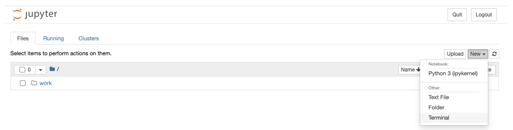
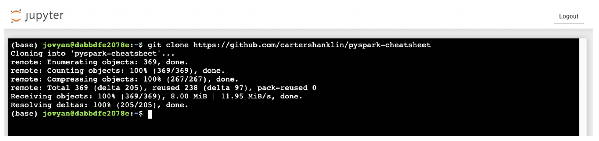
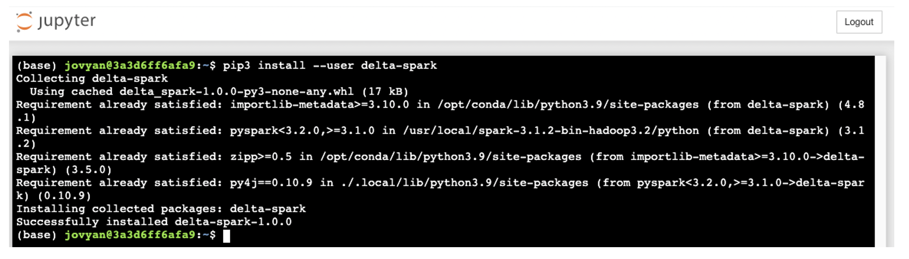
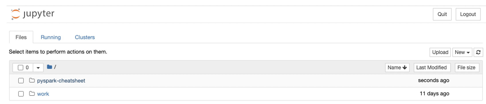
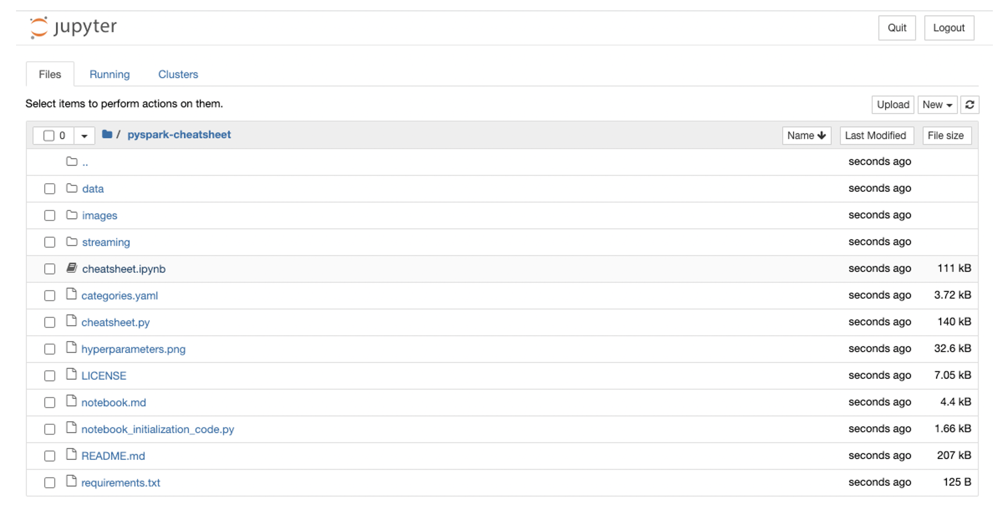
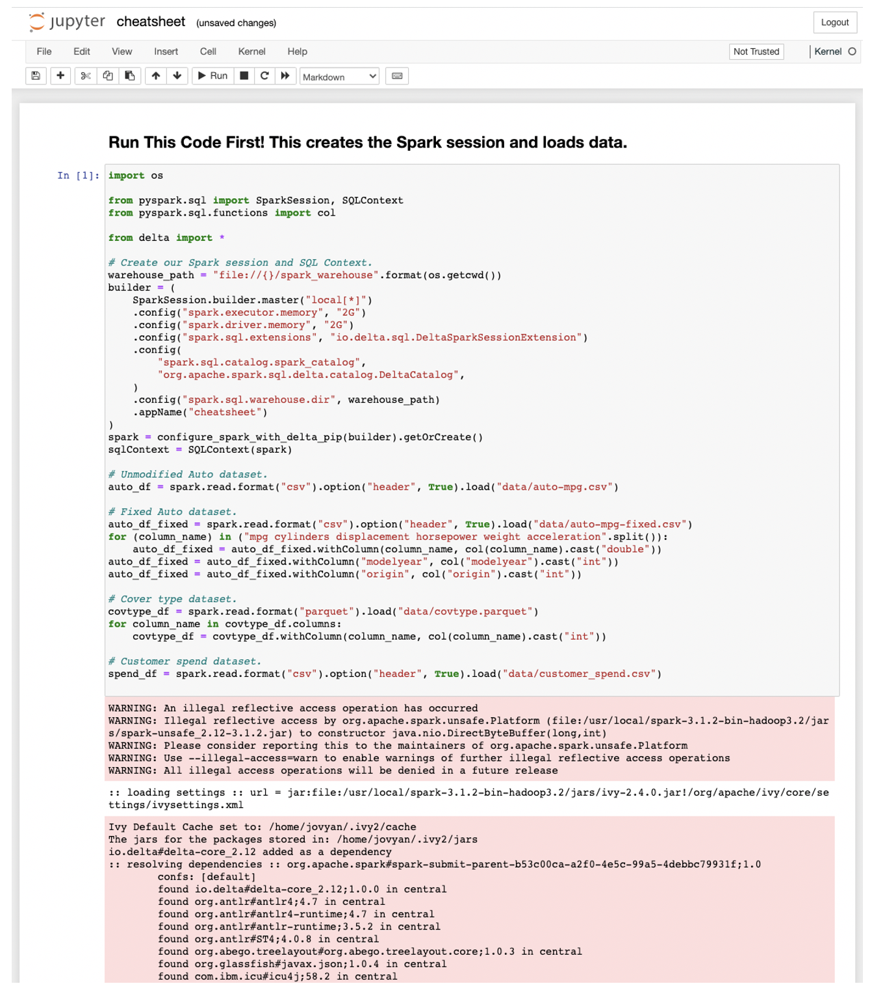

Notebook How-To
===============

Overview
--------
Notebooks are a good way to iteratively explore and visualize data.

Code in [pyspark-cheatsheet](https://github.com/cartershanklin/pyspark-cheatsheet) can be run in any Spark notebook with little or no modification.

This how-to shows how to run code in a Jupyter notebook on a local Docker container. The same approach can be used on any Spark notebook.

Install Docker
--------------
Install Docker using their [installation instructions](https://docs.docker.com/get-docker/).


Install and Start a Jupyter Notebook
------------------------------------
```sh
docker pull jupyter/pyspark-notebook
docker run -it --rm -p 8888:8888 -p 4040:4040 -p 4041:4041 jupyter/pyspark-notebook
```

The second command will produce a link you need to click to open the Jupyter notebook, for example you may see:
```
[C 20:48:13.082 NotebookApp]

    To access the notebook, open this file in a browser:
        file:///home/jovyan/.local/share/jupyter/runtime/nbserver-7-open.html
    Or copy and paste one of these URLs:
        http://21ea37496cd2:8888/?token=5713d34d0c7b3580d925e9dec04636319a982119e085aa40
     or http://127.0.0.1:8888/?token=5713d34d0c7b3580d925e9dec04636319a982119e085aa40
```

In this case you need to open the bottom link with a web browser.

Open a Terminal in the Notebook
-------------------------------


In the Notebook browser window, press New -> Terminal.

Clone the Repository in the Notebook
------------------------------------


The first step is to load all code and sample data into the Notebook. In the terminal window run:

```sh
git clone https://github.com/cartershanklin/pyspark-cheatsheet
```


Add Delta Libraries
-------------------


Some samples use the Delta library to manage data. In the terminal window run:

```sh
pip3 install --user delta-spark
```

Open the Notebook
-----------------



Close the terminal tab and return to the Files tab. There's a new folder called `pyspark-cheatsheet`. Click into this folder.



Open the notebook by clicking on the file called `cheatsheet.ipynb`.


Initialize Spark and Data
-------------------------


When the notebook loads you need to run the first code cell to start Spark and load sample data. You may see some warnings while this runs.

Run Cells
---------

After Spark is started and data is loaded you can run other cells in the notebook using the Run button.