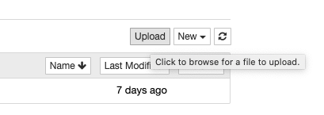
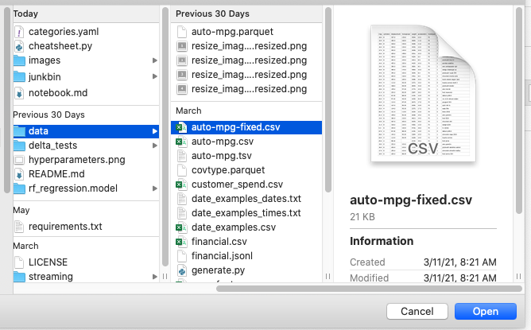
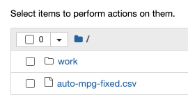
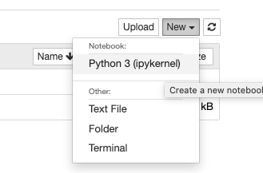
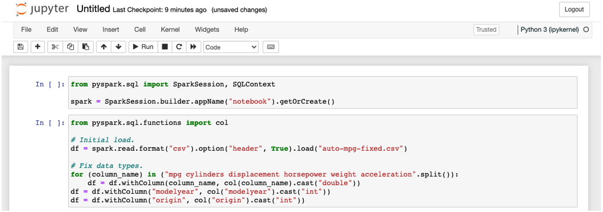
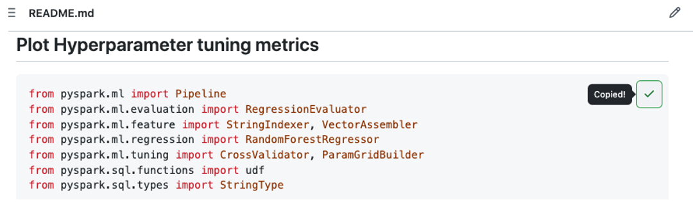
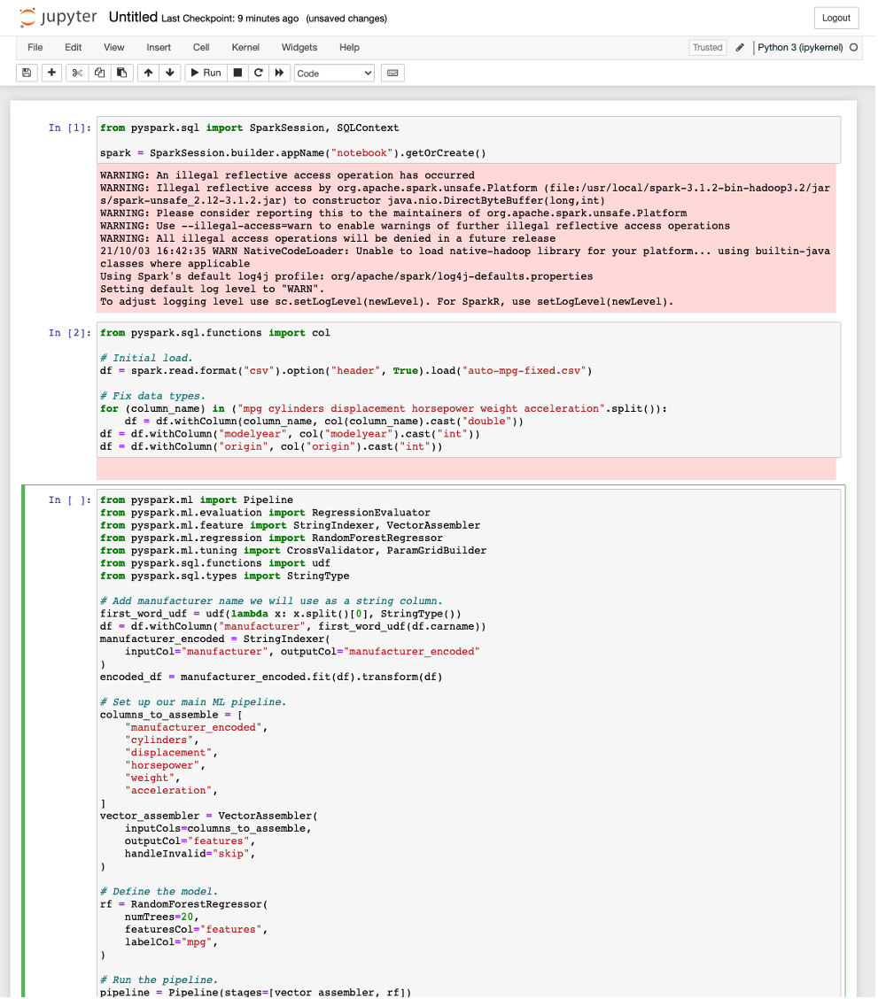
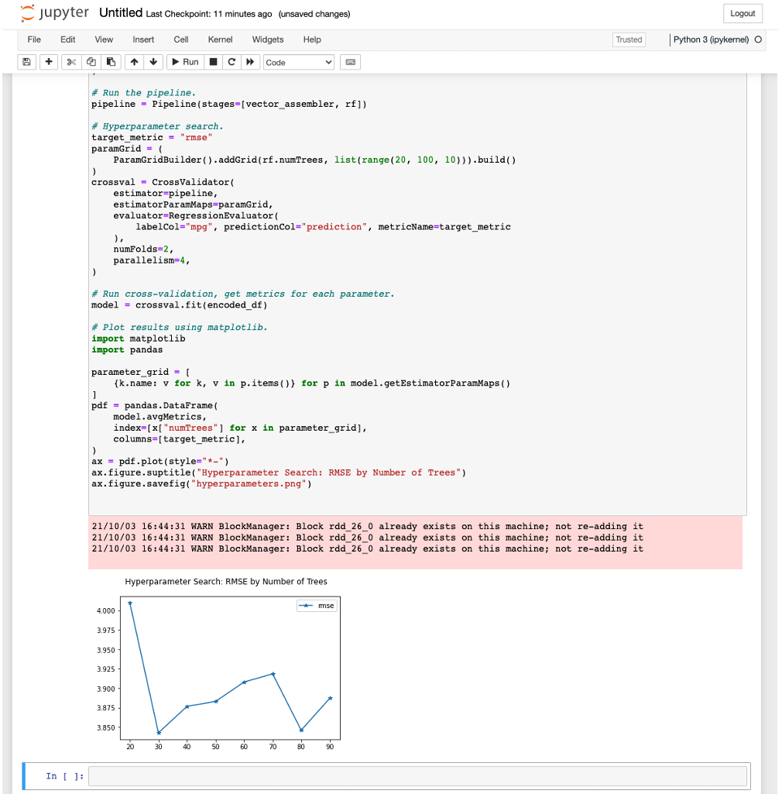

Notebook How-To
===============

Overview
--------
Notebooks are a good way to iteratively explore and visualize data.

Code in [pyspark-cheatsheet](https://github.com/cartershanklin/pyspark-cheatsheet) can be run in any Spark notebook with little or no modification.

This how-to shows how to run code in a Jupyter notebook on a local Docker container. The same approach can be used on any Spark notebook.

Install Docker
--------------
Install Docker using their [installation instructions](https://docs.docker.com/get-docker/).


Install and Start a Jupyter Notebook
------------------------------------
```sh
docker pull jupyter/pyspark-notebook
docker run -it --rm -p 8888:8888 -p 4040:4040 -p 4041:4041 jupyter/pyspark-notebook
```

The second command will produce a link you need to click on to open the Jupyter notebook, for example you may see:
```
[C 20:48:13.082 NotebookApp]

    To access the notebook, open this file in a browser:
        file:///home/jovyan/.local/share/jupyter/runtime/nbserver-7-open.html
    Or copy and paste one of these URLs:
        http://21ea37496cd2:8888/?token=5713d34d0c7b3580d925e9dec04636319a982119e085aa40
     or http://127.0.0.1:8888/?token=5713d34d0c7b3580d925e9dec04636319a982119e085aa40
```

In this case you would need to navigate to the bottom link with a web browser.

Upload Sample Data
------------------
Most code in this project works on a DataFrame loaded from the `auto-mpg.csv` or `auto-mpg-fixed.csv` files. Upload `auto-mpg-fixed.csv` to the Jupyter notebook. You can get this data by cloning the repository or [directly](https://github.com/cartershanklin/pyspark-cheatsheet/blob/master/data/auto-mpg-fixed.csv).

After you've downloaded the data click the Upload button in the notebook.



Choose auto-mpg-fixed.csv.



Confirm auto-mpg-fixed.csv is in the file listing.



Start the Python Kernel
-----------------------
Start the Python Kernel by clicking on the pulldown labelled "New" and clicking Python 3 (pykernel).



Create the Spark Context in Jupyter
-----------------------------------
Enter this code in the first cell to create a SparkSession.

```python
from pyspark.sql import SparkSession
spark = SparkSession.builder.appName("notebook").getOrCreate()
```

Load and Clean the Sample Data
------------------------------
In the next cell, load the CSV file into a Spark DataFrame.

Because of the way the source data is formatted, Spark is not able to detect the right data types for this file. After we load we run a bit of code to convert all columns to their proper types.

```python
from pyspark.sql.functions import col

df = spark.read.format("csv").option("header", True).load("auto-mpg-fixed.csv")

for (column_name) in ("mpg cylinders displacement horsepower weight acceleration".split()):
    df = df.withColumn(column_name, col(column_name).cast("double"))
df = df.withColumn("modelyear", col("modelyear").cast("int"))
df = df.withColumn("origin", col("origin").cast("int"))
```

When you've defined these cells your notebook should look this this:



Press the Run button to run both cells to load the DataFrame in the notebook.

Get a Code Snippet
------------------
Most code snippets can be run without modification. We'll use the [Hyperparameter Plotting](https://github.com/cartershanklin/pyspark-cheatsheet#plot-hyperparameter-tuning-metrics) example since it includes a visualization. Navigate to the page and press the "copy to clipboard" button in the top right.



Paste into the next notebook cell. Your notebook should now look something like this:



Run the Snippet
---------------
Press the Run button to run the hyperparameter example. After a few moments you'll get a graph at the bottom of the cell.



Your graph will look different since results are random.

Try Other Examples
------------------
Most cheatsheet code can be run as-is. If an example is not working it is probably using a different dataset. You can always refer to the [cheatsheet source](https://github.com/cartershanklin/pyspark-cheatsheet/blob/master/cheatsheet.py) for more information on what data the code uses.